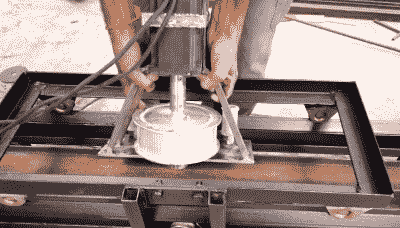

# 滑动屏幕有轮子，会移动

> 原文：<https://hackaday.com/2020/09/28/sliding-screen-has-wheels-will-travel/>

在最近的一次活动中，[MakerMan]的任务是创建一个交互式显示器，它可以沿着莫斯科的天际线来回移动，以突出不同的兴趣点。最终的结果当然是华丽的，但由于这是 Hackaday，我们更兴奋地看到所有的幕后视频，它是如何建立的。

和他的许多项目一样，这个项目也是从废弃零件开始的。两根金属工字梁焊接在一起形成一条轨道，一辆有轮子的车被制作成可以在上面行驶。使用一个皮带和滑轮系统，这与你可能在桌面 3D 打印机上看到的放大版本没有什么不同，推车中的马达能够以最小的斜度来回移动排列。

Installing the motor and pulley in the cart.

推车实际上容纳了项目中的所有电子设备，包括电源、MA860H 电机控制器、一对终点停止开关和将所有这些设备拉在一起的 Arduino。拖链用于将电线紧紧地固定在栏杆边上，而不会被任何东西缠住。

[MakerMan]没有解释这个的软件方面，虽然我们认为他可能只是被签约开发硬件。但在视频的结尾，你可以看到当适当的命令被发送到 Arduino 时，顶部安装了大型触摸屏显示器的推车是如何来回移动的。

我们真的不确定这样一个装置对普通黑客来说会有什么应用，但这并不意味着我们不能嫉妒。巨大的发光屏幕对我们来说就是。

 [https://www.youtube.com/embed/cp7Tq-6iAvg?version=3&rel=1&showsearch=0&showinfo=1&iv_load_policy=1&fs=1&hl=en-US&autohide=2&wmode=transparent](https://www.youtube.com/embed/cp7Tq-6iAvg?version=3&rel=1&showsearch=0&showinfo=1&iv_load_policy=1&fs=1&hl=en-US&autohide=2&wmode=transparent)

