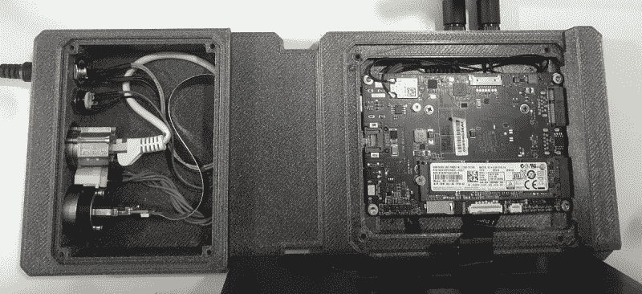

# Slim Sypherdeck 跳过键盘，打包 X86 CPU

> 原文：<https://hackaday.com/2021/02/18/slim-sypherdeck-skips-the-keyboard-packs-x86-cpu/>

在定制电脑平台的世界里，很少有硬性规定，但许多定制的机器确实有一定程度的共性。他们通常使用低功耗 ARM 板，如 Raspberry Pi，它不会消耗太多功率，也不需要任何额外的热量管理，大型机械键盘几乎是必然的。但一眼看去，很明显[【金奎大·格里茨】在设计 Sypherdeck](https://www.thingiverse.com/thing:4740576) 时并没有考虑现状。

现在公平地说，放弃 x86 的 ARM 单板计算机并不是完全没有听说过。但是这些建筑比 Sypherdeck 要大得多。这里的秘密似乎是，3D 打印的外壳除了 LattePanda 和一个 7 英寸的液晶触摸屏之外，没有什么别的东西。侧面的舱口盖覆盖了电源，USB 和 HDMI 舱壁连接器的后部，但它看起来有足够的空间挤在那里，如果你想定制电子产品。没有明显的地方安装任何电池，所以如果你想在路上表演，你需要使用外部包。

 更大的惊喜是完全没有集成键盘。显然，这让[金奎大]创造了一个更加纤薄的外壳，但当然是以不得不随身携带外部键盘为代价的。也就是说，如果你有某种完全由触摸屏完成的用例，这可以被视为一种优势。听起来好像最初的计划是让键盘夹在甲板的底部或顶部，但这个功能没有在第一版中出现。

为了尽可能多的装上硬件，我们见过的许多[电脑平台都相当大](https://hackaday.com/2020/04/20/heavyweight-cyberdeck-is-in-a-class-of-its-own/)。虽然有些人可能会对 Sypherdeck 有限的功能集犹豫不决，但我们认为它纤细的线条和无可挑剔的便携性值得一提。

 [https://www.youtube.com/embed/gGegUJCFnMQ?version=3&rel=1&showsearch=0&showinfo=1&iv_load_policy=1&fs=1&hl=en-US&autohide=2&wmode=transparent](https://www.youtube.com/embed/gGegUJCFnMQ?version=3&rel=1&showsearch=0&showinfo=1&iv_load_policy=1&fs=1&hl=en-US&autohide=2&wmode=transparent)

