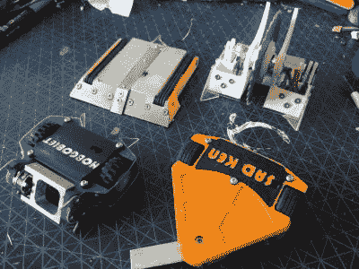

# 小型战斗机器人在重量级战斗中表现出色

> 原文：<https://hackaday.com/2022/08/22/small-combat-robots-pack-a-punch-in-antweight-division/>

两个机器人进来，一个机器人离开！战斗机器人是设计和技能的绝佳展示，但是机械竞争者没有大、重和贵。战斗机器人有一个蚂蚁重量级，其中大多数竞争者的体重只有 150 克，而[【哈利制造东西】展示了蚂蚁重量世界系列赛(AWS) 64](http://bodgeitandhope.blogspot.com/2022/07/aws-64.html) 的四名参与者。

Clockwise: ReLoader, Shakma, Sad Ken, and HobGoblet antweight combat robots.

他们每个人都有非常不同的设计，有大量的照片以及关于做了什么和它如何工作的深刻细节。这正是我们喜欢读到的细节，非常感谢[哈利]的分享！

在战斗机器人中，参赛者通常操纵他们的遥控机器来牵制或固定他们的对手。这可能是由于对它们的破坏导致它们停止运作，但也可能是通过某种机械优势使它们变得无助。

其中一个机器人是履带式的，两个是轮式的，第四个是步行机。黄色的*装弹机*是一种履带式设计，形状为一个低平的楔形，带有一个中央提升臂。这个想法是钻到对手的下面，把他们举起来，最好是让他们的轮子离开地面，让他们失去移动的能力。另一个设计是 *Sad Ken* ，它使用一个水平旋转的杆作为武器，用来给对手一记漂亮的老拳。绿色的*滚刀杯*有一个前置铝制“搅拌器”，直接安装在无刷电机上，类似于联合收割机或脱粒机。最后一个设计是 *Shakma* ，这是一个基于凸轮的步行器，它缓慢蹒跚，同时戏剧性地旋转着一个滑稽的大锯片。

正如人们可能想象的那样，3D 打印机已经在总体上为打击机器人做出了很大贡献。[哈利]最喜欢的方法是将机器人的身体打印成一大块实心的 ABS，上面有用于所有工作部件的凹槽。有很多交叉授粉与钢筋混凝土飞机世界，无刷电机，无线电硬件，和电子控制系统(电子速度控制)是常见的景象。这并不意味着人们不会挑战极限。发烧友们已经[用一个树莓派 Zero 和蓝牙游戏手柄代替了 RC 装备](https://hackaday.com/2021/06/12/raspberry-pi-zero-takes-the-wheel-in-miniature-fighting-robot/)，为了减轻重量常用[碳纤维。](https://hackaday.com/2021/11/05/battle-robot-uses-carbon-fiber-to-save-weight/)

观看视频(嵌入下面)来参观 150 克*装弹机*，并查看一些硬件和设计的其他视图。也许你会带着自己的灵感离开？

 [https://www.youtube.com/embed/NZ-xct7BcBk?version=3&rel=1&showsearch=0&showinfo=1&iv_load_policy=1&fs=1&hl=en-US&autohide=2&wmode=transparent](https://www.youtube.com/embed/NZ-xct7BcBk?version=3&rel=1&showsearch=0&showinfo=1&iv_load_policy=1&fs=1&hl=en-US&autohide=2&wmode=transparent)

