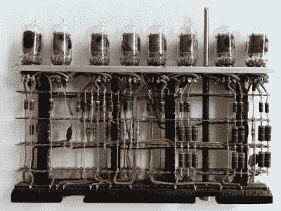
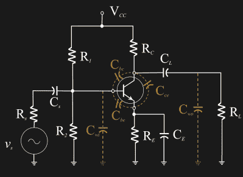
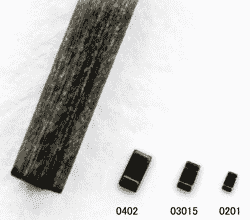
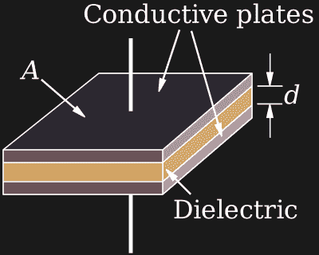

# 有时候越小越好:为什么电子元件如此之小

> 原文：<https://hackaday.com/2021/11/08/smaller-is-sometimes-better-why-electronic-components-are-so-tiny/>

也许电子领域中仅次于欧姆定律的第二著名定律是[摩尔定律](https://en.wikipedia.org/wiki/Moore%27s_law):集成电路上可以制造的晶体管数量大约每两年翻一番。由于芯片的物理尺寸大致保持不变，这意味着随着时间的推移，单个晶体管会变得更小。我们已经开始期待具有更小特征尺寸的新一代芯片以固定的速度出现，但是把事情做得更小到底有什么意义呢？而*更小*是否总是意味着*更好*？

## 更小的尺寸意味着更好的性能

在过去的一个世纪里，电子工程取得了巨大的进步。在 20 世纪 20 年代，最先进的 AM 收音机包含几个真空管，几个巨大的电感器，电容器和电阻器，几十米长的电线作为天线，以及一大堆电池为整个系统供电。今天，你可以在一个适合你口袋的设备上听十几个音乐流媒体服务，还可以做更多的事情。但是小型化不仅仅是为了便于携带:它对于实现我们今天对设备的期望是绝对必要的。

A module from a 1950s IBM 700 computer. Note the enormous size of all components. Credit: autopilot, CC BY-SA 3.0

更小的组件的一个明显的好处是，它们允许您在相同的体积中装入更多的功能。这对数字电路尤其重要:更多的元件意味着你可以在相同的时间内做更多的处理。例如，在理论上，一个 64 位处理器可以处理 8 倍于 8 位 CPU 在相同时钟频率下处理的信息。但是它也需要 8 倍多的组件:寄存器、加法器、总线等等都变得 8 倍大。所以你要么需要 8 倍大的芯片，要么需要 8 倍小的晶体管。

同样的道理也适用于内存芯片:制造更小的晶体管，在同样的体积下，你就有更多的存储空间。当今大多数显示器中的像素都是由薄膜晶体管制成的，因此在这里缩小像素并实现更高的分辨率也是有意义的。然而，还有一个更小的晶体管更好的重要原因:它们的性能大幅提高。但这到底是为什么呢？

## 这都是因为寄生虫

A diagram illustrating the parasitic capacitances of a transistor. Credit: Michel Bakni, CC BY-SA 4.0

每当你制造晶体管时，它都会免费附带一些额外的元件。每个端子上都串联有电阻。任何载流的物体都有自感。最后，任何两个相对的导体之间都有电容。所有这些效应都会消耗功率，降低晶体管的工作速度。寄生电容尤其麻烦:每次晶体管开关时，它们都需要充电和放电，这需要时间和电源电流。

两个导体之间的电容是其物理尺寸的函数:尺寸越小意味着电容越小。因为更小的电容意味着更高的速度和更低的功耗，更小的晶体管可以在更高的时钟频率下运行，同时散发更少的热量。

当你缩小晶体管的尺寸时，电容并不是唯一改变的效应:许多奇怪的量子力学效应会突然出现，而这些效应对于较大的器件来说并不明显。然而，总的来说，晶体管越小，速度越快。但是电子产品不仅仅是晶体管。当你缩小其他组件的规模时，它们的表现如何？

## 没那么快

一般来说，电阻、电容和电感等无源元件并不会随着尺寸的减小而变得更好:在许多方面，它们会变得更差。因此，这些器件的小型化主要是为了缩小体积，从而节省 PCB 空间。

可以减小电阻的尺寸，而不会有太大的损失。一块材料的电阻由给出，其中 *l* 为长度， *A* 为截面积， *ρ* 为材料的电阻率。您可以简单地缩小长度和横截面，最终得到一个物理尺寸更小但电阻不变的电阻。唯一的缺点是，在消耗相同的功率时，物理尺寸较小的电阻比较大的电阻发热更多。因此，小电阻只能用于小功率电路。下表显示了 SMD 电阻的最大额定功率如何随着尺寸的减小而下降。

| 公制的 | 帝国的 | 额定功率(瓦) |
| --- | --- | --- |
| Two thousand and twelve | 0805 | Zero point one two five |
| One thousand six hundred and eight | 0603 | Zero point one |
| One thousand and five | 0402 | Zero point zero six |
| 0603 | 0201 | Zero point zero five |
| 0402 | 01005 | Zero point zero three one |
| 03015 | 009005 | Zero point zero two |

Small, smaller, smallest: tiny resistors compared to a 0.5 mm mechanical pencil lead. Credit: [Rohm Semiconductor](https://www.rohm.com/rasmid)

今天，你能买到的最小电阻是公制 03015 尺寸(0.3 毫米 x 0.15 毫米)。额定功率仅为 20 mW，仅用于功耗极低且体积极其有限的电路中。一种更小的公制 0201 封装(0.2 毫米 x 0.1 毫米)已经发布，但尚未投入生产。但是，即使它们出现在制造商的目录中，也不要指望它们会在任何地方出现:大多数取放机器人都不够精确，无法处理它们，所以它们很可能仍然是一种利基产品。

电容也可以缩小，但这会降低其电容量。计算平行放置电容器的电容的公式是，其中 *A* 是极板的面积， *d* 是极板之间的距离， *ε* 是介电常数(中间的材料的一种性质)。如果将电容器小型化，它基本上是一个扁平的器件，你必须减小面积，从而减小电容。如果你仍然想在一个小体积里装很多纳米法拉，唯一的选择就是一层一层地堆叠几层。由于材料和制造的进步，也使得薄膜(小 *d* )和特殊电介质(较大 *ε* )成为可能，电容器的尺寸在过去几十年中大幅缩小。

An idealized parallel-plate capacitor. Credit: inductiveload, [public domain](https://commons.wikimedia.org/wiki/File:Parallel_plate_capacitor.svg)

目前可用的最小电容采用超小型[公制 0201](https://www.murata.com/en-eu/products/productdetail?cate=luCeramicCapacitorsSMD&partno=GRM011R60J104ME01%23) 封装:仅 0.25 mm x 0.125 mm。它们的电容限制在仍然有用的 100 nF，最大工作电压为 6.3 V。同样，这些包是如此之小，以至于需要先进的设备来处理它们，这限制了它们的广泛采用。

对于电感来说，情况有点复杂。直线圈的电感由给出，其中 *N* 为匝数， *A* 为线圈的截面积， *l* 为其长度， *μ* 为材料常数(磁导率)。如果将所有尺寸缩小一半，电感也会减半。然而，导线的电阻保持不变:这是因为导线的长度和横截面都减少到原来的四分之一。这意味着你最终得到的是一半电感的相同电阻，因此你的线圈品质因数减半了。

Almost invisible: three 0201 (metric) capacitors. Image credit: [Murata Electronics](https://www.murata.com/products/capacitor/ceramiccapacitor/overview/lineup/smd/grm)

市面上最小的分立电感采用的是 [imperial 01005](https://www.murata.com/en-us/products/productdetail?partno=LQP02HQ56NH02%23) 尺寸(0.4 毫米 x 0.2 毫米)。这些高达 56 nH，具有几欧姆的电阻。超小型公制 0201 封装的电感早在 2014 年[就已发布](https://article.murata.com/en-eu/article/murata-develops-smallest-chip-inductor-008004-size)，但显然从未推向市场。

已经有一些努力通过使用一种叫做[动态电感](https://en.wikipedia.org/wiki/Kinetic_inductance)的现象来绕过电感器的物理限制，这种现象可以在石墨烯制成的[线圈中观察到。但即使这样，如果能以商业上可行的方式制造，也能提高大约 50%。最后，线圈不能很好地小型化。但如果你的电路在高频下工作，这就不是问题了。如果您的信号在 GHz 范围内，那么几 nH 的线圈通常就足够了。](https://physicsworld.com/a/engineers-reinvent-the-inductor-after-two-centuries/)

## 不仅仅是部件

这给我们带来了另一个在过去的一个世纪里被小型化了的东西，但是你可能不会马上注意到:我们用于交流的波长。早期的无线电广播使用 1 兆赫左右的中波调幅频率，波长约为 300 米。以 100 MHz 或 3 米为中心的 FM 波段在 20 世纪 60 年代左右开始流行，而今天我们主要使用 1 或 2 GHz 左右的 4G 通信，大约 20 厘米。更高的频率意味着传输信息的更大容量，正是因为小型化，我们才有了在这些频率下工作的廉价、可靠和节能的无线电。

波长的缩小使得天线也能缩小，因为它们的大小与它们需要发射或接收的频率直接相关。今天的移动电话不需要长的突出天线，这是因为它们只在 GHz 频率下通信，为此天线只需要大约一厘米长。这也是为什么大多数仍然包含 FM 接收器的手机要求你在使用前插上耳机:收音机需要使用耳机的电线作为天线，以从那些一米长的波中获得足够的信号强度。

至于连接到我们微型天线的电路，当它们更小的时候，实际上变得更容易制造。这不仅仅是因为晶体管变得更快，还因为[传输线](https://en.wikipedia.org/wiki/Transmission_line)效应不再是个问题。简而言之，当一根导线的长度超过波长的十分之一时，在设计电路时，需要考虑沿其长度的相移。在 2.4 GHz 下，这意味着仅仅一厘米的导线就已经影响到你的电路；如果将分立元件焊接在一起，这是一件非常令人头疼的事情，但如果在几平方毫米的面积上布置电路，这就不是问题了。

## 你能走多低？

在科技新闻中，预测摩尔定律(T1)的终结，或者一次又一次地证明(T2)这些预测是错误的(T3)，已经成为一个反复出现的主题。事实是，仍然在这场游戏的前沿竞争的三家公司——英特尔、三星和 TSMC——继续在每平方微米内挤压越来越多的功能，并计划在未来推出几代改进的芯片。即使他们每一步迈出的步伐可能没有二十年前那么大，晶体管的小型化仍在继续。

然而，对于分立元件，我们似乎已经达到了一个自然的极限:让它们变得更小并不能提高它们的性能，而且目前可用的最小元件比绝大多数用例需要的都要小。分立元件似乎没有摩尔定律，但如果有的话，我们很想看看人们能在多大程度上推动 SMD 焊接挑战。

标题图片:乔恩·沙利文，[公共领域](https://commons.wikimedia.org/wiki/File:Computer_chips_circuits_boards.jpg)。