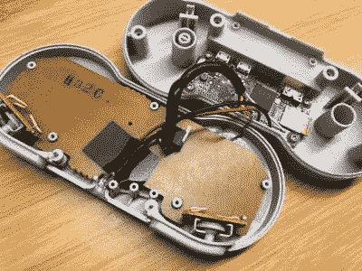

# SNES 控制器在主干中有一个 Pi 零

> 原文：<https://hackaday.com/2018/11/17/snes-controller-has-a-pi-zero-in-the-trunk/>

我们并不陌生，看到人们把树莓派塞进旧游戏机，把它变成一个复古系统。坦率地说，在这一点上，我们似乎已经接近看到这个概念的所有可能的排列。根据我们在 Hackaday 总部保存的宾果卡，我们只是在等待有人将一个放入苹果万代皮聘，创建皮聘并实现奇点。完成它，伙计们。

 话虽如此，我们还是会偶尔对人们想出的东西感到惊讶。扎克·莱文(Zach Levine)的超级游戏手柄 Zero 是一款相当引人注目的游戏，采用了我们以前没有见过的 Pi-in-the-controller 主题，为超级任天堂的普通控制器增加了一个 3D 打印的“车尾”。Thingiverse 用户[Sigismond0]设计的印刷外壳扩展使控制器的厚度增加了一倍左右，但与现代游戏控制器相比，这仍然不算差。

在他的指南中，[Zach]引导读者在扩展的情况下安装运行 RetroPie 的 Raspberry Pi。这包括将电源 LED 放在控制器电缆曾经经过的地方，并将库存控制器 PCB 连接到 Pi 的 GPIO 引脚。这是一种特别好的触摸，不仅节省了您的时间和精力，而且保留了 D-Pad 和按钮的原始感觉。在开始构建之前，请确保您的原生控制器上的按钮没有被击中。

为您的布线增加一点呼吸空间也不是使用 3D 打印底部的唯一原因。它实现了一个非常聪明的“架子”设计，将 Pi 的 USB 和 HDMI 端口暴露在控制器的背面。这使您可以轻松地将电源和视频连接到设备，而不会破坏整体外观。随着连接器的集成标签和适当匹配的灯丝颜色，整体效果看起来确实像是一个商业产品。

SNES 控制器是一个特别受欢迎的黑客和修改目标。[从商用套件](https://hackaday.com/2018/09/26/bring-your-own-controller-kits-just-add-bluetooth/)到[各种各样的自制版本](https://hackaday.com/2013/11/19/wireless-snes-controller-for-logitech-receiver/)，有很多人希望让这款传奇游戏装备[强势进入 21 世纪](https://hackaday.com/2013/11/19/wireless-snes-controller-for-logitech-receiver/)

 [https://www.youtube.com/embed/jTjLKFas_gU?version=3&rel=1&showsearch=0&showinfo=1&iv_load_policy=1&fs=1&hl=en-US&autohide=2&wmode=transparent](https://www.youtube.com/embed/jTjLKFas_gU?version=3&rel=1&showsearch=0&showinfo=1&iv_load_policy=1&fs=1&hl=en-US&autohide=2&wmode=transparent)

