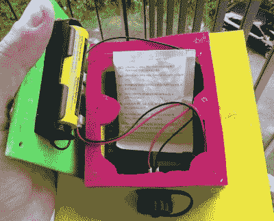

# 用这个 3D 打印的太阳能采集器吸收阳光

> 原文：<https://hackaday.com/2019/07/09/soak-up-the-sun-with-this-3d-printed-solar-harvester/>

乍一看，在你的项目中加入太阳能似乎很容易。拿一块光电板，对着天空中燃烧的气体大球，然后你就可以出发了。但实际上，事情远不止如此。尤其是当你试图做一些小规模的事情时。没有一个满是电池板的屋顶来提供电力，你必须尽你所能。

 如果你想用一块太阳能电池板为传感器等小型电子设备供电，[【瓦迪姆·帕诺夫】整理了一篇非常简洁的文章和视频，介绍如何建造一台低成本的太阳能采集器](https://www.shortn0tes.com/2019/07/solar-harvester.html)。它将相对较小的光伏电池板、充电电路和储能电池结合到一个易于安装的封装中。他已经提供了创建你自己的版本所需的所有细节，你现在要做的就是为它提出申请。

就电子学而言，这个项目非常简单。三瓦的电池板连接到一个简单的充电电路，该电路依次馈入一个 18650 电池。您可能想知道为什么在如此简单的设置中还需要充电控制器。一个问题是面板的输出电压高于电池的输出电压。你还需要一个阻塞二极管，防止电池在夜间或阴天放电。

虽然对一些读者来说，电子产品可能看起来很初级，但我们认为 3D 打印的外壳本身就值得一看。[Vadim]不仅提出了一个完美封装脆弱的太阳能电池板和相关电子设备的设计，而且在休息后的视频中，他还解释了如何用环氧树脂涂层使整个东西防水。由于 3D 打印可能有多孔的趋势，如果你一直在考虑在户外部署打印的外壳，这种技术肯定是你应该记住的东西。

无论你是想为技术上可行的近一个世纪的环境传感器供电，还是想为移动匿名的便携式 OpenWRT 路由器供电，如果你知道如何克服它们的局限性，这些小型太阳能电池板都有很大的前景。

 [https://www.youtube.com/embed/9WFlKlJO1iI?version=3&rel=1&showsearch=0&showinfo=1&iv_load_policy=1&fs=1&hl=en-US&autohide=2&wmode=transparent](https://www.youtube.com/embed/9WFlKlJO1iI?version=3&rel=1&showsearch=0&showinfo=1&iv_load_policy=1&fs=1&hl=en-US&autohide=2&wmode=transparent)

