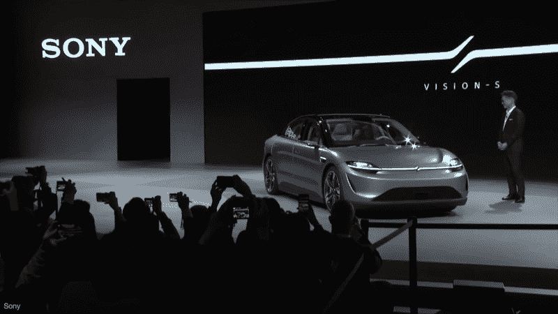
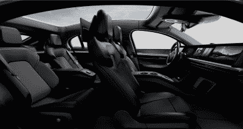
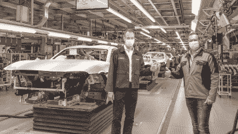
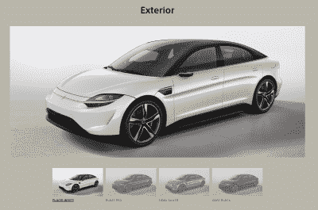

# 索尼的电动汽车现在在奥地利进行道路测试

> 原文：<https://hackaday.com/2021/01/27/sonys-electric-car-now-road-testing-in-austria/>

消费电子展通常不是概念车的展示场所，索尼也不是知名的大型汽车制造商。然而，时代在变，电动交通革命已经发生了很大的变化。在著名的贸易展上，索尼展示了它的 Vision-S 概念，震惊了许多人，这是一款行驶、驾驶的原型电动汽车。

远远不是一个简单的展示车内娱乐或新的花式相机的模型，索尼进入汽车世界是令人惊讶的完全。最近，[日本科技巨头被发现在奥地利的道路上测试车辆，](https://thedriven.io/2021/01/14/sony-releases-video-of-vision-s-electric-car-prototype-test-drive/)引发了对该项目的未来的质疑。让我们深入了解索尼展示了什么，以及这对 Vision-S 的潜力意味着什么。

## 大量时髦的功能

Vision-S 原型拥有双电机，一个前置，一个后置，峰值功率可达 200 千瓦。加上大约 2300 公斤的整备质量和 4.8 秒的零到 60 英里/小时的时间表明，性能与特斯拉的 Model 3 相当。有趣的是，该公司对电池的范围或规格守口如瓶。据推测，电池组使用索尼自己制造的电池。

The interior features wall-to-wall screens, as is the current trend. There are four bucket seats for the passengers. as the classical rear bench seems to be going out of style along with declining birth rates in the developed world.

这辆车内外都很先进，装有一套 40 个传感器，包括 CMOS 相机、激光雷达、超声波传感器和雷达。通过这个包，索尼希望使车辆能够实现第二级自主——在驾驶员监督下，车辆可以保持速度和车道，类似于 Telsa 的自动驾驶系统。目标是最终达到第 4 级自主，车辆能够在选定的区域完全自动驾驶。

车内娱乐备受关注，考虑到索尼在这一领域的历史，这并不奇怪。功能包括屏幕横跨仪表板的整个宽度，以及后座乘客的进一步显示。每个座位也有自己的一套扬声器，目的是让每个乘客都能听到自己选择的内容。一个值得注意的内容是，索尼的目标是在进入汽车时，将司机智能手机耳塞中的音频无缝传输到汽车扬声器中。无论如何，它不是游戏规则的改变者，但它强调了公司追求的无缝体验。

## 原型或生产就绪？

Magna-Steyr are well established contract manufacturer in the automotive industry, bringing much needed engineering experience to the project.

索尼一直在与总部位于奥地利格拉茨的汽车合同制造商麦格纳-斯太尔合作研发这款汽车。目前，该公司正在生产一系列汽车，从内燃机奔驰 G 级到混合动力宝马 5 系和全电动捷豹 I-Pace。这种合作极大地提高了该项目的可信度，该公司在汽车生产方面的长期经验为索尼的技术探索提供了基础。

与苹果汽车不同，围绕苹果汽车的谣言已经流传了多年，但没有发现真正的产品，索尼的 Vision-S 在今年进一步的细节曝光之前，于 2020 年在 CES 舞台上完全成型。然而，这款车是否会投入生产或公开销售仍有疑问。索尼不是一个汽车品牌，在世界各地没有经销商或零件网络。此外，制造一辆原型车与让一辆汽车在全球多个司法管辖区获准销售相去甚远，这需要大量的测试，而且往往是破坏性的。将汽车投放市场的前期成本高得惊人；作为一个特别明显的例子，特斯拉用了十多年才实现可持续盈利。

Exterior shots on the Sony website feature different colors – by name – suggesting some thought has been given to marketing the car.

也很难看出 Vision-S 能在多大程度上适应市场。索尼的汽车电池技术不太可能与特斯拉的最新创新相提并论，更不用说工厂需要大规模生产汽车电池了，与普通消费设备相比，汽车需要的电池数量惊人。

生产也是一个因素。麦格纳-斯太尔的年产量约为 20 万辆汽车，已经被几个现有车型分割开来，不太可能有太多的产能来大幅扩大索尼的产量。相比之下，[特斯拉在 2020 年制造了近 50 万辆汽车](https://www.cnbc.com/2021/01/02/tesla-tsla-q4-2020-vehicle-delivery-and-production-numbers.html#:~:text=Tesla%20reports%20499%2C550%20vehicle%20deliveries%20for%202020%2C%20slightly%20missing%20target,-Published%20Sat%2C%20Jan&text=Tesla%20just%20published%20its%20fourth,quarter%2C%20and%20produced%20179%2C757%20vehicles.)——其中 14 万辆是 Model 3。索尼需要规模经济来平衡价格和性能。在汽车行业没有大肆宣传或品牌声望的情况下，押注数百万美元(如果不是数十亿美元的话)是一个可怕的提议。

## 滚动试验台？

该项目很可能是索尼投资汽车技术的努力。相反，Vision-S 可以作为索尼图像传感器、激光雷达和其他技术的测试平台，索尼希望将这些技术出售给现有的汽车制造商。通过制造代表未来市场趋势的汽车，他们拥有了一个完美的工程平台来进行试验。当涉及到将高级硬件实际集成到车辆中的复杂工程时，这一点尤其有用。任何人都可以把一堆昂贵的现成传感器扔在车顶吊舱上，带着它到处跑；创造实用的、有吸引力的、有成本效益的东西要难得多。

这辆汽车令许多人感到震惊；与苹果和谷歌的项目不同，索尼汽车的存在几乎没有炒作或预期。人们不禁要问，早期多一点炒作是否有助于建立市场兴趣。该公司的网站对事情进行了开放的解释，称“这些内容和原型车辆旨在说明我们在移动领域的未来概念。”无论如何，很难对项目的结果下赌注，这个概念对于一个内部工程项目来说似乎太完美了，但对于真正的市场竞争来说又太糟糕了。它甚至可能是这样的情况，该项目被打包并批发给现有的汽车制造商，用一套新的徽章来隐藏其来源。鉴于一些汽车制造商，如马自达和斯巴鲁尚未显示出任何认真努力电气化，这可能是一条路要走。无论如何，我们期待着这款时尚而引人注目的汽车的下一阶段发展——并屏息以待，看看它对市场的影响。