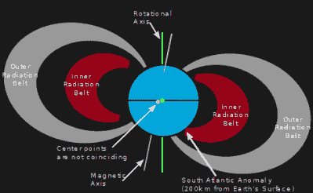
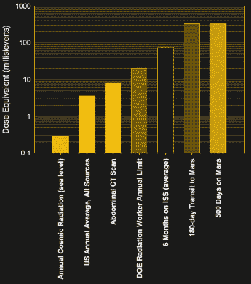
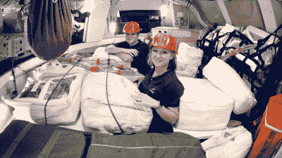

# 太空是放射性的:应对宇宙射线

> 原文：<https://hackaday.com/2020/12/08/space-is-radioactive-dealing-with-cosmic-rays/>

外层空间并不是一个友好的环境，这就是为什么我们在把人送到那里之前要走很长的路。一旦你离开我们心爱的岩石星球几百公里，由于缺氧、极度寒冷和高剂量辐射，一切都会变得不舒服。

尤其是后者对长期太空旅行构成了巨大挑战，因此人们正在研究各种概念来保护宇航员的 DNA 免受宇宙射线的破坏。随着美国宇航局考虑未来载人登月和火星任务，这一点变得更加突出。因此，让我们更多地了解银河宇宙射线和太阳耀斑带来的危险。

## 来自太空的辐射

当德国耶稣会牧师和物理学家西奥多·伍尔夫在 1910 年带着静电计爬上埃菲尔铁塔时，他想证明电离辐射的天然来源是来自地面的。虽然塔顶的读数低于地面水平，但仍然比地面是唯一来源时的预期高得多。几年后，Victor Hess 进行了几次高至 5.3 公里的冒险气球飞行，通过观察验电器的放电率来系统地测量辐射水平。他的实验表明，辐射水平在 1 公里以上会增加，他正确地得出结论，一定有某种辐射源从外层空间穿透了大气层。

落在地球上的宇宙射线主要是质子(~90%)、氦核(~9%)和电子(~1%)。此外，还有一小部分较重的原子核和少量反物质。这些粒子是从太阳和其他银河系和河外的自然粒子加速器，如超新星或黑洞，向我们喷射出来的。

## 地球如何保护我们的安全

Van Allen Belt and location of South Atlantic Anomaly
Credit: [Marko Markovic](https://commons.wikimedia.org/wiki/File:South_Atlantic_Anomaly.svg), public domain

对我们来说幸运的是，地球磁场使许多带电粒子偏转，因此它们永远不会撞击大气层。其中一些被捕获在环绕地球的两个环形带中，即范艾伦带。此外，大气层也很好地保护了我们。撞击大气层原子的初级宇宙射线会产生大量能量低得多的次级粒子，因此它们中的大多数不会到达地面。

地球上这里的平均辐射量大约是每年 3 mSv。根据你的海拔高度，大约 0.39 毫西沃特(13%)是由宇宙辐射贡献的。与海平面相比，在 12 千米高空飞行的飞机会增加 10 倍的辐射暴露。如果你的飞行路线靠近带电粒子集中的地磁极，情况就更糟了。如果你对你下一次飞行将受到的辐射剂量感兴趣，查看美国宇航局的 [NAIRAS](https://sol.spacenvironment.net/nairas/Dose_Rates.html) 网页。它提供了不同高度辐射剂量率的全球地图，这些地图是根据对太阳活动和宇宙射线的测量近实时生成的。

## 国际空间站、月球和火星上的剂量

Comparison of radiation doses. Note logarithmic scale.
Credit: [ASA/JPL-Caltech/SwRI](https://commons.wikimedia.org/wiki/File:PIA17601-Comparisons-RadiationExposure-MarsTrip-20131209.png), Public Domain

对于国际空间站的一名成员来说，在太阳活动高峰期停留六个月的平均辐射剂量约为 72 毫西沃特:比在地球上高出约 50 倍。因为来自太阳粒子的贡献随着 [11 年太阳周期](https://hackaday.com/2020/10/06/welcome-to-solar-cycle-25-our-sun-enters-a-new-11-year-period/)而变化，人们可能会认为在太阳活动极小期辐射剂量较低。但事实上，辐射量是太阳活动高峰期的两倍。

这是因为国际空间站上的主要辐射源是银河宇宙射线(GCR)，这些射线被太阳磁场偏转。在太阳磁场最弱的太阳活动极小期，GCR 强度最高。即使是像太阳耀斑或日冕物质抛射这样的大型太阳粒子事件(SPE)也不会对国际空间站的宇航员造成太大伤害，而是会扫除其他带电粒子，从而减少数周的 GCR 通量。这种效应被称为布什下降的。

国际空间站上辐射暴露的另一个重要因素来自于范艾伦带中的质子。当国际空间站穿越所谓的南大西洋异常点(SAA)时，辐射带更接近地球表面，暴露程度最大。大多数时候，国际空间站在范艾伦带内舒适地运行，但在国际空间站在 SAA 度过的 5%的任务时间中，它可能要对总吸收辐射剂量的 50%以上负责。

另一方面，月球暴露在各种宇宙射线下，因为它位于更远的地方，既没有磁场也没有大气层。在这里，像 1972 年 8 月发生在阿波罗 16 号和阿波罗 17 号登月任务之间的大太阳风暴这样的事件，对宇航员来说可能是威胁生命的事件。最近，中国嫦娥四号着陆器上的月球着陆器中子和剂量测定(LND)实验[测量了月球表面的辐射暴露](https://advances.sciencemag.org/content/6/39/eaaz1334)。辐射剂量约为 500 毫西沃特/年，比在地球上高出近 200 倍。

载人火星任务的计划已经在进行中，辐射暴露是主要关注的问题之一。对火星之旅辐射剂量的估计是基于搭载在好奇号探测器上的辐射评估探测器(RAD)的测量结果。在 360 天的往返旅程中，一名宇航员将接受约 660 毫西沃特的剂量。假设机组人员在等待行星重新排列期间将在表面度过 18 个月，他们将额外暴露于 330 毫西沃特。所以宇航员往返火星的总辐射量大约是 1000 毫希沃特。这相当于美国宇航局宇航员在其整个职业生涯中的暴露极限，并对应于因辐射诱发的癌症而死亡的 [5.5%的风险](https://en.wikipedia.org/wiki/Effective_dose_(radiation))。因此，尽管肯定存在严重的健康风险，但辐射暴露并不是火星任务的绊脚石。

## 保护太空旅行者

The radiation protection plan for the Orion spacecraft includes building a shelter from stowage bags during an SEP event.
Credit: [NASA](https://www.nasa.gov/sites/default/files/thumbnails/image/vlcsnap-2019-08-02-14h34m41s329.png)

国际空间站上的宇航员受到空间站铝外壳的部分辐射防护。低原子序数的材料提供了最有效的保护，防止包括中子等次级粒子在内的空间辐射。这种轻质材料带入太空也更便宜。国际空间站为他们的乘员舱配备了聚乙烯砖，可以减少 20%的辐射剂量。

如果我们在月球上建造定居点，它们可能会被埋在月球土壤下面，以屏蔽 SPEs 和其他宇宙射线。不利的一面是，正如阿波罗 17 号月球中子探测器实验所显示的，这也会增加次级中子的暴露。

美国宇航局的猎户座飞船计划在 2024 年将人类送上月球，并最终送上火星。由于专用屏蔽的额外质量过于昂贵，他们的辐射防护计划包括在发生 SPE 的情况下，从船上供应品(包括食物和水)中建造一个掩蔽所的可能性。

我们不要忘记，太空辐射不仅对人类危险，对电子设备也危险。高能粒子相互作用很容易损坏航天器上的关键电子系统，并导致每年一到两颗卫星全部或部分任务失败。极端的 SPE 甚至可以影响地球上的设备，比如 1972 年的太阳风暴，据说它导致了 24 枚美国水雷在越南的意外爆炸。

对于太空旅行的未来，更先进的主动屏蔽概念是正在进行的研究的主题。这些包括强大的磁场或静电场和围绕在航天器周围的等离子“气泡”，以偏转带电粒子。当然，辐射防护只是长期太空旅行带来的众多挑战之一，但让我们希望我们能找到保持宇航员安全和健康的方法。