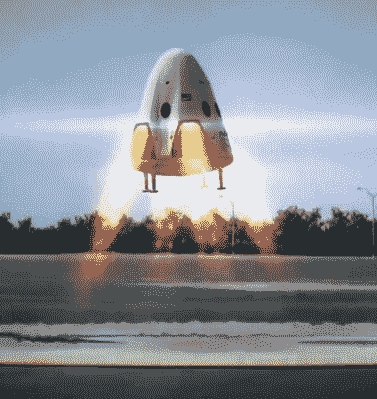
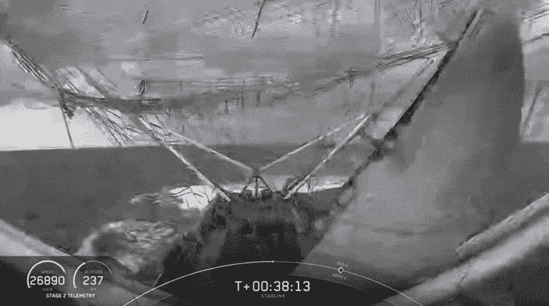
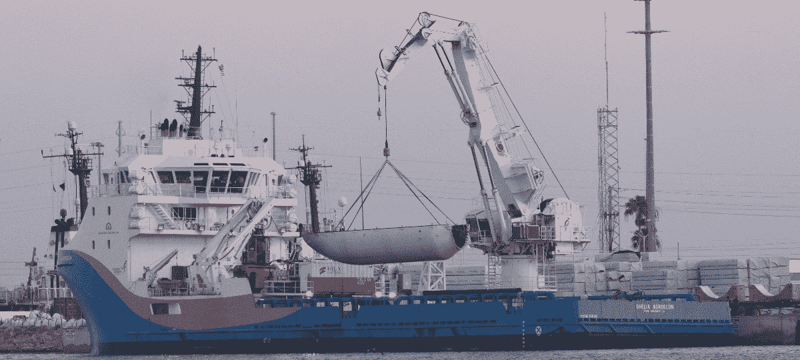

# SpaceX 在抓整流罩时丢球

> 原文：<https://hackaday.com/2021/05/06/spacex-drops-the-ball-on-catching-fairings/>

你不用很努力就能找到 SpaceX 的另一个令人振奋的成功。这是一家以大而大胆的举措为特征的公司，当事情进展顺利时，他们会确保你知道这件事。从将特斯拉发射到深空，到他们下一代星际飞船的迷人试飞，这家私营公司已经将高风险的航空航天研发变成了一项公共活动。围绕 SpaceX 古怪的首席执行官埃隆·马斯克(Elon Musk)已经形成了一种个人崇拜，只要他还在掌舵，我们就可以期待他带领该公司实现将人类送上火星的最终目标时出现更大、更光明的景象。

当然，SpaceX 的事情并不总是一帆风顺。虽然在航空航天领域，挫折是不可避免的，但该公司已经出现了一些特别令人尴尬的失败，这些失败可能直接归因于他们的快速发展步伐，甚至是运营经验不足。一个完美的例子是 2016 年猎鹰 9 号(Falcon 9)发动机在发射台上静态点火时失去了以色列的阿莫斯-6 卫星，因为行业专家质疑为什么该航天器在通过飞行前检查之前就被安装在火箭上。由于这个代价高昂的错误，该公司一直等到所有发动机测试完成后，才连接客户的有效载荷。

SpaceX’s concept art for propulsive landing

但有时失败与其说是技术问题，不如说是公司无法实现自己的崇高目标。偶尔，马斯克的一个伟大想法会因过于复杂、危险或昂贵而无法付诸实践。例如，尽管花费了数年时间和数不清的金钱来完善相关技术，但在这个想法得到充分测试之前，船员龙的推进着陆就被禁止了。据报道，与更传统的降落伞下的海洋溅落相比，美国宇航局认为这是不必要的风险，对此感到不安；诚然，这将是一个令人印象深刻的景象，但它并没有比更简单的方法提供实质性的好处。

类似的命运最近降临在 SpaceX 的双胞胎整流罩回收船*树女士*和*酋长女士*身上，它们于 4 月份悄然退役。这些船[被设计成当猎鹰的校车大小的有效载荷整流罩](https://hackaday.com/2018/02/26/spacex-joins-in-the-long-history-of-catching-stuff-from-space/)飘回地球时，使用悬挂在甲板上的巨大网，但最终，这个过程比预期的更困难。更重要的是，很明显，这根本就没有必要。

## 最致命的捕获

值得表扬的是，特里女士和 T2 女士在 SpaceX 公司任职期间都成功地抓住了机遇。这些船证明了这个概念是可行的，在 2020 年的两次任务中，他们甚至成功捕获了整流罩的两半。但总的来说，他们的成功率很低。[根据 SpaceXFleet.com](https://spacexfleet.com/fairing-data/)的统计，在一艘或两艘船只试图回收整流罩的 37 次任务中，他们总共只捕获了 9 次。这已经是一个相当糟糕的平均数，但是当你意识到每个任务实际上有两个需要抓住的整流罩时，这是糟糕透顶的。

低成功率已经够糟糕了，但是即使船只在半空中抓住了一个整流罩，也不总是有好结果。在 2020 年 10 月 18 日的 Starlink 任务中，来自【Tree 女士的现场视频短暂显示了一个整流罩撕裂网格并砸到甲板上。由于每个整流罩的一半估计重约 950 千克(2094 磅)，有一个破损会给回收船上的船员和设备带来明显的危险，更不用说整流罩本身了。毕竟，我们的目标是完好无损地回收它们，这样它们就可以在随后的飞行中使用。

Only a few seconds of low-resolution video were shown before SpaceX cut the stream.

这可能看起来很奇怪，SpaceX 在这些相对较大且温顺的物体在其翼伞下漂流到表面时遇到了这么多麻烦，特别是与猎鹰 9 号第一阶段着陆的大火和愤怒相比。在过去的三年里，SpaceX 已经成功地将海上助推器回收的成功率保持在 90%左右，至少从表面上看，这两种程序似乎相似之处多于不同之处。

但归根结底，这是指挥权的问题。猎鹰 9 号的主动栅格翼和推力矢量能力使它在下降时比整流罩使用的可操纵翼伞更具机动性。即使回收船主动与整流罩的航空电子设备进行通信，并试图规划一个拦截点，错误时刻的一阵强风也足以让它们偏离航线。

## 引起轰动

从一开始，SpaceX 就认为他们需要用网抓住整流罩，因为让它们直接接触盐水会对它们造成损害，超出经济修复的范围。虽然具体细节很难公开，但人们普遍认为，这种担忧并不是来自船上的电子设备，这些电子设备可能是防水的，而是整流罩本身的独特结构。由夹在复合材料层之间的铝蜂窝结构制成，水侵入可能是一个严重的问题；一旦海水进入整流罩本身的结构，快速而经济地把它弄出来可能是不可能的。

但是面对一个似乎毫无进展的恢复计划，SpaceX 的工程师们显然已经找到了一个让它运转起来的方法。最近建造的整流罩的特写照片显示，各种通风口和开口已经被重新定位，因此它们将离水面更高，有传言说，内部隔音面板现在被认为是消耗品，每次任务后都被丢弃，而不是试图将它们晾干。目前还不知道采取了什么措施(如果有的话)来防止水渗入整流罩的铝/复合材料结构。

虽然这些“湿”整流罩的翻新过程无疑比它们被网住更昂贵和耗时，但这种差异显然不足以证明*特里女士*和*酋长女士*的继续运营。相反，SpaceX 租用了更大的 *Shelia Bordelon* 作为主要整流罩回收船。这艘 78 米(256 英尺)长的船旨在进行水下研究，具有开阔的甲板，内置起重机和 Triton XLX 遥控潜水器(ROV)，可以下潜到 3000 米(9840 英尺)。

*Shelia Bordelon* unloading a fairing half. Photo by [Kyle Montgomery](https://www.kylemphoto.com/).

集成的起重机使其更容易将整流罩拉出水面并放到码头上，但除此之外，这艘船似乎并不特别适合手头的任务。首先，它的水下能力被完全浪费了。但更重要的是，Starlink 任务要求的快速发射节奏意味着回收船在返回港口之前应该能够理想地容纳四个整流罩半体。因此，要么 Shelia borde lon 很快就会进行一些自己的修改，要么 SpaceX 只是暂时使用它，直到他们能够拿出一个长期的解决方案。