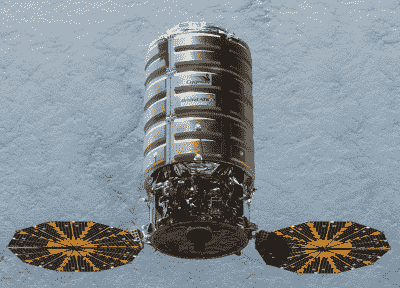
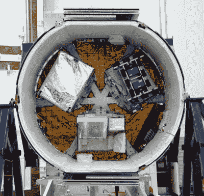

# SpaceX 公司向美国宇航局提供定制的月球货船

> 原文：<https://hackaday.com/2020/04/15/spacex-offers-nasa-a-custom-moon-freighter/>

在现任政府的领导下，美国宇航局的任务是尽快让美国宇航员重返月球。Artemis 计划将在 2024 年向我们最近的天体邻居发射载人任务，并在 2028 年前建立一个可持续探索和居住的系统。委婉地说，这是一个非常激进的时间表。

为了有机会实现这些目标，NASA 不仅要寻求国际合作伙伴的帮助，还要寻求私营企业的帮助。对于该机构来说，根本没有足够的时间来设计、建造和测试最终在月球上或月球周围持续存在所需的所有硬件。通过授予一系列合同，NASA 计划将 Artemis 计划的一些后勤部分交给有资格的公司和机构。

Artist’s Rendering of the Dragon XL

对于最近几年一直关注新的太空竞赛的任何人来说，听到 SpaceX 已经获得这些利润丰厚的物流合同之一应该不会感到惊讶。他们已经被选为向 Gateway 运送货物的第一家商业供应商，Gateway 是美国宇航局打算在月球轨道上运行的一个小型空间站。考虑到 SpaceX 已经有了为国际空间站提供补给的合同，他们是为未来的月球前哨站提供类似服务的理想候选人。

但这并不意味着这很容易。所谓的“门户物流服务”合同规定，供应商必须能够向月球轨道运送至少 3400 公斤(7500 磅)的加压货物和 1000 公斤(2200 磅)的非加压货物。这超出了 SpaceX 的龙飞船的能力，该飞船仅设计用于低地球轨道。

为了完成这项新任务，该公司提出了一种新的交通工具，他们称之为龙 XL，将乘坐猎鹰重型助推器进入轨道。但是，即使对于这个新的太空宠儿，也没有太多的时间来设计、测试和建造一个全新的航天器。为了让 Dragon XL 尽可能快地飞行，SpaceX 将需要把飞行器拆到最低限度。

## 经典灵感

Cygnus, operated by Northrop Grumman

到目前为止，我们只有一张艺术家绘制的 Dragon XL，但这已经足以了解 SpaceX 如何接近这种新的月球货运飞船。首先，很明显这个设计与最初的龙或者它的船员龙完全不同。如果有的话，它看起来更接近日本的 H-II 转移飞行器(HTV)或诺斯罗普·格鲁曼公司的天鹅座。

这当然很有道理。像 HTV 和天鹅座一样，龙 XL 不是为在大气层中飞行而设计的。传统的太空舱之所以呈圆锥形，是因为它们在上升过程中安装在助推器的顶端，实质上相当于火箭的鼻锥。但龙 XL 将乘坐猎鹰重型的货物整流罩进入太空，这意味着它没有理由拥有空气动力学形状。

在形状的问题上，敏锐的观察者可能会注意到，龙 XL 的机身似乎与释放它的猎鹰重型第二级的直径相同。虽然在这一点上它只不过是一个猜测，但一些人已经从理论上推测，龙 XL 实际上可能是一个重新设计的猎鹰第二级，带有一个推进剂罐作为加压货舱。这将省去 SpaceX 为 Dragon XL 建造新工具的麻烦，并且不是没有先例；天空实验室是由土星五号火箭的末级建造的。

## 保持简单

我们还可以看到，龙 XL 没有主火箭发动机，这意味着猎鹰重型的第二级将需要为穿越月球的注入(TLI)机动提供能量，这将使它朝着月球的方向前进。一旦 TLI 燃烧完成，龙 XL 就可以被释放，点缀在飞船外围的较小的反作用控制系统(RCS)推进器将被用来最终减缓飞船与 Gateway 会合的速度。

这不是唯一缺失的主要部分。由于龙 XL 不会降落在地球上，它不需要隔热板或降落伞。尚不清楚一旦货运任务完成，这艘飞船将会发生什么，尽管 Gateway Logistics Services 合同确实提到了将货物返回地球轨道的可能性。这可能意味着在国际空间站停下来卸载，之后它可能会被命令重新进入地球大气层，并在海洋上空安全烧毁。

从飞船上删除引擎、隔热罩和降落伞显然节省了质量，这反过来增加了 Dragon XL 可以带给 Gateway 的可用货物量。但不仅如此，它还大大减少了设计和测试航天器所需的时间和精力。由于航空电子设备和 RCS 系统来自标准的 Dragon，机身可能是备用的 Falcon 上面级，飞船的大部分硬件可以从 SpaceX 的现有生产线上获得。

## 充裕的行李箱空间

目前的“龙”能够在位于太空舱和猎鹰 9 号助推器上一级之间的非加压“行李箱”中运载大型货物。这是不需要带入内部的组件的理想选择，例如将暴露在开放空间中的天线阵列或[实验。](https://hackaday.com/2018/03/12/lost-in-space-how-materials-degrade-in-space/)

Cargo loaded in the Dragon’s unpressurized trunk.

这种能力已被用于将几个大型组件带到国际空间站，如 Bigelow 可扩展活动模块(BEAM)和国际对接适配器(IDA)。很自然，美国宇航局希望申请网关后勤服务合同的车辆具有相同的能力，因为拥有多艘能够运输空间站组件的飞船将加快组装过程。

所以我们知道 Dragon XL 有自己的“后备箱”，但是它在哪里呢？在标准的 Dragon 上，当从后面看时，我们会看到一个开放的货舱，但在其位置上似乎是一个对接端口。由此我们可以推测，Dragon XL 的布局很可能与标准 Dragon 相反:不是在前面有一个对接端口，在后面有一个主干，主干必须位于飞船的前面，在宣传渲染中看不到它。

鉴于 Falcon Heavy 的有效载荷整流罩有多大，这种安排可能会允许 Dragon XL 携带实际上延伸到非加压舱外面的长物体。只要 RCS 系统能够补偿质量中心的变化，这种新的航天器没有理由不能充当大部分 Gateway 的“拖船”。

## 即将推出？

那么 Dragon XL 什么时候飞？正如美国宇航局重返月球的许多元素一样，它是一个移动的目标。根据目前的时间表，Gateway 的核心模块预计将于 2022 年底发射，随后将进行几次携带额外模块的发射。理论上，第一次载人前往 Gateway 的任务可能会在 2024 年发生，到那时，NASA 将需要开始执行消耗品的再补给任务。

假设美国宇航局坚持这一时间表(这还远未确定)，龙 XL 可能会在 2025 年左右投入使用。这使得 SpaceX 在 2006 年被选为商业轨道运输服务合同后，有足够的时间准备好原始的 Dragon。鉴于他们在中间几年获得的经验，以及他们可以从主线龙上借用组件的事实，应该没有任何技术问题阻碍这种新的交通工具准备迎接第一批称为 Gateway home 的宇航员。