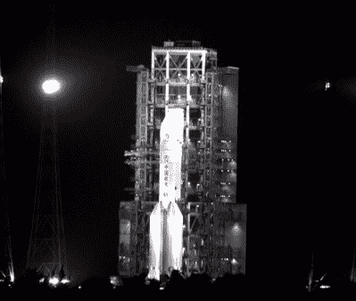

# 间隔:来自月球的岩石，来自火星的岩石，一次侥幸逃脱，和一些有趣的发射

> 原文：<https://hackaday.com/2020/12/01/spacing-out-rocks-from-the-moon-rocks-from-mars-a-near-miss-and-some-interesting-launches/>

当然，[SpaceX 的工作人员安全抵达国际空间站](https://blogs.nasa.gov/crew-1/2020/11/17/hatches-open-crew-dragon-astronauts-join-expedition-64-2/)，但是在那个特定的地平线之外还有很多事情发生。中国国家航天局已经发射了他们的嫦娥 5 号任务，以收集和返回月球岩石样本，美国航天局和欧空局之间的合作，以做同样的火星样本已通过审查，一对卫星非常接近彼此，这可能会产生重大的轨道碎片后果。*间隔出*的时候到了！

## 将外星岩石带到地球

The Chang’e 5 mission on the launch pad. China News Service, [CC BY 3.0](https://commons.wikimedia.org/wiki/File:Launch_of_Chang%27e_5_01.png).

自从美国国家航空航天局和苏联在太空竞赛最激烈的时候发射月球以来，就没有新的任务从月球表面收集物质并将其返回地球。上周情况发生了变化。

11 月 23 日在中国发射的嫦娥五号任务将把月球岩石运送到地球，当本文被写下时，[已经进入月球轨道并分离成其组成部分，为着陆做准备](https://news.cgtn.com/news/2020-11-30/China-s-Chang-e-5-probe-to-execute-soft-landing-on-the-moon-VPBqsJu66k/index.html)。这是一项四飞行器任务，一个月球着陆器和登月舱前往表面，一个服务舱和地球返回飞行器留在轨道上接收样本，并将样本发送回地球，以便重返和检索。科学家和工程师们面临着巨大的障碍，12 月中旬样本的安全返回将是一个令人印象深刻的成就。

幸运的是，嫦娥 5 号甚至有黑客的角度，因为它的遥测技术为卫星观察者提供了一个财源，他们把他们的天线转向天空捕捉这一事件。Daniel Estévez EA4GPZ 已经发布了一份收集的数据遥测工作分析[，由世界各地的许多人进行](https://destevez.net/2020/11/a-look-at-change-5-telemetry/)，但最吸引眼球的奖项还是授予了 r00t.cz，他已经[成功解码了图像流数据](https://twitter.com/r2x0t/status/1331097492482646016)，以至于[他们组合了一段在飞船旅行期间捕获的视频片段](http://www.r00t.cz/Sats/Change5)。

在雄心勃勃的样本返回任务领域不甘示弱，美国宇航局和欧空局收集并返回火星岩石核心样本的联合计划已经获得了独立审查委员会的批准。这将涉及来自两个机构的多艘飞船，美国宇航局已经发射的[坚持](https://mars.nasa.gov/mars2020/)号火星车收集和包含样本，然后将它们留在表面，最终由未来的欧空局火星车收集。这将把他们送到美国国家航空航天局的登月舱，登月舱将把他们带到火星轨道，并与欧空局的飞船会合，然后返回地球。我们太空观察者将迎来激动人心的十年。

## 好险啊！

任何看过电影《万有引力》的人都会熟悉《T2》中的凯斯勒综合症(T3)，在这种情况下，航天器和或碎片之间的碰撞可能会产生进一步碰撞的连锁反应，并使整个轨道球无法用于未来的飞行器，因为由此产生的太空碎片云会带来碰撞危险。因此，航天器运营者投入大量资源来避免这种碰撞，并经常对轨道进行细微调整，以避免与其他轨道人造物体接近。

11 月 27 日，这些努力似乎失败了，Roscosmos 发布了一份简短的声明，称他们的 Kanopus-V 飞船和印度 [CARTOSAT 2F](https://twitter.com/roscosmos/status/1332304001338142721) 飞船险些相撞。两颗远程成像卫星彼此相距 224 米，从空间角度来看，考虑到它们可能的接近速度，这种距离太近了，令人不舒服。公告的措辞似乎暗示印度飞行器出了故障，然而，这可能是一个更公平的结论，即两个航天局都应该看到对方的卫星到来。幸运的是，我们这次躲过了一场灾难，但希望所有此类卫星的操作者都会注意到这一点。

## 火箭实验室加入可重复使用助推器俱乐部

最近其他可能引起读者兴趣的发射是总部位于新西兰的 RocketLab 发射了他们的电子火箭，在[之前搭载了 30 颗小型卫星，首次回收了他们的助推级](https://www.rocketlabusa.com/about-us/updates/rocket-lab-launches-16th-mission-completes-booster-recovery/)，以及日本三菱电机将他们的 [JDRS-1](https://space.skyrocket.de/doc_sdat/jdrs-1.htm) 卫星送入地球同步轨道。这最后一艘飞船令人感兴趣，因为它携带光学数据链，而不是更常见的射频，并可能证明未来发射的技术。

接下来的几周应该会有很多来自中国的关于嫦娥五号进展的消息。让飞船到达月球并返回将是一个巨大的成就，我们希望没有失败，我们将看到自 20 世纪 70 年代以来地球上第一批新的月球岩石的照片。我们不知道如何说“祝你好运，任务成功！”用中文，所以我们用英文说。