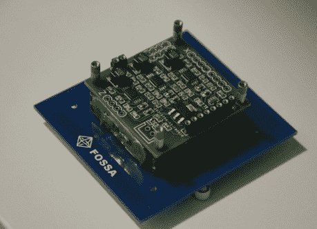
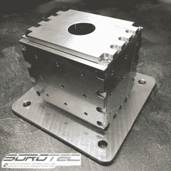

# 西班牙第一颗开源卫星

> 原文：<https://hackaday.com/2019/08/15/spains-first-open-source-satellite/>

总部位于马德里的非营利青年协会【Fossa Systems】正在开发一颗开源卫星，计划于 2019 年 10 月发射。fossa at-1 尺寸为 5x5x5 厘米，重量为 250 克，将通过低功率射频 LoRa 模块传递 LoRa RTTY 信号，提供免费的物联网连接。该卫星由效率为 28%的砷化镓 TrisolX 三结太阳能电池供电。

该卫星的开发和发射成本低于 30000 欧元，这对于立方体卫星——或皮卫星——该项目被称为——来说是相当可观的。它一直在超高频业余卫星波段(435-438 MHz)工作，最近获得了 125kHz 的 LoRa IARU 频谱分配。

    

这颗卫星的规格几乎和用来描述它们的缩略语一样引人注目。该设计包括基于 ATmega328P-AU 微控制器的板载计算机(OBC)、用于电信的 SX1278 收发器以及基于三个 SPV1040 MPPT 芯片和 TC1262 LDO 的电力系统(EPS)。该卫星还使用 TMP100 温度传感器、INA226 电流和电压传感器、用于单粒子翻转(SEU)保护的 MAX6369 看门狗、用于单粒子闭锁(SEL)保护的 TPS2553 以及用于太阳能电池板和天线部署的各种 MOSFETs。

到目前为止，该小组一直在通过气象气球跟踪 LoRa 的采用情况。cubesat 项目计划使用价值不到 5 美元的接收器测试新的 LoRa 扩频调制。最终目标是实现全球电信的民主化。

该卫星正在雷伊胡安卡洛斯大学的一个洁净室中建造，并在该设施中进行了热真空和振动测试。该小组后来开发了一个教育用的[卫星开发套件](https://fossa.systems/product/educational-pocketqube-lora-kit/)，它提供了三个 40×40 毫米的主板，允许添加修改。正如他们的任务所述，该小组正在寻求开发一个开源项目，因此卫星的代码可以在[他们的 GitHub](https://github.com/Bambofy/FossaSat-1) 上免费获得。

 [https://www.youtube.com/embed/8nvCpDvTl8w?version=3&rel=1&showsearch=0&showinfo=1&iv_load_policy=1&fs=1&hl=en-US&autohide=2&wmode=transparent](https://www.youtube.com/embed/8nvCpDvTl8w?version=3&rel=1&showsearch=0&showinfo=1&iv_load_policy=1&fs=1&hl=en-US&autohide=2&wmode=transparent)

The [HackadayPrize2019](https://prize.supplyframe.com) is Sponsored by:     