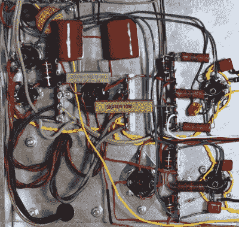

# 装扮贝尔&豪威尔 34 型示波器

> 原文：<https://hackaday.com/2019/07/04/sprucing-up-a-bell-howell-model-34-oscilloscope/>

我们不得不承认，在一个花几百美元就能买到带协议解码的四通道数字存储示波器的时代，很难不看到几十年前模拟 CRT 示波器的吸引力。当然，它们很重，更难使用，功能更差，但它们看起来太酷了。谁会拒绝在他们的长凳上放一件这样的经典装备呢？

 【科迪尼博】当然不能。尽管事实上他已经有了一个数字示波器，但他不能错过将大约 1973 年的一个钟& Howell Schools Model 34 添加到他的收藏中的机会。在重新投入使用之前，它需要一点小心，但现在它已经全部修好，准备投入使用。对于一个有将近半个世纪历史的齿轮来说，这已经不错了。

Model 34 的修复得益于这样一个事实，即[Cody]在交易中获得了示波器的原始手册和原理图，他很友好地扫描并上传给班上的其他人欣赏。你们中那些在旧电子设备上工作过的人已经能猜到示波器哪里最需要关爱:所有的电容器都需要换成新的。他还发现了几个不合规格的电阻，以及偶尔出现的焊接不良。

即使你不打算修理自己的中年示波器，他拍摄的 34 型示波器的内部照片也很吸引人。瞄准镜是成套出售的，所以结构出奇的简单，几乎完全是点对点的。当然，在工作中有一些权衡:[Cody]说在事情开始变得不稳定之前，它不会显示超过 2.5 MHz。但话说回来，对于音频工作和大多数业余爱好者项目来说，这已经超过了合理的频率上限。

自从示波器不得不在一张纸上画出读数的日子以来，示波器已经有了很大的进步。虽然[的新设备几乎埋葬了经典的模拟示波器](https://hackaday.com/2019/06/05/you-dont-need-that-bulky-crt-oscilloscope-anymore/)，但像这样的美人在我们的实验室仍然有一席之地。