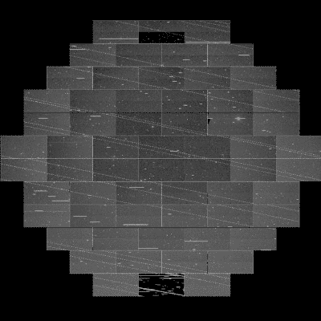

# Starlink 卫星给天文学家带来的问题

> 原文：<https://hackaday.com/2019/11/20/starlink-satellites-posing-issues-for-astronomers/>

在业余天文爱好者中，从地面上观测卫星是一项很受欢迎的消遣。通常，国际空间站和铱星是常见的景象，它们的轨道和设计使它们在天空中显得足够明亮。最近， [SpaceX 大规模发射 Starlink 卫星已经因为错误的原因引起了关注](https://twitter.com/89Marvaz/status/1196356715270291456)。

A capture from the Cerro Telolo observatory, showing the many Starlink satellite tracks spoiling the exposure.

Starlink 是 SpaceX 运营的一个项目，通过卫星提供互联网，使用各种技术来保持低延迟和高带宽。人们在谈论卫星间激光通信、自主避障以及限制太空垃圾数量的特殊设计。今年早些时候，我们已经在一篇综合文章中介绍了这项技术。

Starlink 飞船长期以来一直困扰着天文学家，他们依靠黑暗和无障碍的天空来开展工作。现在有大量的卫星在相对较低的轨道上，飞行器具有很高的反照率，这意味着它们反射了大量照射到它们身上的阳光。随着飞船以密集的列车队形发射，已经对研究工作产生了影响。

有希望的是，当飞船进入服役状态时，随着它向更高的轨道移动，这个问题将会减少。[据报道，SpaceX 公司也在考虑修改设计，以减少反照率](https://twitter.com/elonmusk/status/1132908689860415488?lang=en)，帮助天文学界保持一致。不管怎样，计划发射 12，000 到 42，000 颗卫星，这可能不是我们最后一次听到这个问题。