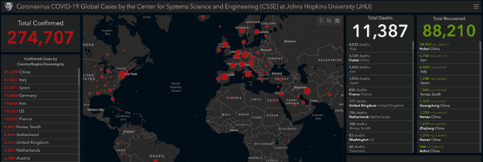
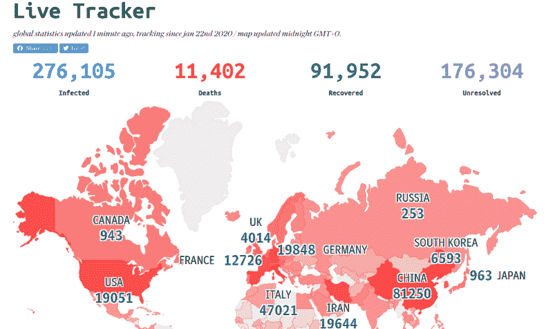

# 保持消息灵通:如何获取你自己的新冠肺炎数据

> 原文：<https://hackaday.com/2020/03/26/stay-informed-how-to-pull-your-own-covid-19-data/>

尽管我们拥有各种技术，但要从媒体那里获得任何具体的信息仍然是令人沮丧的困难。有时候你只想穿过噪音，看到一些真实的数字。观看半个小时的讨论可能不会告诉你太多关于新冠肺炎病毒如何在你的当地社区传播的信息，但看到来自多个经过审查的来源的实时数据可能会告诉你。

委婉地说，能够接触到新冠肺炎病例、死亡人数和康复情况的原始数据令人大开眼界。即使在你所在的世界角落，日常生活看起来几乎没有变化，但看到这些数字攀升的速度，真的会让你正确看待这场斗争。如果你知道在过去的 24 小时内你所在的地区出现了多少新病例，你可能就不太愿意出去悠闲地散步了。

但是这篇文章并不是告诉你如何感受这些数据，而是告诉你如何得到它们。之后你怎么处理它完全取决于你自己。取决于你住在哪里，你看到的数字可能会让你感觉好一点。这是你自己的信息，在这个不确定的时代，这可能是我们所能期待的最好的了。

## 刮疾控中心网站

如果你在美国，那么疾病控制和预防中心可能是目前唯一最可靠的新冠肺炎数据来源。不幸的是，虽然该机构通过他们的开放数据 API 提供了丰富的数据，但似乎事情发展得太快了，他们一时无法跟上。在撰写本文时，似乎还没有一个官方的 API，只有一个人类可读的网站。

[](https://hackaday.com/wp-content/uploads/2020/03/covidapi_cdc.png)

当然，如果我们能读懂它，那么电脑也能。该网站非常简单，我们只需几行 Python 代码就可以划分出所有案例的数量，我们甚至不需要使用正式的网络抓取库。应该注意的是，在正常情况下这不是一个好主意，因为网站布局的改变可能会破坏它，但这(希望)不是我们需要保持很长时间的东西。

```

import requests

# Download webpage
response = requests.get('https://www.cdc.gov/coronavirus/2019-ncov/cases-updates/cases-in-us.html')

# Step through each line of HTML
for line in response.text.splitlines():
    # Search for cases line
    if "Total cases:" in line:
        # Split out just the number
        print(line.split()[2][:-5])

```

在这个例子中，除了最后一行，所有的东西都应该很容易理解。基本上，它从网页中取出字符串，用空格作为分隔符将其分割，然后去掉后面的最后五个字符，去掉结束的 HTML 标记。绝对是一个黑客，但这就是这个网站的全部内容。

像这样从 CDC 提取数据时，有几件重要的事情需要记住。首先，既然网站现在是一个重要的信息来源，就不要锤它。真的没有理由一天点击页面一次或两次以上。第二，即使在疫情，疾病预防控制中心也保持正常的工作时间；该网站称统计数据只会在周一到周五更新。

## 约翰霍普金斯大学非官方 API

一个更好的选择是使用由约翰·霍普金斯大学系统科学与工程中心(JHU·CSSE)维护的数据库，尤其是如果你在寻找全球数据的话。这些数据是从全球多个来源收集的，并且在不断更新。不管你当时有没有意识到，你很有可能已经看过他们的在线仪表盘了，因为它已经成为任何跟踪新冠肺炎进程的人的无价参考。

[](https://hackaday.com/wp-content/uploads/2020/03/covidapi_dashboard.png)

这些数据[每天都会发布到官方的 GitHub 库](https://github.com/CSSEGISandData/COVID-19)上，供任何想在本地克隆它的人使用，但这对我们的目的来说并不太方便。幸运的是，法国数据科学家 [Omar Laraqui 已经开发了一个 web API](https://github.com/Omaroid/Covid-19-API) ，我们可以使用它轻松地查询数据库，而不必下载整个数据库。

他的 API 提供了很多粒度，并允许您查看特定省或州有多少案例或恢复。你需要尝试一下位置代码，因为似乎没有可用的列表，但是一旦你找到了你想看的地方的 ID，就很容易得到最新的统计数据。

```

import requests

# Get data on only confirmed cases
api_response = requests.get('https://covid19api.herokuapp.com/confirmed')

# Print latest data for location ID 100: California, USA
print(api_response.json()['locations'][100]['latest'])

```

API 在 [/latest](https://covid19api.herokuapp.com/latest) 也有一个方便的端点，它将简单地向您显示活动病例和死亡的全球总数。

## 病毒跟踪器 API

另一个选择是 thevirustracker.com 的免费 API。我有点犹豫要不要推荐这项服务，因为它具有某些人希望利用灾难的所有特征，而且该网站似乎经常宕机。也就是说，它易于使用，并为您提供了许多似乎无法从其他来源获得的非常方便的数据点。

[](https://hackaday.com/wp-content/uploads/2020/03/covidapi_tracker.png)

例如，它允许您查看有多少案例被认为是严重的，以及今天增加了多少新案例。该 API 还包括与您选择的国家相关的最近新闻条目列表，如果您想制作自己的仪表板，这可能会很有用。

```

import requests

# Request fails unless we provide a user-agent
api_response = requests.get('https://thevirustracker.com/free-api?countryTotal=US', headers={"User-Agent": "Chrome"})
covid_stats = api_response.json()['countrydata']

# Break out individual stats
print("Total Cases:", covid_stats[0]["total_cases"])
print("New Today:", covid_stats[0]["total_new_cases_today"])

```

## COVID 跟踪项目

虽然缺乏约翰霍普金斯数据库的全球数据，但 [COVID 跟踪项目](https://covidtracking.com/)提供了目前可用的功能最丰富、记录最完整的 API。该项目由一组记者在 3 月初启动，致力于不仅从州和地区卫生机构，而且从可信的当地记者网络收集准确的信息。有趣的是，他们表示，如果 CDC 推出他们自己的带有完整州级数据的 API，该项目可能会被暂停。

通过这个 API 可以获得令人难以置信的大量信息，包括各个州的历史每日数据。该 API 的独特之处还在于，它不仅会显示有多少人的新冠肺炎病毒检测呈阳性，还会显示那些已被清除的人。这可以让你看到每个州实际上做了多少测试，这也是该项目希望 CDC 官方报告的数据的关键点之一。

```

import requests

# Get current data for New York, USA
api_response = requests.get('https://covidtracking.com/api/states?state=NY')

# Show positive and negative test results
print("COVID-19 Testing Results in", api_response.json()['state'])
print("Positive:", api_response.json()['positive'])
print("Negative:", api_response.json()['negative'])

```

因为他们的团队在发布数据之前会仔细审查数据，所以 COVID 跟踪项目可能不会像其他一些来源那样快速更新。但是如果你正在寻找关于美国“地面”上发生的事情的最准确的信息，这绝对是你想要的 API。

## 知识就是力量

在仔细研究了这些数据源之后，您可能会注意到它们并不总是一致的。事情发展得如此之快，以至于即使像这样直接找到源头，也会有一定的误差。一种合理的方法可能是获取多个数据源，然后将它们平均在一起，尽管这是假设您能够在每个服务上深入到相同的级别。

正如本文介绍中所述，如何处理这些信息完全取决于您自己。出于我自己的目的，我组装了一个小小的网络连接显示器，这样我就可以监控美国的病例总数，老实说，这是一次令人清醒的经历。看到每天数以千计的*号*在增加，这真的让我关注到了这个情况；我知道当这篇文章发表的时候，图中显示的数字会比最新的数字低很多。

我不能说我特别高兴每天早上都能看到最新的数据，但我宁愿知道我们面临的是什么，也不愿对此视而不见。直觉告诉我，你们中的许多人会有同样的感觉。如果你想找一些不那么令人沮丧的东西，你可以随时滚动一些令人高兴的数据，甚至可以在恢复数量上升时显示一个动画。在外面注意安全。