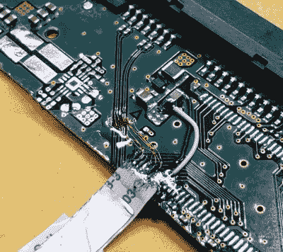

# 稳定的手动再利用廉价固态硬盘模块

> 原文：<https://hackaday.com/2018/11/08/steady-hand-repurposes-cheap-ssd-modules/>

对于黑客来说，廉价(也可以说是一次性的)消费硬件有助于免费或低价组件的现成供应。当你走进一家大卖场，花 150 美元买到一台新的低端笔记本电脑时，有多少人会花钱去维修或升级他们现在拥有的那台呢？所以旧的被扔进垃圾箱，或者在网上卖零件。从生态学的角度来看，我们的一次性社会是可怕的，但至少我们从这笔交易中得到了一些技术上的便宜。

 举个例子，[极其便宜的 32 GB eMMC 固态硬盘【杰森·金】最近拿下了](https://ripitapart.com/2018/11/06/emmc-adventures-episode-3-building-a-custom-adapter-to-use-cheap-emmc-based-32gb-ssd-modules/)。惠普公司在他们的经济型笔记本电脑生产线上使用了这款硬盘，他能够以每块 12 美元的价格抢购其中一些定制硬盘。唯一的问题是，由于它们是为一个非常特定的市场和使用情况而设计的，它们并不是那种你可以随便放在电脑硬盘上的东西。他不得不做一些逆向工程来找出如何与它们交谈，然后进行一些令人印象深刻的精细焊接来插入它们，但最终他以非常低的价格获得了一些非常方便的驱动器。

[Jason]首先使用黑客电子工具包的基石:万用表来找出驱动器的引脚排列。通过将一根导线放在明显的接地点，如 PCB 的螺丝孔，您可以通过连接器上的引脚进行工作，并做出一些有根据的猜测。接地引脚将显示为短路，但电表应将电源和数据引脚显示为正向偏置二极管。凭借对 pin 身份的粗略了解和一些运气，他能够发现这基本上是一种不同形式的标准 SATA 连接。

为了真正将其连接到他的计算机上，他从一个废弃的 SATA 硬盘上取下 PCB，将其切割成合适的尺寸，并能够使用细电磁线将驱动器带状电缆中的导体连接到适当的焊盘上。他用适量的热胶水密封了所有东西，以确保它不会松动，然后在他拼凑的 SSD 上运行了一些驱动器诊断程序，以确保它运行正常。[Jason]报告称该硬盘并不完全是速度恶魔，但鉴于其低成本和良好的性能，他仍然认为值得使用它们来测试不同的操作系统等。

[杰森]似乎对 eMMC 黑客有点着迷。上次我们听到他的消息时，[他正通过更换 eMMC 的 shot 芯片，让廉价的 Windows 平板电脑起死回生。](https://hackaday.com/2018/03/06/hot-air-surgery-revives-a-cheap-windows-tablet/)