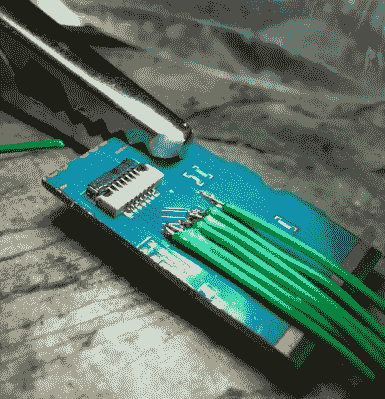

# 股票期待 PSP 隐藏一个树莓 Pi 零

> 原文：<https://hackaday.com/2018/10/21/stock-looking-psp-hides-a-raspberry-pi-zero/>

我们没有看到很多 PSP 在这些方面遭到黑客攻击，也许是因为这个系统从来没有达到任天堂 Game Boy 系列在其全盛时期获得的那种代次。这是一个遗憾，因为这确实是一个相当不错的系统，有很大的黑客潜力。它的大尺寸使它更容易移植新的硬件，控制很好，二手市场上也不缺乏它们。

 希望像[这个来自【Drygol】](https://www.retrohax.net/pisp-old-project-in-new-skin/)的不可思议的“PiSP”这样的项目将激励更多的黑客重新审视索尼在废黜任天堂便携式王者地位方面的勇敢尝试。凭借他一贯对细节的关注，他成功地用 Pi 零运行 RetroPie 替换了 PSP 的原始内部，同时保持系统的外部看起来几乎完美。这并不完全是在公园散步，但我们会说，结果肯定证明了手段。

项目的前半部分相对来说没什么痛苦。[Drygol]剥离了所有原来的内部部件，安装了一个新的液晶显示器，它非常适合，看起来像是为 PSP 制作的东西。然后，他添加了一个 USB 锂离子充电器板(配有由 3D 打印机灯丝制成的“光导管”)，以及一个音频板，以从通常静音的 Pi Zero 中获取声音。他很难把所有东西都装进箱子里。解决方案是用一部旧诺基亚手机的扁平锂电池来使东西变得更薄，只要用一些磁铁将 PSP 的外壳吸住就够了。

最终成为构建中最难的部分是让最初的控件工作起来。[Dyrgol]想在 PSP 的主板上使用原来的 ZIF 连接器，这样他就不必修改股票带状电缆。但这是说起来容易做起来难的事情之一。切掉带有连接器的 PCB 部分没有问题，但是需要一只稳定的手和一个 USB 显微镜来将所有的电线焊接到它的轨迹上。但最终结果肯定是一个不错的接触，使安装更干净。

我们已经[报道了 PSP 家酿](https://hackaday.com/2010/06/21/psp-homebrew-using-the-half-byte-loader/)的激动人心的世界，甚至为解决原始硬件的缺乏而建造的 [DIY 电池，但在过去几年里它相当安静。这里希望这不是我们最后一次在这些页面上看到索尼的光滑掌上电脑。](https://hackaday.com/2014/09/20/psp-lithium-hack-could-be-called-the-franken-cell/)

 [https://www.youtube.com/embed/eWzJYHTUtrA?version=3&rel=1&showsearch=0&showinfo=1&iv_load_policy=1&fs=1&hl=en-US&autohide=2&wmode=transparent](https://www.youtube.com/embed/eWzJYHTUtrA?version=3&rel=1&showsearch=0&showinfo=1&iv_load_policy=1&fs=1&hl=en-US&autohide=2&wmode=transparent)

