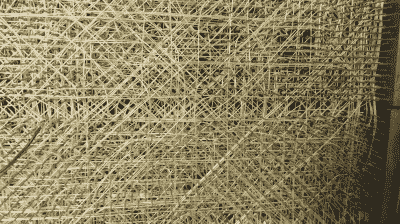

# 字符串艺术机器人是一个反向自动路由器

> 原文：<https://hackaday.com/2018/09/15/string-art-robot-is-an-autorouter-in-reverse/>

在 Etsy 和 Pinterest 的深处是一种迷人的艺术形式，尽管有些乏味。线条画，在木板上钉上钉子，用线缠绕四周来创造形状和阴影的过程，这方面最受欢迎的项目是用线把一颗心的轮廓画成你家乡的形状。至少是类似的东西。

虽然这种艺术形式涉及的努力与托盘木家具一样多，但它有一个有趣的计算方面:你可以用细绳艺术来创建图像，而这样做是一个非常非常难以用算法解决的问题。[维也纳大学的研究人员展示了弦乐艺术的精华](https://www.tuwien.ac.at/en/news/news_detail/article/126174/)。他们给一个工业机器人编了程序，用绳子制作肖像。

这个实验的设置非常简单。这是一个圆形框架，周围布满了 256 个钩子。一个工业机器人手臂将几公里长的线缠绕在一个钩子上，然后移动到另一个钩子上。重复成千上万次，你就会得到阿达·洛芙莱斯或爱因斯坦的肖像。

The wire wrapped backplane of a DEC PDP-11\. This was assembled by a robot that was programmed with an autorouter. It’s also string art.

这里真正的技巧是获取图像并将其转换为字符串将采用的路径的算法。这是一个 NP 难的问题，但却是一个令人惊讶的被充分研究的问题。第一款自动布线器是我们为绕线式计算机设计的，你绝对不要相信它可以在 PCB 上的封装之间布线。在这里，计算机会在任何需要连接的针脚之间找到最短的路径。当然，这也有局限性:由于电线缠绕的特性，引脚上只能有这么多连接，而且你不可能为一条并行总线准备一大堆电线。第一个自动路由器是字符串艺术算法，只是相反。

你可以在这里看一下[的完整发表。](https://onlinelibrary.wiley.com/doi/10.1111/cgf.13359)

你也可以在我们自己的网页上找到现有的艺术作品。这里有一位艺术家用手做这件事，如果你懒的话，这里有一台机器为你做这件事。我们甚至看到[在 Hackaday.io 上对底层算法](https://hackaday.io/project/130951-diy-knit)做了进一步的工作