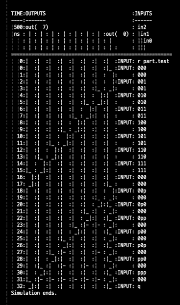
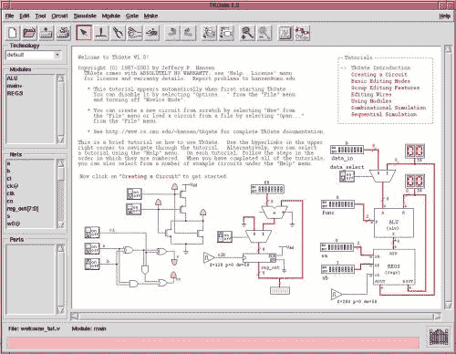
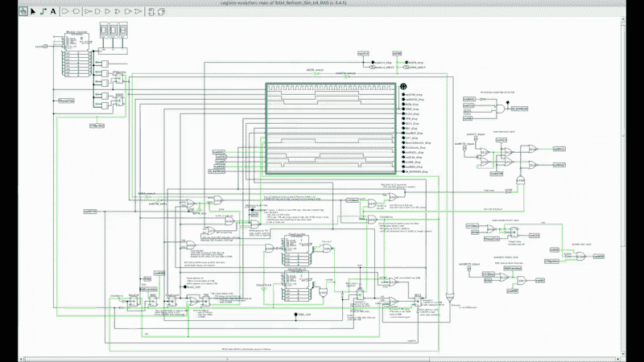
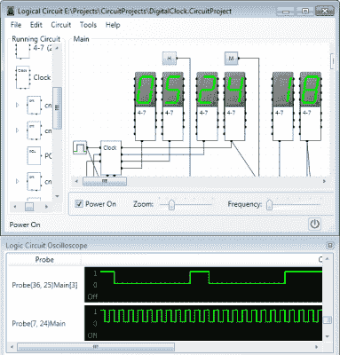

# 简单逻辑模拟器综述

> 原文：<https://hackaday.com/2021/06/10/survey-of-simple-logic-simulators/>

几个月前，[Ken Shirriff]的一条关于简单数字模拟器的推文引起了我的注意。这个话题在 5 月份再次出现，当时由[CuriousMarc]制作的一个[维修视频](https://www.youtube.com/watch?v=-mHjTjn6XWA)展示了一个叫做 *Logisim-evolution* 的模拟器。这让我想以全新的眼光看待外面有什么，以及哪些功能将不同的模拟器区分开来。

所以今天，让我们快速浏览一下我找到的几个这样的模拟器。我专注于简单的逻辑模拟器，使用布尔逻辑分析 1 和 0。他们没有对晶体管逻辑门进行类似 SPICE 的模拟分析，但是他们仍然可以很方便地验证设计。

## logisim

1983 年的 Logicsim 是我们列表中最古老的一个，由 Wun Chin Kau 和 Douglas Jones 开发，用于支持爱荷华大学计算机科学系的计算机科学实验室课程。这是一个基于文本的模拟器，开源用于个人和研究用途，用 Pascal 写的[。最近在 2008 年，](http://homepage.divms.uiowa.edu/~jones/logicsim/logicsim.p)[一个用户能够使用 FreePascal 编译它](https://programmersheaven.com/discussion/371375/iowa-logic-simulator-logicsim-p)。

## TKGate

接下来是 [*TKGate*](https://bnoordhuis.github.io/tkgate/) ，由卡耐基梅隆大学的本科生于 1987 年开发的一个项目。它用 C 和 Tcl 编写，最后一次更新是在 2016 年，由杰弗里·汉森[在 Sourceforge](https://sourceforge.net/projects/tkgate/) 上维护。在我发现的所有模拟器中，这是唯一一个包含隐藏的煎饼配方的。

## 我的逻辑

下一个是由卡尔·伯奇教授在 2000 年为他在明尼苏达州圣本尼迪克特学院和圣约翰大学的学生开发的*(注意遗漏的‘c’)。它用 Java 编写，是开源的，可以在 Sourceforge 上获得[。他在 2013 年改变了重点，开发了一个名为](https://sourceforge.net/projects/circuit/) [*Toves*](http://www.cburch.com/logisim/index.html) 的后续程序，也是在 Sourceforge 上开源的[，但用 C#/Mono 编写。这两个项目似乎都被放弃了，但仍然可用。Logisim 似乎在高校中很受欢迎](https://sourceforge.net/projects/toves/files/Version%200.x/0.0.1/)*

 *

伯奇教授离开后，逻辑主义的许多分支突然出现，填补了空白。其中包括:

*   波斯顿温特沃斯理工学院的约瑟夫·劳伦斯。
*   [*Logisim-evolution*](https://github.com/reds-heig/logisim-evolution)出可重构研究所&嵌入式数字系统(REDS)，瑞士伊韦尔登莱班。更新:自从写了这篇文章后，[CuriousMarc]已经发布了一个关于如何开始使用 *Logisim-evolution* 的[教程视频](https://www.youtube.com/watch?v=gYmDpcV0X7k)。
*   [*数字*](https://github.com/hneemann/Digital) ，一个受 *Logisim* 启发的模拟器，但由德国巴登-符腾堡合作州立大学的赫尔穆特·尼曼教授从零开始建造

## 逻辑电路和其他一些

*逻辑电路，*2016 年开发，[开源](https://dev.azure.com/evglep/LogicCircuit/_git/LogicCircuit)用 Visual Studio for Windows 编写。

密歇根州立大学的瑞德·李察开发了一个名为 *logic-sim* 的程序。我们发现这个问题在埃默里大学的[计算机科学课程大纲](http://www.mathcs.emory.edu/~jallen/Courses/355/Syllabus/syl.html)中有非常详细的解释。唉，这个程序本身要么是专有的，要么是被互联网数字腐蚀掉了。

以下是对[Ken]推文的回复:

*   [花栗鼠开路设计](http://opencircuitdesign.com/~tim/programs/chipmunk/index.html)
*   [anira 开发工具](https://people.csail.mit.edu/ebakke/anitra/article.html)
*   [Proteus VSM 实验室](https://www.labcenter.com/vsmstudio/)
*   [SmartSim(在树莓 Pi 上)](https://smartsim.org.uk)
*   [Antares 数字电路学习平台](https://www.antarescircuit.io/docs/about/)
*   [EDA 游乐场](https://www.edaplayground.com)
*   [开源量子开发](https://qiskit.org)
*   [Multisim Live](https://www.multisim.com/)
*   [Autodesk Tinkercad](https://www.tinkercad.com)
*   [雪松逻辑模拟器](https://sourceforge.net/projects/cedarlogic/)
*   [Logic.ly](https://logic.ly)
*   [iCircuit 3D](http://icircuit3d.appmanuals.com)
*   [模拟器. io](https://simulator.io)
*   [电路资源](https://circuitverse.org)
*   [逻辑星期五](https://www.electronicsforu.com/buyers-guides/software-buyers-guide/logic-friday-digital-logic-design)

我对有这么多模拟器感到惊讶，尽管我期待更多基于文本的命令行工具，如 *Logicsim* 。我们在过去写过一些这样的逻辑模拟器，包括文本的[逻辑模块](https://hackaday.com/2018/05/21/online-logic-simulator-is-textual-no-graphical/)和一个 [Javascript TTL 模拟器](https://hackaday.com/2020/11/02/ttl-simulator-in-javascript/)。你在你的项目中使用这些模拟器吗，或者你能推荐一个吗？你对这些工具的文本界面和 GUI 界面有什么看法？请在下面的评论中告诉我们。*