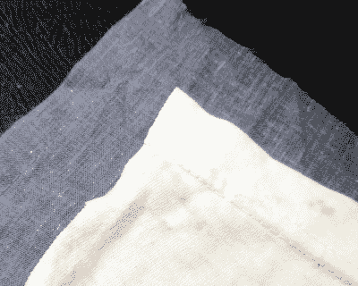
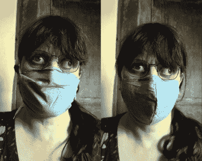
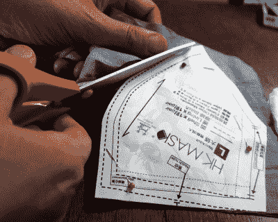
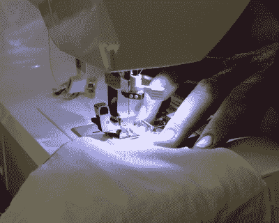
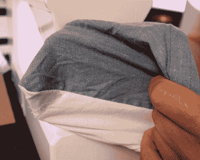
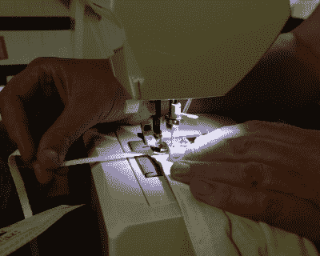
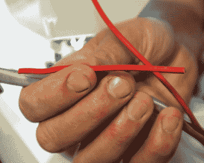
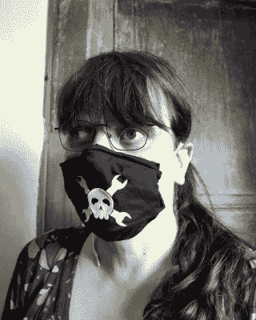

# 作为一名黑客在疫情生存:制作你自己的面具

> 原文：<https://hackaday.com/2020/06/10/surviving-the-pandemic-as-a-hacker-making-a-mask-of-your-very-own/>

随着新冠肺炎·疫情继续在世界各地发展，我们的社区一如既往地作出回应，设计和制作旨在解决我们所处的情况所产生的问题的东西。这项工作的大部分投入到了生产个人防护设备以填补缺口，许多关键员工受到了制造商提供的设备的保护，而剩余的工作则为与 COVID 相关的项目产生了一系列[巧妙的设计](https://hackaday.com/2020/04/23/3d-printed-covid-stuff-thats-not-face-shields-or-ventilators/)。

随着许多地区的曲线变平，世界各地的政府现在都鼓励在日常社交中佩戴口罩。普通大众戴口罩的目的是为了捕捉飞沫，而不是过滤病毒，自制口罩很容易做到这一点。所以让我们来看看你需要知道的关于制作你自己的桅杆的事情。

## 现在是谈论制作个人防护装备的时候了

Raiding my old clothes and bed linen for mask materials

[在本系列的第一部分](https://hackaday.com/2020/06/03/surviving-the-pandemic-as-a-hacker-peering-behind-the-mask/)中，我概述了普通公众口罩与医务人员口罩的不同要求，并研究了几种市售的选择。我们现在将一起检查自制面具的材料和结构。

在过去，我已经详细地观察过[缝纫机](https://hackaday.com/2016/10/26/why-you-should-own-a-sewing-machine/)和[织工工作台](https://hackaday.com/2017/05/23/the-textile-bench/)，但是对于面具制作，你应该可以使用几乎任何缝纫机，一把锋利的布料剪刀，也许还需要一些大头针来使你的生活更轻松。我希望我们的社区以良好的状态度过这一切，所以我邀请你和我一起在缝纫机旁。你可以制作一种[政府认可的简单无缝合口罩](https://www.gov.uk/government/publications/how-to-wear-and-make-a-cloth-face-covering/how-to-wear-and-make-a-cloth-face-covering)，但是在接下来的几个月里，没有什么可以替代缝合口罩。

在考虑面膜之前，我们必须先从面料的选择开始。重要的是，无论你的面罩包含哪一层，都必须既能有效过滤，又能安全呼吸。无论什么样的空气通过它都会进入你的肺部，所以你可以想象会有不合适的物质给你带来严重的问题。特别是一些无纺布没有设计成过滤器，会脱落纤维，一些材料可能含有矿物质或有害的化学成分。例如，一个普遍吹捧的想法是，真空吸尘器袋根据其过滤能力制成合适的材料，但是由于真空吸尘器袋的纸张含有杀真菌剂和其他有害物质，因此很难确定您的袋子是否可以安全呼吸。[我们在 3 月份曾报道过一些研究](https://hackaday.com/2020/03/18/homemade-masks-in-a-time-of-shortage/)，这些研究着眼于各种材料的有效性，为了本文的目的，我们将继续他们的双层设计结论，以棉 t 恤面料和棉床上用品为特色。

## 制作许多面具

Left: pleated mask. Right: fitted mask.

有各种各样的面具设计，但它们都属于两大类，一类是褶皱的“外科手术”风格，另一类是中间有接缝的更合身的风格。你选择的风格是个人喜好的问题。

在这两种款式中，我发现打褶的设计更容易制作，但不够时尚，合身的款式很难做对，但值得坚持——一旦你确定了尺寸，你就可以准备几件。

我使用的图案是 [HK 面具](https://diymask.site/)，这是我尝试的第一个合身的面具， [Tanya Fish 的带说明的图案](https://tanyafish.com/tutorials/)，以及[sleep phones](https://www.sleepphones.com/Comfortable-Coronavirus-Face-Mask-Beard-Glasses-Fogging)的褶皱面具图案，我对其做了一些修改。

## 模式行为

Cutting the panels using the pattern for the fitted mask

Sewing the two layers together to form an inside-out bag

第一步是根据尺寸打印出图案，并把它别在你的材料上。对于合身的面具，你可以将每一层的两块样板缝在一起，对于褶皱面具，你只需剪出一块长方形的布料。从那里开始，沿着三条缝将各层缝在一起，形成一个由内而外的包，将你使用的鼻加强筋整合到顶部的缝中。

## 转弯并固定好带子

Turning the bag inside out to make the mask

Sewing the pleats and the trainer lace used as a tie

我们让第四条边敞开着，这样你就可以把袋子翻出来。剩下的线缝现在可以用顶部缝合了。无论你选择什么样的设计，最好都按照说明去做，但是一旦你做了几个，你就会有感觉了，并且能够按照你认为合适的方式修改图案。

在商用口罩上，领带通常是有弹性的，可以挂在耳朵上或头上。在疫情期间，有时会出现松紧带短缺，所以我用运动鞋鞋带来代替。你也可以试着用 3D 折页设备和缝纫机制作自己的斜带，或者从一次性口罩上省下橡皮筋。松紧带可以在缝制时加入侧缝中，或者在运动鞋鞋带的情况下，松紧带的中点可以放在侧缝或褶裥区域的中心，然后缝制在面料表面。

## 贴合你的鼻子，为你的面具增添一些风格

A single conductor from insulated copper house wiring cable, used as a nose wire.

鼻线几乎可以是任何坚硬但足够弯曲的东西，可以经受住清洗。管道清洁器和园艺电线都被使用过，我尝试了一个不够硬的电缆扎带，最后我满足于英国房屋布线电缆的单根绝缘铜导线。我建议你在使用一个之前先尝试几个，以便于使用。

这些口罩不是无菌医疗器械，但应该定期清洗。肯定有很多方法可以让它们绝育，但我还没走到那一步。相反，既然建议是新冠肺炎病毒有一个对肥皂敏感的外壳，我就用洗衣机洗我的口罩和其他衣物。

Staying on-brand through the pandemic.

最后，折叠口罩有两种折叠方式。第一种是一系列朝一个方向折叠的短板，但还有一种是使用盒褶，一个较大的平面区域，在相反的方向有较小的褶。这对穿着者来说没什么区别，但后一种风格有助于更好地展示织物上的任何标志或图案。

特别是去年 10 月在荷兰举行的 eth0 活动上，我有幸让一位朋友用兄弟刺绣机在一块亚麻服装面料上拧上一个扳手。从那以后，它就一直放在我的纺织品盒子里，在盒子褶裥的中心有一个标志的扳手面具是它的完美用途。我很抱歉，这是一次性的，但也许它会给你的想法，你应该知道谁有类似的刺绣机。

我希望到目前为止，这个系列的两个部分已经填补了你关于口罩知识的空白，并为你提供了制作自己的口罩所需的一切。这个系列还有一部分是关于作为一名黑客如何在疫情中生存，这一次与病毒本身无关。封锁和隔离对我们大多数人来说是一生一次的剧变，这本身就会对人们产生影响。我们将着眼于幸存下来的心理健康方面，以及如何带着尽可能少的伤疤走出另一面。