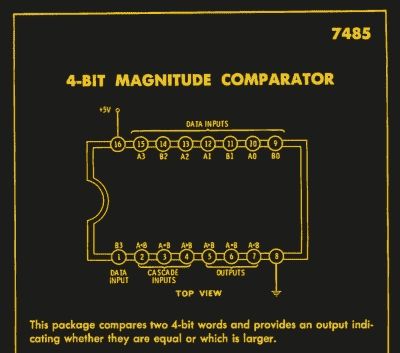
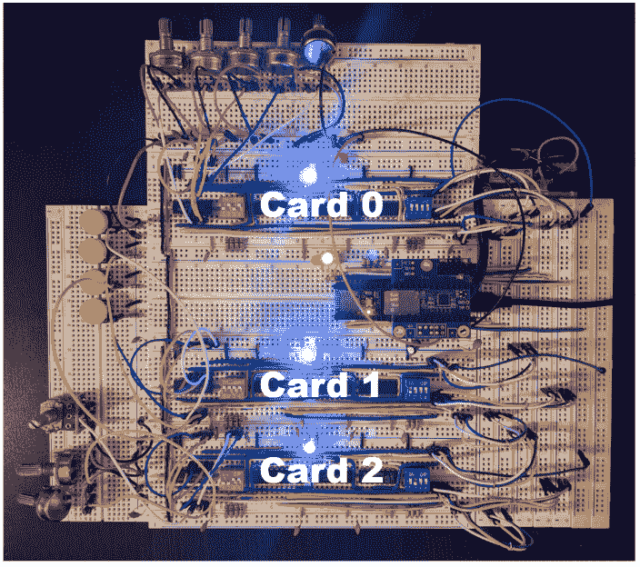

# Synth 增益即插即用模拟多路复用器

> 原文：<https://hackaday.com/2021/05/04/synth-gains-plug-and-play-analog-mux/>

高中计算机工程教师[Andy Birch]在他自制的 synth 上不断丢失 I/O 引脚，所以他定制了一个[即插即用可寻址多路复用系统](https://hackaday.io/project/178959-synth-design-system-addressable-mux-circuit)来解决这个问题。[Andy]的 synth 基于 Teensy 微控制器，他已经使用 CMOS 模拟 8:1 多路复用器芯片(CD4051)给他更多的 I/O 引脚。但是 I/O 引脚扩展意味着现在有更多的 I/O 引脚要忘记。*我是在 U3 的第 13 号针脚上连接了俯仰电位计还是 U10 的第 2 号针脚？*

他继续为每个 I/O 卡设计一个寻址系统，使用三位(可扩展到四位)支持八个卡，将来可能最多支持 16 个卡。由于每张卡可能不会使用全部八个信号，所以每张卡可以告诉青少年它有多少个信号。[Andy]使用 OR 和 XOR 门对每张卡进行地址解码。我们会考虑使用一个 74HC85 四位幅度比较器。这将只需要一个芯片，而不是两个，但会剥夺他的学生学习门级地址解码的机会。

当看到术语“I/O 卡”时，你可能会像我们一样被愚弄，以为这是使用 PCB 和某种主板。[Andy]的 I/O 卡实际上是安装在 synth 控制面板背面的无焊试验板。我们真的很喜欢他的总线技术——他从几个试验板上移除了电源板部分，并将它们重新用作地址和数据总线。查看[Andy]准备的完整文档，并在下面的评论中告诉我们您是否曾经为某个项目设计过自己的即插即用方法。

我们爱我们的一些 mux！ ]

I/O Cards — Note the use of Power Strip Bars as Data / Address Buses