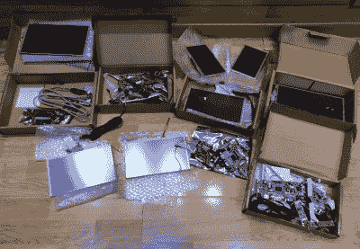

# 合成器有一个外部触摸屏

> 原文：<https://hackaday.com/2020/07/08/synthesizer-gets-an-external-touch-screen/>

像其他高端雅马哈 MODX 的所有者一样，[sn00zerman]对合成器的集成触摸屏并不满意。它有点小，而且不是一个观看的好角度。所以他的任务是找到一种方法来增加一个更大的外部触摸屏，而不需要对昂贵的仪器做任何永久性的修改。

这似乎是一个艰巨的任务，但他不是从零开始。众所周知，如果你使用 USB 转 DVI/HDMI 适配器，你可以将外部显示器插入其中；但如果没有触摸覆盖，这不是一个特别有用的技巧。他考虑为设备的内置触摸屏添加一个外部连接器，但这违反了他的不可修改规则。考虑到这些东西的价格，我们不能责怪他不想在侧面打一个洞。

Sometimes you just have to dig out the right parts.

所以他开始寻找一种软件解决方案来完成剩下的路。幸运的是，MODX 运行 Linux，雅马哈很好地履行了他们的 GPL 责任，并为任何感兴趣的人发布了源代码。在四处摸索的过程中，他发现设备[使用 tslib 与触摸屏](https://github.com/libts/tslib)对话，这是【sn00zerman】在之前的项目中使用过的。他意识到解决方案可能就像找到一个与 MODX 上运行的 tslib 版本兼容的 USB 触摸屏控制器一样简单。

最后，在他的零件箱里找到了一个独立的触摸屏控制器，他凭经验知道这个控制器可以和图书馆一起工作。果然，当插入 MODX 时，操作系统接受它作为输入设备。通过增加 USB 集线器，他能够将其与现有显示器结合起来，最终为他的合成器提供一个更舒适的用户界面。

现在他所要做的就是插上一个 USB 软驱，他将拥有最终的雅马哈节拍实验室。

 [https://www.youtube.com/embed/pjelA23g-Sc?version=3&rel=1&showsearch=0&showinfo=1&iv_load_policy=1&fs=1&hl=en-US&autohide=2&wmode=transparent](https://www.youtube.com/embed/pjelA23g-Sc?version=3&rel=1&showsearch=0&showinfo=1&iv_load_policy=1&fs=1&hl=en-US&autohide=2&wmode=transparent)

