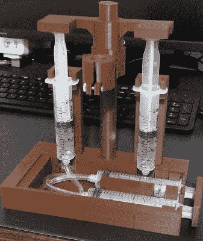

# 注射器在这个迷你钻床上施加压力

> 原文：<https://hackaday.com/2020/07/05/syringes-put-the-squeeze-on-this-mini-drill-press/>

如果你在家里为通孔项目制作自己的 PCB，蚀刻电路板只是成功的一半；你还是得钻那些小洞。这是一个单调乏味的过程，如果你有很多，徒手用钻孔机做是不行的。这就是为什么[【ru chir Chauhan】建造了这个小小的 3D 打印钻床](https://hackaday.io/project/173412-hydraulic-drill-press-on-shoe-string-budget)。

 这个设计实际上很有趣，原因有很多。它主要是 3D 打印的事实是一个大问题，尽管我们当然不是第一次看到这种情况。我们还喜欢最少的零件数量和低成本，这肯定会吸引那些希望在预算内生产 PCB 的人。但最令人印象深刻的特征是液压系统[Ruchir]已经想出实际进行钻探。

使用四个注射器、一些水和一点管子的系统来拉下工具，而不是拉臂来降低朝向工件的钻头。这可能看起来很奢侈，但是如果你有很多洞要钻，这个设计真的会节省你的手臂。这种方法也应该给你更一致和准确的结果，因为你不会把任何扭矩的结构，你会与手动操作的新闻。

[Ruchir]在该项目的 Hackaday.io 页面上没有提供太多的说明，但一旦你打印出所有提供的 STL 并准备好注射器，其余的应该是相当不言自明的。就我个人而言，我们可能会在那里添加一个光滑的钢棒，以确保运动是漂亮和直的，但我们可以看到用印刷零件来做它以保持便宜的吸引力。

寻找更多的想法？如果你想要更大一点的东西[，我们可能会推荐这款由 PVC 管制成的](https://hackaday.com/2017/03/31/make-a-pvc-drill-press/)，还有[这款 3D 打印桌面压力机放在任何人的工作台上都会很好看](https://hackaday.com/2019/09/05/print-a-drill-press-for-your-printed-circuit-boards/)。如果你的胳膊累了，别怪我们。

 <https://hackaday.com/wp-content/uploads/2020/07/drill-press-short-video.mp4?_=1>

[https://hackaday.com/wp-content/uploads/2020/07/drill-press-short-video.mp4](https://hackaday.com/wp-content/uploads/2020/07/drill-press-short-video.mp4)