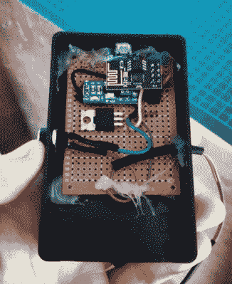

# 与 ESP8266 的通话电报

> 原文：<https://hackaday.com/2019/02/21/talking-telegram-with-the-esp8266/>

在这一点上，如果你想拼凑一个小型互联网连接的小工具，那么 ESP8266 家族的成员可能是你的最佳选择。成本低至 3 美元，这款有据可查的一体化解决方案无与伦比。当然，硬件只是等式的一半。决定如何处理家酿物联网设备的软件方面完全是另一回事。

A simple Telegram ESP8266 switch

公平地说，没有明确的“正确的”方法来处理软件，它实际上取决于您的特定项目的需求或限制。例如， [[Brian Lough]发现在他的 ESP8266 中内置电报支持可以让他以最少的忙乱完成他的目标](https://github.com/witnessmenow/Universal-Arduino-Telegram-Bot)，同时使用他已经熟悉的环境。他最近写信与我们分享了他的一个 Telegram 项目，并在休息后的视频中，花时间解释了他最喜欢通过加密聊天平台控制他的硬件的一些事情。

但你不必相信他的话，你可以自己试试。多亏了[Brian]开发的将他的项目连接到 Telegram 的软件库，它被恰当地命名为“通用 Telegram Bot 库”，任何人都可以轻松地跟随他的脚步。将他的电报库添加到您的下一个 ESP8266 项目中就像在 Arduino IDE 中选择它一样简单。从这里开始，视频解释了从 Telegram 获取 bot ID 的过程，以及最终如何使用它从服务接收消息。你如何处理这些信息完全取决于你自己。

根据[Brian]的说法，主要的缺点是你不得不依赖一个 web 服务来控制你的本地设备；如果互联网瘫痪，或者你宁愿你的小黑客项目不要与可怕的大互联网对话，那就不理想了。如果你更愿意让你所有的智能东西都在你自己的网络范围内交流，[也许你的下一个项目是建立一个私有的 MQTT 服务器](https://hackaday.com/2016/05/09/minimal-mqtt-building-a-broker/)。

 [https://www.youtube.com/embed/-IC-Z78aTOs?version=3&rel=1&showsearch=0&showinfo=1&iv_load_policy=1&fs=1&hl=en-US&autohide=2&wmode=transparent](https://www.youtube.com/embed/-IC-Z78aTOs?version=3&rel=1&showsearch=0&showinfo=1&iv_load_policy=1&fs=1&hl=en-US&autohide=2&wmode=transparent)

