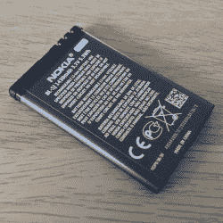

# 拆解专家对拉伸释放粘合剂大加赞赏

> 原文：<https://hackaday.com/2020/11/08/teardown-experts-sing-praise-of-stretch-release-adhesives/>

任何喜欢打开消费电子产品的人都知道 iFixit 是一个有价值的资源，充满了参考图片和维修程序，以帮助恢复设备并使它们远离电子垃圾。作为可修复性的倡导者，他们沮丧地看到对更薄更轻设备的追求也使它们更难修复。但是他们想为这个暗淡的景观中的一个亮点欢呼:[拉伸释放粘合剂的使用越来越多](https://www.ifixit.com/News/45779/ask-ifixit-what-is-stretch-release-adhesive-and-why-do-we-love-it)。

An elegant battery, for a more civilized age.

从前，电池被设计成用户可更换的。但这需要接入机制、电连接器和脆弱电池周围的保护壳。消除这种开销可以让设备更纤薄，但并不能改变电池仍然需要更换的事实。因此，我们进入了一个黑暗的时代，电池袋被粘在设备上，更换电池意味着要与粘粘的水滴斗争，还要清理粘粘的残留物。iFixit 的拆解专家对此再熟悉不过了。

这就是为什么每当他们窥视某物内部时，他们很高兴看到拉环，因为这些拉环意味着该设备被赋予了拉伸释放粘合剂。我们所要做的就是在这些拉环上施加一个坚定而稳定的拉力来松开它们，不会留下任何残留物。我们大致了解了这种魔法是如何工作的，同时提醒我们，实现细节涉及专利和商业秘密。

但是我们确实得到了如何最好地去除它们，以及如何重新应用新条带的提示，这对 iFixit 的使命很重要。它们对设备内部设计的影响也是迂回的:标签必须是可访问的，它们需要空间来伸展。这不仅仅是设计工程师关心的问题，他们也适用于销售给消费者的拉伸释放粘合剂。3M Command 和竞争对手的广告宣传已经开始，提醒人们拉伸释放胶带是临时节日装饰的理想选择。即使我们不是他们宣传的目标，他们也可以在我们自己的项目中很好地容纳电池。

我们的年终送礼传统将意味着新一波的小玩意。虽然不是所有的都很容易修复，但我们很高兴这一点点可修复性的存在。每一点都有助于阻止电子垃圾的流动。