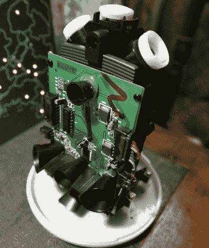
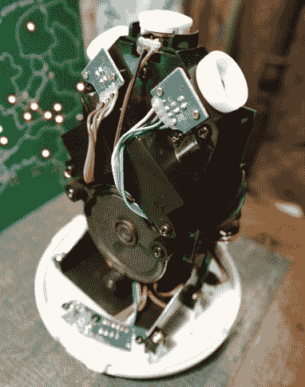
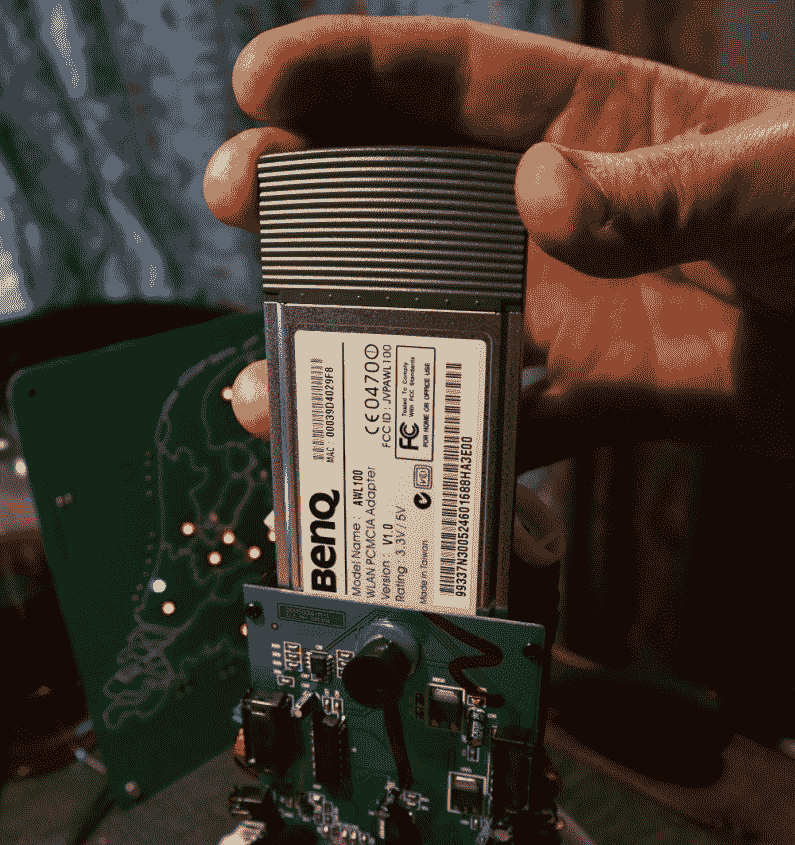

# 拆卸:纳巴兹塔格

> 原文：<https://hackaday.com/2020/05/26/teardown-nabaztag/>

在 2020 年，在线设备没有什么新奇或令人兴奋的。即使是最有能力的机型也被设计成不引人注目的冰球和智能音箱；他们的功能在于他们做什么，而不是他们看起来怎么样。2005 年，互联网连接设备是一个罕见的珍品，一个新时代的大胆象征:“物联网”！

我们的冰箱会根据它们的内容推荐食谱，但很少有人会想到一个永远在线的联网设备会代表一家全球公司收集你的数据。Nabaztag(来自亚美尼亚语，意为“兔子”)走进了这个竞技场，这是一个造型别致的法国塑料兔子形式的信息设备，可以发出语音警报，并通过闪烁灯光和移动耳朵来指示状态警报。

## 第一只兔子连接，然后是第一只兔子断开连接

The 100 Nabaztag Opera at NextFest 2006\. Violet06 ([Public domain](https://commons.wikimedia.org/wiki/File:Nabazmobny1.jpg))

如果这听起来出乎意料，在 2005 年，它是更懂技术的喋喋不休阶层的宠儿，被誉为在线信息新未来的曙光，作为一件艺术品而不是消费电子产品出现。质量杂志的专栏作家对它们赞不绝口，尽管[一些人窥探到未来的设备会带来什么来解决他们的缺点](https://www.theguardian.com/technology/2006/may/18/comment.comment)，有一段时间，一只奇怪的拟人化塑料发光兔子成为了人们的渴望。

物联网初创公司获得了很大的吸引力，但未能创造足够的市场，这是我们今天熟悉的故事，但尽管创造 Nabaztag 的法国公司 Violet 绝不是该领域第一个失败的公司，但它们是硬件设备在其服务器离开互联网时被遗弃的早期高调案例。财务问题导致了向游戏开发商 Mindscape 的出售，但即使这样也没能挽救这款设备，其服务器在 2011 年被关闭。从那时起，剩余的 Nabaztag 通过在他们周围成长起来的黑客社区的努力仍然活着，像 Raspberry Pi 这样的板提供了替代的 Nabaztag 服务器。

## 可爱的外表下是什么？

Nabaztag 作为早期标志性的互联网信息设备之一，一直对我有着好奇的吸引力。在 2005 年，它们对于冲动购买来说太贵了，但现在通过你最喜欢的在线拍卖行，它们的价格不到一个树莓派 4。所以几年前，我买了一个全新的盒装样品，现在我要对它进行拆解。有三种不同功能的型号，我的是 2005 年的 Nabaztag。

从盒子里拿出一个电源适配器、说明书和兔子本身。这是一个大约 150 毫米(略低于 6 英寸)高的大致圆锥形白色塑料设备，其圆形底座的直径约为 130 毫米(5 英寸)，顶部逐渐变细至约 80 毫米(3.25 英寸)。在它的正面印有一个风格化的兔子脸，顶部中央是一个白色的塑料按钮，顶部的两侧安装了一对 100 毫米(4 英寸)长的塑料耳朵。这些是可拆卸的，由磁铁固定，它们可以旋转指向身体的任何地方，从直向上到向外。在后底部是一个 8 伏 DC 电源的电源插孔，和一个内置扬声器的三位音量开关。

  The front of the disassembled bunny. The PCMCIA card is nestled behind the PCB.  The rear of the unit. At the top are the ear motors and their position sensors.  The PCMCIA network card, an off-the-shelf Benq item.

将它翻过来，有几个螺钉将底座和机身固定在一起，需要一个防篡改的三角形螺丝刀。我发现一个三翼驾驶员可以稍微小心地拧开它们，很快就把身体拆开，露出内部工作原理。内部是一个垂直的黑色塑料机箱，一侧是 PCB，另一侧是扬声器和耳机电机及其小型位置传感器 PCB，一系列黑色塑料光导从 PCB 的前面伸出。检查电路板，所有外围电缆都整齐地安装在电路板边缘的插座上，除了 DIP 封装中的 [L293D](http://www.ti.com/lit/ds/symlink/l293.pdf) 电机控制器外，所有器件都是表面贴装的。值得注意的是构成该单元大脑的 [PIC18F6525](https://www.microchip.com/wwwproducts/en/PIC18F6525) 微控制器、OKI ML2870A 声音芯片和 Atmel AT45DB161B 16 兆位闪存芯片。

这是一款支持 WiFi 的设备，所以我还期望在电路板上找到一个屏蔽 can，包含 WiFi 芯片组和 RF 电路。相反，我惊讶地发现在 PCB 的背面有一个 PCMCIA 插座，其中有一个 Benq 801.11B 11 兆 PCMCIA WiFi 卡。到 2005 年，这些设备开始从笔记本电脑中消失，因为 USB 和内置设备承担了这个角色，所以这是一个意想不到的发现。看到微控制器驱动这个接口是特别不寻常的，但考虑到它起源于 90 年代初的便携式计算，它几乎没有超出这张图片的能力。

## 理解 2020 年的纳巴兹塔格

Just because you can see a network, doesn’t mean you can connect to it.

有一系列选项可以让你的 Nabaztag 在 2020 年工作，包括[Nabaztag lives](https://nabaztaglives.com/)Raspberry Pi 服务器、 [OpenJabNab](http://openjabnab.fr/index.php) ，甚至还有 [ServerlessNabaztag 固件](https://github.com/andreax79/ServerlessNabaztag)。不过最有趣的是[tag tag](https://www.ulule.com/le-retour-du-retour-du-nabaztag/)，这是一款基于 Raspberry Pi Zero 的升级板，由最初的 Nabaztag 设计师制作，第二次众包生产因新冠肺炎而暂停。没有标记标签，我开始将我的 Nabaztag 连接到前两个选项中的一个，这就是我遇到障碍的地方。

在开箱即用的情况下，Nabaztag 似乎试图连接到一个开放的 WiFi 网络，并从那里试图到达现已停止运行的 Nabaztag 服务器。这是一个 11 兆无线网络更天真的时代的回声，那时 WEP 仍然被认为是安全的，许多网络没有任何安全性。连接到一个安全的网络揭示了过去的另一个提醒，按下按钮给设备加电使其建立一个对等无线网络，在该网络上可以通过网络接口访问。如果你足够年轻，从未使用过点对点无线网络，你应该觉得自己很幸运，因为即使在最好的情况下，它也是不可靠的，因此现代设备总是会建立一个临时热点来做同样的工作。现代设备支持点对点网络，但我在这里一无所获。我没有可以连接到我的 Nabaztag 的设备。几个晚上对 Linux、Android 和 ChromeOS 设备的设置毫无结果的调整让我能够看到网络，但无法与之建立连接。显然，2005 年的 Windows XP 笔记本电脑会有一些设置，但在 2020 年，我根本无法让它发生。我们都听说过数字过时，当谈到媒体格式和其他文件时，我们意想不到地发现它出现在协议中被遗忘的部分，这仍然是我们日常生活的一部分。

No rabbits were harmed in the writing of this piece.

因此，我的 Nabaztag 并没有多大用处，尽管它本身是一个漂亮的桌面装饰品和话题。破解它的内部结构很容易,我有一部分想要用一个 ESP32 来组装我自己的主板。我觉得这很有趣，因为它告诉我们自 2005 年以来物联网设备的发展。对我们来说，PIC 驱动 PCMCIA 卡可能看起来*不可思议*古怪，但在 2005 年，他们真的在推动一个设备的极限。今天的同类产品几乎肯定会有支持 Linux 的处理器和/或更加智能的云服务。它甚至可能将 WiFi 电子设备与内核放在同一个芯片上！我们可以以一两美元的价格买到单个数量的处理器来完成所有这些功能，这是一个小小的奇迹，Nabaztag 提醒我们已经走了多远。