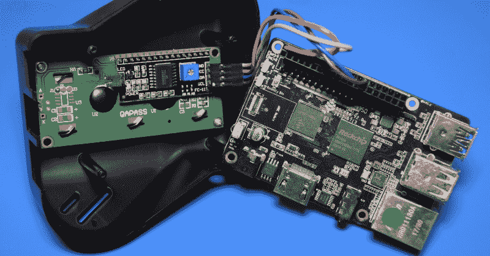

# 拆卸:侦察哨兵

> 原文：<https://hackaday.com/2020/11/16/teardown-recon-sentinel/>

现在可能很难想象，但曾经有一段时间，普通家庭只有一个单独的互联网连接设备。这个米色的盒子，在过去被称为“台式电脑”，是整个家庭的信息和生产力中心。很有可能你甚至需要等待轮到你使用它，因为它不像你口袋里有一个个人设备，让你从~~浴室~~登录，无论你当时可能在哪个房间。这也无妨，因为即使那时你有宽带，你也肯定不会用我们现在认为理所当然的神奇的互联网光束在房子里四处扫射。

今天事情变得复杂多了。您的计算机只是等式的一部分。现在有手机和平板电脑共享你的互联网连接，除了你带来的任何智能小工具。当你的门铃和房子里一半的灯泡都有自己的 IP 地址，它需要更多的诺顿防病毒软件来保证一切安全。

这正是 Cigent Technology 所说的“侦察哨兵”的设计目的。[这个小玩意不是保护一台电脑或设备，而是被宣传为能够通过嗅出可疑活动并在新硬件连接时提供即时通知来保护您的整个网络](https://www.reconsentinel.com/)。根据官方白皮书，它还运行一种被 Cigent 称为“网络欺骗引擎”的蜜罐服务，并能够部署“主动防御对策”来迷惑试图攻击它的恶意设备。

这听起来的确令人印象深刻。但是对于 149.99 美元加上年费，它更好。如果你希望这次拆卸能告诉你是否值得购买 899.99 美元的终身订阅套餐，不要太兴奋。这不是一个评论，我们只对打开这个东西感兴趣，看看是什么让它滴答作响。

## 嗯……那很简单

伙计们，这是第一次。在 Recon Sentinel 形状奇特的注塑外壳中，有一个来自 Pine64 的 ROCK64 板和一个我们都放在零件箱中的 I2C 16×2 LCD。就是这样。除了外壳，Recon Sentinel 唯一定制的组件是适配器电缆，从 40 引脚 Raspberry Pi 风格的扩展接头向下延伸到连接显示器的四根电线。它甚至包装了一个普通的 SanDisk 8 GB micro SD，[至少奇迹圣经中的那个被打上了](https://hackaday.com/2020/06/22/teardown-wonder-bible/)的商标。

毫不夸张地说，该产品的硬件仅比 DIY 周末版高一步。你现在就可以上 Thingiverse，找到一个可打印的外壳，可以带着这个相同的 LCD 和你喜欢的任何风格的 Linux 板，就在半路上了。如果这是某种类型的原型，那就好了，但这是他们实际上向客户发运的产品。

虽然称之为“简单”可能有点夸张，但构建一台运行 Linux 的单板计算机 [(SBC)现在是专业黑客](https://hackaday.com/2020/10/20/thinking-about-creating-a-raspberry-pi-replacement/)力所能及的。我们也看到许多个人[为 Raspberry Pi 计算模块](https://hackaday.com/2017/11/17/raspberry-pi-compute-module-3-in-a-gameboy-original/)创建定制载板。简而言之，即使是小公司也没有理由不能推出更适合这种应用的定制板。有双以太网接口的东西会是理想的，如果它们永远不会被使用，就没有理由包括 USB 和 HDMI 端口。

也就是说，看起来 Pine64 正在清理入门级 ROCK64 的库存，[以每单 25 美元的价格出售它们](https://pine64.com/product/rock64-single-board-computer)。侦察哨兵可能是一些批量订单的产品，这使得单位成本更低。这不是第一次[一家公司的大甩卖导致一种新产品](https://hackaday.com/2019/06/06/the-atomic-pi-is-it-worth-it/)的诞生。

## 在侦察上做侦察

在这些拆卸过程中，我们通常不关心软件方面的事情，但坦率地说，通常会有更多的硬件需要考虑。因此，在这种情况下，仔细研究一下运行在 Recon Sentinel 内部的 Linux 系统似乎是合适的。显然，所有的时间和精力都花在了产品上。

我在网上搜索了一下，没有发现任何迹象表明侦察哨兵的根密码是开箱即用的，但当然，当你可以弹出微型 SD 卡时，并不难获得访问权限。我将它安装在我的桌面上，清除了来自`/etc/shadow`的散列 root 密码，然后用允许 root 登录和空白密码的最小版本替换了 sshd_config 文件。我不想让它打电话回家，所以我把它插到一个未使用的无线路由器上，这样它就可以在没有连接到互联网的情况下租用 DHCP。LCD 显示了一条关于连接的错误消息，但是我可以通过 SSH 登录，当时没有任何问题。

这个系统看起来是 Pine64 为 ROCK64 发布的标准 Debian Stretch 映像，外加一些 Raspbian 包。看起来大多数为侦察哨兵开发的定制软件都是用 Python 开发的，所以很容易打开文件，看看它在做什么。还有一个叫做`lcd_display`的便利工具，它允许你将两行文本推送到屏幕上，这在整个系统中被广泛使用。

虽然它很容易插入并四处查看(而且液晶显示器已经设置好并可以工作也很方便)，但操作系统存在一些问题，使得重新利用它不切实际。首先，本地登录似乎已经被完全禁用了。我还注意到，几分钟后设备重启，可能是因为它无法连接到互联网。当然，你可以识别和撤销这些改变，但我认为你最好把时间花在清除这些改变和重新开始上。

## 让哨兵投入工作

最终，侦察哨兵可能是我们见过的最不寻常的商业设备之一。当然，我们已经发现了我们以前认识的电路板，[比如经常被发现藏在](https://hackaday.com/2019/04/30/teardown-refuel-propane-tank-monitor/) [Quirky 的古怪物联网设备系列](https://hackaday.com/2019/10/08/teardown-quirky-egg-minder/)中的的电动 Imps，但没有什么像这样的。对于硬件黑客来说，如果有一个更明显的可重复使用的设备，我无法想象它会是什么。只需擦除 SD 卡，重新安装 Debian，你就有了一个方便的内置 LCD 显示器的 Linux 小盒子，你可以用它做任何事情。

事实上，一些有事业心的公司显然已经得到了一批剩余的侦察哨兵，并开始在亚马逊上把它们作为开发包出售。价格似乎有波动，但总的来说，你可以用低于原价 15%的价格买到一台。这似乎是一个安全的赌注，事情对公司来说不是那么好，所以就我个人而言，我会跳过终身订阅。它可能会比你希望的要短得多。