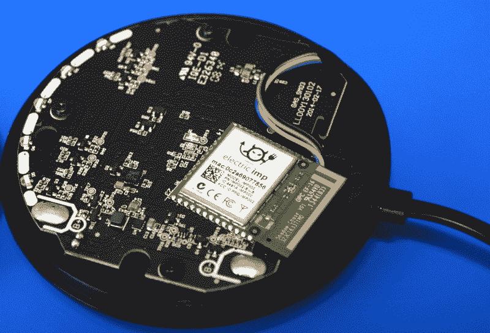
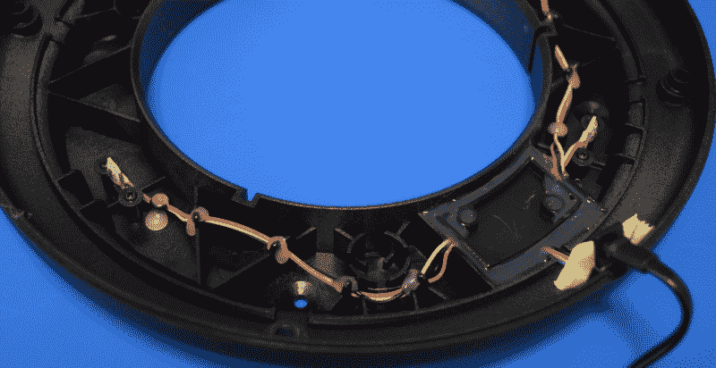

# 拆卸:换料丙烷罐监控器

> 原文：<https://hackaday.com/2019/04/30/teardown-refuel-propane-tank-monitor/>

经常阅读 Hackaday 的读者会知道，你当地的大盒子零售商的清仓区是以极低的价格买到稀奇古怪的小玩意和小玩意儿的好地方。在一个制造商急于让他们的产品变得“智能”的时代，不管他们是否需要，偶尔出现的无法获得牵引力的想法只是做生意的成本。如果你留心观察，你几乎肯定会看到这些物联网废品中的一种在后面的过道上收集灰尘，通常以一美元几美分的价格出售。

一个恰当的例子是来自 Wink 的“加油”丙烷罐监视器。虽然包装上也有 Quirky 和 GE 的标志，甚至还有提出这个想法的人的照片。基本上，我们这里有一个数字秤，它通过互联网向你的手机报告你的烤架丙烷罐的当前重量。在正常情况下，我们可能会认为这是一个相当简单的技巧，一个称重传感器和一个 ESP8266，但由于这是一个建议零售价为 49.99 美元的商业产品，它自然过于复杂，以至于荒谬。

当然，人们可以简单地提起丙烷罐，并得到其内容的体面估计；自古以来，周末烧烤大师们就掌握了这种技巧。但这样一来，你就不必使用 Wink 创建账户，或者经历一个非常奇怪的过程，试图通过使用智能手机屏幕的闪光灯来配置设备(说真的)。所有这些都是为了让你出门在外的时候，可以检查你的烤架上还剩下多少丙烷。你知道，就像一个人做的那样。

坦白地说，我很难想象谁会真的以全价购买这样的东西。但是，当然，这可能是为什么我能以 5 美元的高价买到它的原因。在这个价格上，我们不能让来自波士顿的 Wink、Quirky、GE 和 Anthony 看一眼这个小发明。

## 小鬼在里面

加油由两个主要部分组成:秤本身，以及将它实际连接到 WiFi 网络的基本单元(因为缺乏更好的术语)。基本单元有一个磁性背衬，允许用户将其粘贴到烤架的框架上，并通过大约一米长的扁平电缆连接到秤，电缆中间由防水连接器隔开。

当打开设备时，我们真的很惊讶:里面有一个相当神气的电动 Imp 模块。具体来说，现在已经过时(但在撰写本文时仍可购买)的 IMP002。[早在 ESP8266 成为黑客眼中的亮点之前，](https://hackaday.com/2012/09/04/hands-on-with-the-electric-imp/)这些 32 位 WiFi 模块有望成为让您的硬件项目上线的最简单方式之一。从那时起，我们已经看到了一些[围绕电动 Imp 板](https://hackaday.com/2016/11/26/exquisitely-crafted-nixie-tube-weatherclock/)的非常令人印象深刻的构建，很高兴看到他们在消费电子领域取得的第一手进展。

BlinkUp LEDs and light sensor

事后看来，屏幕闪烁配置方案应该是一个巨大的暗示，说明是什么在驱动这个设备。这种功能在 Electric Imp 的说法中被称为“BlinkUp”，并被宣传为最终用户快速轻松地用智能手机配置设备的一种方式。它避免了[设置用户需要连接的临时 WiFi 接入点](https://hackaday.com/2019/03/28/wopr-security-loses-some-of-its-obscurity/)的安全隐患，但不幸的是，这可能有些挑剔，因为这在很大程度上取决于环境。

很明显，IMP002 模块是这里的明星，因为 PCB 的其余部分几乎是裸露的。大多数其他组件都用于驱动电路板边缘的双色 led 阵列，这些 led 用于显示设备本身的粗略“燃料表”，因此您不必总是拿出手机。

## 一条巨鲸

我推测，燃料的秤部分将是某种类型的称重传感器，当我看到四线电缆时，我感到特别有信心。我最不希望在里面看到的是三个霍尔效应传感器、匹配的弹簧安装磁铁和一些神秘的电子设备。

这三个传感器呈三角形排列，显然是为了更准确地读取坦克的重量。每个霍尔效应芯片都安装在一个微小的丝网印刷电路板上，并精心封装在环氧树脂中，以保护它们免受自然环境的影响。乍一看，我以为这只是一个比新奇礼物高一步的东西，但这里的构造确实令人印象深刻。

[很明显，这个隔间里面有一些诡计，我承认，挖通那个密封剂的前景*几乎*足以让我把它密封起来，但 Hackaday 的读者应该得到更好的东西；我们必须有答案。所以我在 YouTube 上下载了“*lofi hip hop radio-beats to relax/study to”*，开始用锋利的刀片工作。](https://hackaday.com/wp-content/uploads/2019/04/refuel_pic16.jpg)

内部是一个相当密集的小 PCB，配有 PIC16F1823 微控制器。我没有把它从外壳中撬出来，因为它看起来粘得很好，但只要看到上面的 MCU 就足以告诉我们需要知道的一切。芯片正在读取来自三个霍尔效应传感器的原始数据，对其进行处理，并以数字方式将其发送到电动 Imp。有人可能会说，秤实际上并不是一个传感器，而是一个与基站协同工作的独立设备。

## 重量级通信

因此，我们有四根电线将电子秤连接到基站:我们知道其中两根是电源，两根是数据。我的第一个猜测是 I2C，因为我们已经在其他商业产品中看到过使用类似于这个的嵌入式无线模块的[，但结果是基本的 UART。甚至看起来有些数据是普通的 ASCII 码，尽管我还没有*完全*弄明白。](https://hackaday.com/2019/02/27/teardown-applights-personalized-projection/)

通电大约 15 秒后，基站向 PIC16F1823 发送字符“V ”,并收到一条回复，似乎是电子秤固件的版本号。然后，基站向电子秤发出十几个连续的数据请求，可能是某种校准表。交换之后，正常操作开始。

从这一点开始，基站和秤台每隔 1.5 秒交换一次心跳信号(字母“A”)，以验证它们是否还活着。这个简短的握手之后是来自秤的未经请求的 10 字节包，该包大概代表当前罐的重量。不幸的是，我还没有完全破译这个值是如何工作的，因为这似乎比一个只有 20 磅的秤所需的数据要多。

Current tank weight. Probably.

如果协议被完全解码，那么基站中的电子设备可以用标准的微控制器替换，如果有人希望能够远程称重他们的丙烷罐，而不必购买 Wink 生态系统。在一个完全不同的项目中重复使用秤也是一件简单的事情，尽管我不确定这种特殊的测量设备还有多少其他潜在的应用。

## 建得像牛排店

我仍然认为这个产品不实用。话虽如此，我不得不承认这件事让我吃惊。我本以为是由出价最低的人组装的一个设计糟糕的硬件，但它最终却是我有幸解剖过的最好的产品之一。“一分钱一分货”这句话通常有负面含义，但我认为可以肯定地说[眨眼加油可以被添加到赢得价格标签](https://hackaday.com/2018/06/20/teardown-box-of-pain-gom-jabbar-sold-separately/)的小工具的短列表中。

我不知道这对于那些花了 50 美元的人来说是否是一种安慰，因为如果不是因为工作缠身，他们会渴望看到自己能做多少牛排，但我当然不后悔掏出 5 美元把它拆开。