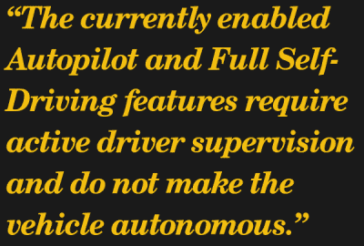

# 美国监管机构审查特斯拉自动驾驶

> 原文：<https://hackaday.com/2021/08/16/tesla-automatic-driving-under-scrutiny-by-us-regulators/>

美国国家公路交通安全管理局(NHTSA)已经就特斯拉的自动驾驶功能 (PDF)展开了[正式调查，声称已经确定了 11 起令人担忧的事故。特别是，他们正在研究特斯拉称为“自动驾驶”或交通感知巡航控制的功能，同时接近消防车或救护车等停止响应的车辆。根据 NHTSA 的声明，大多数案件发生在晚上，还涉及警告装置，如锥形路标、闪光灯或带箭头的标志，你可能会认为，这些装置会使人类司机保持谨慎。](https://static.nhtsa.gov/odi/inv/2021/INOA-PE21020-1893.PDF)

 没有关于那些事故严重程度的细节。在正在研究的事件中，NHTSA 报告称，使用交通感知巡航控制“的车辆遇到了第一响应场景，随后撞上了一辆或多辆与这些场景有关的车辆

不管他们如何营销这些功能，特斯拉都会告诉你，他们的车辆都不是真正的自动驾驶，司机必须保持控制。这是一个很大的假设，即使你忽略了一个事实，即一些特斯拉车主已经竭尽全力绕过有司机控制的需要。特斯拉已经承诺[完全自动化驾驶](https://hackaday.com/2020/10/23/tesla-begins-full-self-driving-public-beta-as-waymo-and-cruise-go-unattended/)，并正在测试该功能，但截至本文撰写之时，该公司仍表示[在使用现有的“完全自动驾驶”功能时，主动驾驶员监督是必要的](https://www.tesla.com/support/autopilot)。

我们过去已经谈论了很多关于自动驾驶汽车安全的话题。我们也报道了一些我们听说过的更多的[公共事故](https://hackaday.com/2018/03/20/uber-has-an-autonomous-fatality/)。你怎么想呢?自动驾驶汽车是否像他们希望你相信的那样接近现实？请在评论中告诉我们你的想法。