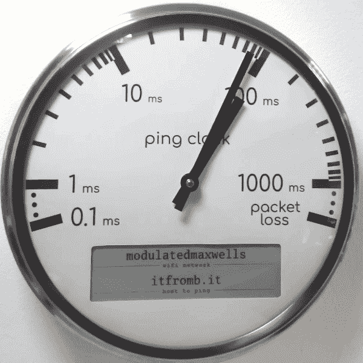

# 墙上的时钟实际上是一个网络 Ping 显示器

> 原文：<https://hackaday.com/2022/02/09/that-clock-on-the-wall-is-actually-a-network-ping-display/>

最近，我们在家上网的次数比平时多了一些，这常常超出了我们的 ISP 所能达到的极限。你知道这些迹象——音频中断，视频会议让你看起来像[最大净空],在下班时间，几乎每个人都拥有 *CS:GO* 。世界上所有的带宽都无法弥补高延迟，知道你在这方面的立场是[这个 ping 跟踪时钟](https://github.com/turingbirds/ping-clock/)的要点。

 这款引人注目的 lag-o-meter 由【Charl】提供，他用宜家的时钟开始建造。除了表圈之外，他几乎什么都不用做，只增加了一个同轴时钟马达和一个驱动板，以及一个带有对数刻度的定制印刷面板。电机由 ESP32 驱动，ESP32 使用互联网控制消息协议(ICMP)通过 WiFi ping 一个可信的服务器，计算手部的正确角度，并驱动电机向您显示坏消息。面部还有一个电子纸显示屏，显示当前的服务器和 WiFi 设置。

我们真的很喜欢这个时钟的外观，如果不是因为它显示的数字经常令人沮丧到无法忍受，我们会很快造出一个。如果面对痛苦的事实不是你的风格，你可以试试其他简洁的 ICMP 技巧。