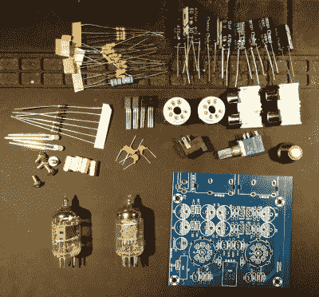
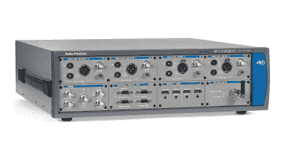
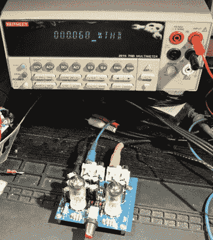

# 那难以捉摸的电子管放大器的声音，不是很多！(这其中肯定有蹊跷)

> 原文：<https://hackaday.com/2020/09/01/that-elusive-valve-amp-sound-for-not-a-lot-there-has-to-be-a-catch/>

上个月，我怀着极大的兴趣开始追踪世界上哪里还有制造电子管的工厂。我的研究在斯洛伐克、俄罗斯和中国发现了它们，而且很确定我没有找到所有的制造商。似乎有一整类平凡的电子管仍在生产，但在他们光鲜亮丽的网站上却找不到。只要看一眼任何可以买到中国模块的商店，就会发现这种电子管在小型音频放大器项目中使用，其中一些非常便宜。当面对便宜的电子产品时，我当然会忍不住买一些，所以我花了大约 10 英镑(12.5 美元)，给自己买了一套双管设备，称为立体声前置放大器和耳机放大器。

## 一个不寻常的音频管选择

我收到的 10 英镑是一个压封袋，里面有一个印刷电路板和一堆元件，除此之外别无其他。没有说明，如果板子上没有清楚地标明每个组件的价值，这将是令人担忧的。该电路位于供应商网站上，在这类套件中非常常用，在网上随处可见——这是一个非常传统的双共阴极放大器，使用一对 6J1 微型五极管，通过+25 V 和-25 V 电源供电，电源通过电压倍增器和调节器电路从 12 VAC 输入获得。它有一个音量电位计，两组用于输入和输出的唱机插座，以及在每个电子管插座下添加一个蓝色 LED 以发出蓝光。我想我还是不要那部分了。

6J1 似乎在整个中国套件中无处不在，当你明白它根本不是一个音频管时，这令人惊讶。相反，它是一个小信号甚高频放大器，大致相当于欧洲的 EF95，在 20 世纪 50 年代的调频收音机或塔式电视调谐器中更为常见。我只能假设，在中国的某个地方，有一家电子管工厂专门针对这个市场生产电子管，因为音频功率放大器套件中的另一种电子管是 FU32 或欧洲人所说的 QQV03-20，这是一种大功率射束四极管，可能出现在 20 世纪 50 年代的军用无线电发射机中。就像你在音频电路中使用射频晶体管一样，它本身会有很好的表现，射频电子管也是如此。在这样的电路中，6J1 没有理由做不出令人满意的工作。

There are no surprises among the parts.

除了稍微有点不寻常的电源，前置放大器电路没有什么值得注意的。6J2 连接为三极管，因为共阴极电路旨在驱动高阻抗，所以可以肯定这不会是一个非常好的耳机放大器。这是一个简单的前置放大器电路，它为无数电子管放大器的小信号端增光添彩，包括[我年轻时的蠢事](https://hackaday.com/2017/08/16/the-best-stereo-valve-amp-in-the-world/)。

制作这个套件和其他通孔设计一样简单，而且只需半个小时左右的时间。没有什么特别要注意的，我只是简单地按自己的方式进行，首先是电阻，然后是二极管(但不是那些 led)，晶体管，电容，最后是更大的部件，如电位计和插座。目测没有任何问题，所以我插上管子，施加 12 伏交流电。

有趣的是，这肯定是我第一次使用新的管插座，而不是从旧设备中清理出来的，所以我没有准备好插入它会有多硬，相比之下，它需要多年的热循环来软化它的金属。一打开工具箱，管式加热器发出柔和的光，测量电压，我发现它产生了正负 30 伏的电压。快速检查应用一些音频到它显示，它确实是放大音频，它听起来不坏，但我需要多一点。该给功放定性了，有什么好的吗？

## 对于一个 10 磅的放大器来说仪器太多了

An Audio Precision APx525 audio analyzer. Bradp723 ([CC-BY-SA 3.0](https://commons.wikimedia.org/wiki/File:APx525_Audio_Analyzer.jpg))

就此而言，你如何描述放大器或任何其他音频设备的特征？有四个指标值得了解:增益、频率响应、相位响应和谐波失真。频率响应与其接受的频率范围有关，相位响应与任意给定频率下输出和输入之间的相移有关，谐波失真通常表示为输出频谱的百分比，它是由放大器的非线性引起的，而不是由输入引起的。有称为音频分析仪的专门仪器，通过向被测设备注入非常高纯度的正弦波并测量其输出来自动完成所有这些测量，但它们极其昂贵，超出了黑客的预算。

对于这款放大器，频率和相位响应可能无关紧要，因此我必须找到一种方法来测量其失真。幸运的是，我能够从黑客空间的朋友那里借一个 [Keithley 2015 精密万用表](https://uk.tek.com/tektronix-and-keithley-digital-multimeter/keithley-2015-series-thd-and-audio-analysis-multimeter)，这个非常高质量的仪器出人意料地具有 THD(总谐波失真)功能及其相关的内置信号发生器。我怀疑它可能是针对通信行业而不是音频业务，但它给了我所需要的东西，我非常感谢我的朋友。我把它放在我信赖的 Rigol 1054z 旁边，准备好描述电路板的特性。

Measuring THD with the Keithley 2015

我将发生器设置在无处不在的音频测试频率 1 kHz，以 100 mV 峰峰值正弦波作为输入来模拟较低电平的音频源。最大音量时的输出为 4.85 V 峰峰值，此时总谐波失真为 1.31%。我算出来是 37.31 分贝。调节单位增益的音量，即 100 mV 峰峰值输出，得到的 THD 读数为 0.03%。给它一个 1V 峰峰值输入来模拟线路电平输入，使我获得了显著的可见削波和天文数字般的 32%最大增益 THD。

这些数字告诉了我什么？在低信号输入电平下，它具有低 THD 的潜力，但即使如此，它也没有达到您在高端音频产品中期望看到的三位数过零区。在更高的电平下，它开始明显下降，但鉴于它是一个前置放大器，而不是线路电平放大器，这应该不会令人惊讶。有可能一些负面反馈会驯服它，但是我担心它的相位反应会受到影响。

问题是，不是超高端前置放大器有关系吗？花了 10 英镑，不是真的。如果你保持足够低的音量，并把它连接到你的高保真音响上，听起来会很不错，事实上我就是这么做的。听起来，嗯，就像我的高保真系统。没有特别的“温暖的阀门声音”，但它确实给了我一个堆叠顶部的一对玻璃管的瞬间纪念。

## 我买了一件杰作，还是一个玩具？

关于这款放大器，还有最后一点需要考虑，回到我之前说过的供应商将其描述为耳机放大器的问题。单端电子管放大器具有非常高的阻抗输出，也就是说它擅长传输电压，但不擅长传输电流。阻抗在几十千欧的东西可以驱动它，但阻抗在几十欧的普通耳机就不行了。我甚至没有尝试，因为我知道它不会做得很好。然而，这一切并没有失去，因为如果你准备增加一点，用这个电路制作一个简单的耳机放大器是可能的。过去，它的输出可能会有降压变压器，但在 2020 年很难找到，所以替代方案可能是[使用 MOSFET 源极跟随器](https://sound-au.com/articles/followers.html#s9)作为缓冲器。这是我可能会带着这款放大器重返的项目之一。

在音频发烧友群体中，有很多人在谈论电子管放大器的一些特别之处。涉及偶次谐波失真的伪技术解释层出不穷，许多花哨的电子管高保真音响受到追捧。不错，一个好的电子管放大器确实可以是一个非常好的放大器，但在几十年来一直在研究这个问题之后，我怀疑电子管的存在是否能赋予它任何特别的东西。

我认为它源于 20 世纪 60 年代和 70 年代的第一代晶体管放大器，当时锗晶体管和单端电源在输出端需要大量电解电容，导致一些型号的性能不太好，但从那以后我们一直在进步。最高品质的晶体管放大器是几十年前的事了，虽然它们的电子管兄弟姐妹在质量上与它们不相上下，但我认为，除了在音频领域和其他领域一样说:一分钱一分货之外，声称太多其他东西是可疑的。买一个这样的小工具包，以零花钱的价格玩一玩管道电路，但不要对它期望太高。