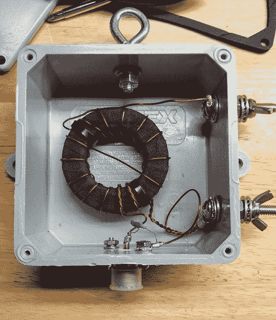
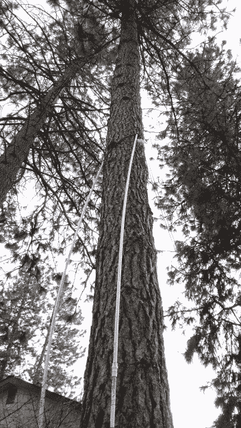
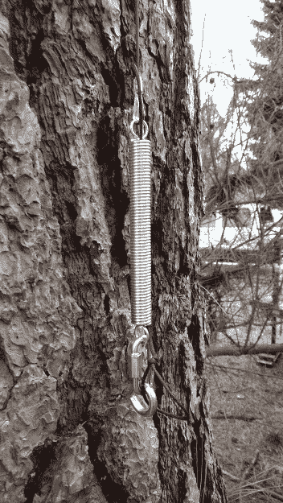
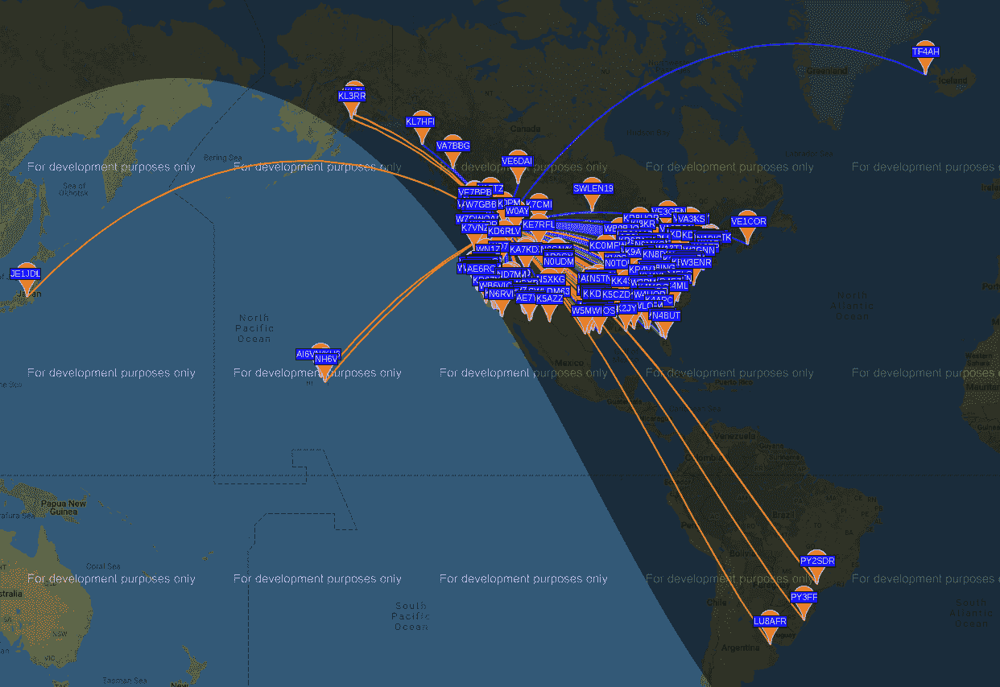

# 50 美元的火腿:高频波段的廉价天线

> 原文：<https://hackaday.com/2021/01/19/the-50-ham-a-cheap-antenna-for-the-hf-bands/>

到目前为止，在 50 美元的火腿系列，我主要集中在甚高频和超高频波段。其中的原因主要与 FCC 规则有关，这些规则在很大程度上将[技师级别的许可证](https://hackaday.com/2019/03/08/the-50-ham-getting-your-ticket-punched/)限制在那些频段。但是这其中也有财务因素。高频(HF)频段特权的代价是学习足够的无线电知识以通过通用执照测试，以及需要比[30 美元的手持对讲机](https://hackaday.com/2019/03/15/the-50-ham-entry-level-transceivers-for-technicians/)贵几个数量级的设备。

尽管高频设备可能很贵，但并不是所有需要播出的东西都是如此。由于往往是天线决定或破坏业余无线电操作员的联系能力，我们来看看一种简单而通用的天线设计，它可以支持从大功率基站到现场便携式 QRP(低功率)激活的一切:端馈半波天线。

## 匹配

有很多业余爱好者把制作天线作为他们的全部爱好。我明白。设计一个能做你想让它做的事情的天线需要大量的魔法，并且需要大量的工程设计来确保它经得起各种因素的考验。我觉得天线搭建的后一方面对我个人更有吸引力。让天线经受住风、雪、太阳和雨是一个有趣的挑战，所以我倾向于花更多的时间思考设计的机械方面，有人已经解决了射频问题。

所以我开始寻找一种适合我情况的天线。也许最容易制造的天线是经典的半波偶极子天线。它们有两个元件，每个都是设计波长的四分之一，从同轴电缆馈线连接的中心馈电点向外辐射。当然，有一些复杂的细节，但对我来说，最基本的问题是中心馈电点。我的小屋位于我的房子的最后面的角落，所以没有长馈线很难安装这样的天线，这可能会引入不可接受的信号损失。此外，80 米波段的偶极天线端到端的长度为 40 米，这很难在我狭长的郊区空地上安装。

出于我的目的，端馈半波(EFHW)天线是一个很好的选择。这就像它听起来的那样:一大块半波长长的电线(在我的例子中，有 40 米长，所以我可以在 80 米的波段工作),从它的末端馈电。但这并不像切下一段 40 米长的电线并把它粘在你的收音机上那么简单。问题是天线的阻抗随着馈电点远离中心而变化。当馈电点到达线的末端时，阻抗一直增加到大约 2500 欧姆，这对于期望 50 欧姆负载的收发器来说确实是非常糟糕的匹配。

为了解决这个问题，EFHW 天线需要一个变压器来匹配阻抗。当用于匹配平衡天线(如偶极天线)和不平衡馈线(如同轴电缆)之间的阻抗时，它们被称为“巴伦”。不过，在这种情况下，天线和同轴馈线都是不平衡的，所以我构建的变压器在技术上是一个“unun”。不管你叫它什么，这是一个非常简单的构建。

My 49:1 matching transformer, mounted and ready to go outside. I considered potting the whole thing in epoxy, but decided against it.

我按照史蒂夫·尼科尔斯(G0KYA)提供的优秀指令来缠绕我的 49:1 自耦变压器。它基本上只是一个大铁氧体磁心——我从易贝买的，但亚马逊上有很多选择——有几圈磁线。我的核心是 FT-240-61，这意味着它的外径是 2.4 英寸，它是由 61 型材料制成的。我用 18 AWG 磁线的绕组。当我缠绕它的时候，我注意到电磁线上的漆涂层被铁氧体磁芯的边缘划伤了。在用布摩擦带覆盖圆环以缓冲边缘后，我重新缠绕了它——在设计用于处理 100 瓦发射机输出的东西中，短裤不是好东西。

就像我说的，我对这个变压器做的许多大惊小怪都是为了让它机械地工作。我将它安装到一个坚固的塑料电气外壳中，并提供了不锈钢配件来连接天线和接地。我还安装了一个吊环螺栓来栓住天线。一个用于馈线连接的高质量 SO-239 插座和一个 100 pF 高压电容用于更高频段的更好匹配，完成了变压器。幸运的话，这种天线应该可以覆盖 80 米到 10 米的波段。

## 推绳

My method for placing a pulley up a tree from the ground. It would have worked better on a tree with smoother bark.

幸运的是，我的停车场只有大约 150 英尺深，我被一大堆又高又壮的黄松祝福又诅咒。我的停车场的长度和树木的位置允许一个完整的 40 米长的“倒 L”形电线。我的计划是在第一棵树上尽可能向上倾斜变压器的电线，然后水平延伸到第二棵树上的锚点。

这听起来比实际上要容易得多。虽然许多火腿都很幸运地将天线悬挂在树枝上，但我的松树已经被修剪掉了较低的树枝，第一批活着的树枝离地面超过 40 英尺(12 米)。我选择了一个“更聪明地工作”的方法，想出了一个主意，基本上是用 PVC 管作为推杆把一圈绳子推上树。虽然美国黄松树皮的粗糙不断地钩住尼龙绳，PVC 管在我添加部分时四处飞溅，但它实际上足够好地将锚定点置于离地约 25 英尺(7.5 米)的地方——比我用 24 英尺的梯子可能达到的高度高不了多少，但降低了我摔死的风险。

使用类似的方法在另一棵树上设置了锚点，这引起了邻居的很多注意。一个人应该总是抓住这样的机会做一些“火腿善意”的宣传，我向邻居保证，我不会给他们的孩子绝育或干扰他们的电视接收。然而，业力的一个例子是，我正在工作的那棵树第二天决定脱落一根枯枝，这根枯枝掉了下来，损坏了我邻居的杜兰戈。它显然来自比我工作的更高的树上，但它仍然引起了一点点的老臭眼。

Sway relief on the anchor end. Note the safety line that runs through the bore of the spring, just in case it breaks.

使用树木作为长线天线的锚的最重要的部分之一是处理摇摆。树木经常移动，如果你在两棵树之间紧紧地系上一根铁丝，不让它们随风移动，悲伤就会随之而来。然而，你希望你的钢丝保持或多或少的绷紧，因为它的形状会影响它的性能。有几种方法可以解决这个问题，我选择在我的两个锚点都使用晾衣绳滑轮。在中点，金属丝穿过滑轮；在端锚处，钢丝通过一个骨状绝缘体系在一段结实的尼龙绳上。那根绳索穿过滑轮，顺着树干，通过一个强力弹簧到达一个固定点。当树木摇摆时，天线可以伸展或收缩几英寸，而不会下垂或折断。

## 终于播出了

我不得不承认这个装置实际上还没有完成。天线真的应该正确接地，我很想在变压器附近敲一根接地棒。然而，我家的主馈电线和整个社区的主馈电线都直接埋在我们的后栅栏下，这是一项高风险的工作。尽管地下定位服务很好，但我并不热衷于用我宝贵的自我来测试它们的精确度。所以我要等一个像样的场地。

尽管如此，我还是忍不住想试试这个天线，所以为了防止射频干扰，我在馈线上缠绕了一个 10 圈的空芯扼流圈，并将其连接起来。我还没有制作任何 qso，但是使用 WSPR，弱信号传播报告系统，我能够在 24 小时内在 80 米、40 米、30 米和 20 米波段上到达四大洲。

The world on one antenna: 24 hours of WSPR reports on 80, 40, 30, and 20 meters.

说到 WSPR，它和其他数字模式是我们将在下一期《50 美元火腿》中讨论的。剧透:尽管我之前抱怨过，但我想我又爱上了业余无线电。