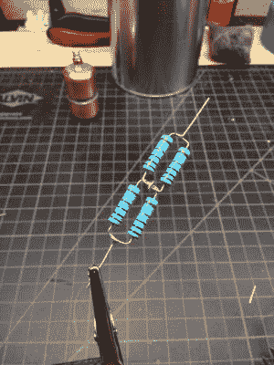
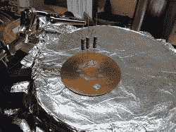
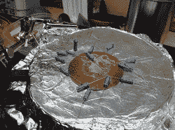
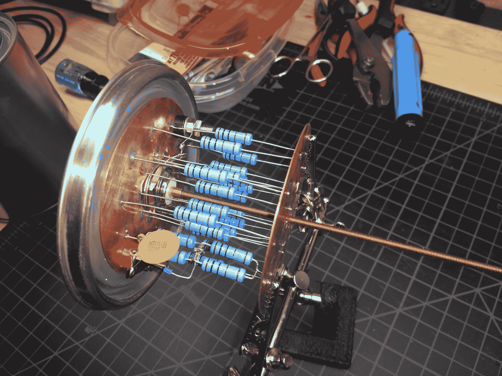
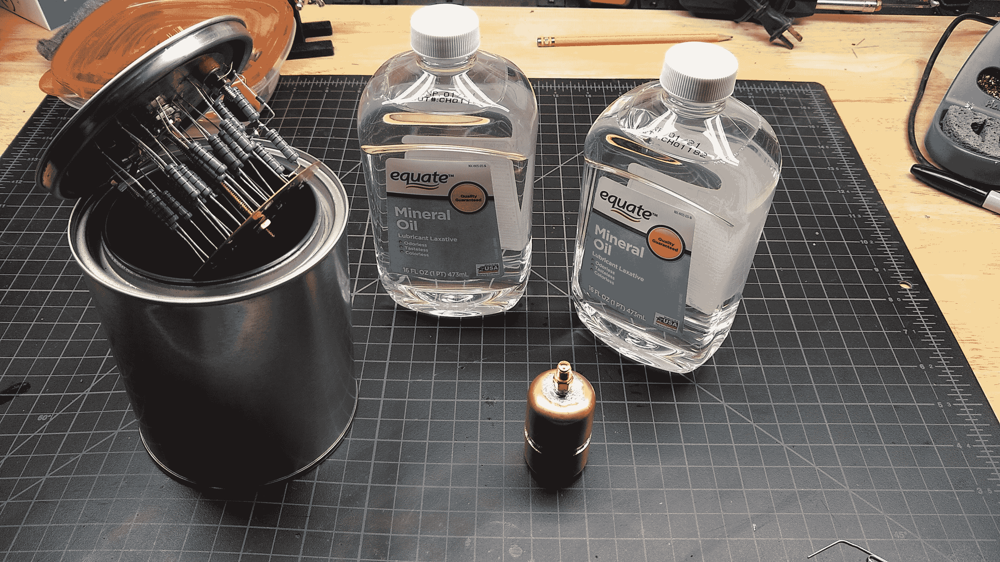

# 50 美元的火腿:假货，第 2 部分

> 原文：<https://hackaday.com/2019/05/17/the-50-ham-dummy-loads-part-2/>

在“50 美元的火腿”的最后一期中，我制作了一个业余无线电操作员在做任何类型的发射机调谐或测试时使用的通用工具:一个假负载。这一构建产生了“L'il Dummy”，一种用于测试典型 VHF-UHF 手持对讲机(HT)收发器的小型虚拟负载，直接拧入收音机的天线插孔。

正如一些读者在评论中提到的，假人没有什么实际用途。实际上，没有太多的要求将假负载直接拧入 ht，有人指出，一个合适的假负载在市场上很便宜。我认为后一种观点忽略了自制的意义，也忽略了一般的黑客风气，但我承认前一种观点。这就是为什么在我建造伊尔假人的同时，我也在建造这里描述的更大、更有能力的版本:大假人。

## 设计目标

正如其较小的 HT 版本，大假人的设计不完全是我自己的。本着寻找其他火腿已经做了什么并坚持下去的伟大传统，我制作了一个版本的【K7AGE 制作的虚拟负载，这反过来是他从 Elecraft 借鉴的设计，Elecraft 是收发器和其他火腿装备的制造商。

我的设计目标比 il Dummy 更宏伟，但仍然非常简单。首先，我希望假负载有利于高频波段，如果可能的话，也有利于甚高频波段。第二，它需要比 L'il Dummy 处理更多的功率——我的目标是 50 瓦。第三，我希望它有一个用于测量发射机输出的抽头，以及更标准的 SO-239 超高频连接器。最后，我希望它看起来不错。

我决定建立一个经典的“坎特纳”假负载的较小版本。不要与品客薯片的 WiFi 天线混淆，我们以前见过很多，cantenna 负载是一个 50ω的大电阻，装在一个装满 T2 绝缘油的油漆罐中，用于冷却。我选择在一夸脱(大约一升)的油漆罐中制作。

Circuit sculpture, sorta. Still 1 kΩ, but with a tap for the test point.

为大虚拟器件选择电阻比为 L'il 虚拟器件选择单个 35 W 厚膜 SMT 电阻要困难一些。线绕功率电阻很容易找到，但如前所述，它们完全不适合用作假负载，因为它们的电感会在较高频率下改变负载的阻抗。我终于在传统轴向引脚封装中找到了 1000ω金属薄膜电阻。一包 30 支的只花了我几块钱。计划是并联 20 个 1000ω电阻，总阻抗为 50ω。在每个两瓦的功耗下，这应该使负载能够处理 40 瓦的功率，足够接近我的目标 50 瓦。

测试点的抽头也是对 K7AGE 设计的修改。他使用一个串并联网络来构建他的假负载，这给了他一个在两个串联电阻之间的自然抽头点，作为一个分压器。我不得不在电阻上玩一些小把戏，我不得不组成一个网络来做同样的事情。我在[我的 Hackaday.io 帖子](https://hackaday.io/project/164761-the-50-ham-dummy-loads/log/161668-big-dummy)中详细介绍了它的结构，但简单来说，是四个 1kω电阻以并联-串联方式实现了这一功能，允许我为测试点安装一个 1N5711 肖特基二极管和一个小型陶瓷去耦电容，同时保持 50ω的总负载。

How not to schematic. All resistors are 1 kΩ, 2 W, 1%

## 建筑

为了抑制杂散电感，我决定将电阻安装在两个铜片之间。这听起来是一个比实际情况更好的主意。我将把该决定导致的 hijinks 留到构建日志中，但可以说，试图将 20 个电阻焊接到一个沉重的铜板上并不像您想象的那么容易。我最后用一个便宜的热板均匀加热整个组件，同时将所有引线焊接到一个板上，然后翻转组件，再做一次。

Going well for a while, and then…

Oops. Hot plate got too hot.

我终于明白了怎么做——首先需要用螺纹杆将金属板固定在一起，我需要在铜板上使用孔而不是凹痕。这导致了这种矫枉过正的美——我真的很喜欢赛道雕塑，我希望它在扣篮之前看起来不错。

Almost done – just need to trim the center rod and connect it to the SO-239 jack on the lid of the can.

## 收尾工作

我选择普通矿物油作为我的介电流体。有人警告我，装满油的假货最后总是弄得一团糟，但我还是决定试试。它花了大部分一升的油来填充罐子，我确实在穿透罐子顶部的连接器周围有一些最初的泄漏。我可能不得不添加某种垫圈，但现在如果我保持直立就好了。

Big Dummy gets ready for a bath while L’il Dummy looks on.

我做了与上一篇文章中描述的完全相同的测试，以确定 Big Dummy 的阻抗在 2.5 MHz 至 20 MHz 范围内的平坦程度，这是我的函数发生器的上限。该数据与 L'il Dummy 的读数几乎相同，这意味着该负载在 ham HF 频段上为平坦的 50ω。不幸的是，自从我搬到全国各地后，我还没有把我的高频设备从仓库中拿出来，所以全功率测试和使用测试点进行一些测量将不得不等待。

## 下次

我想我真的抓住了这两个版本的自制缺陷，所以我打算下次再找一个便宜的版本。我倾向于描述出了名的“宝丰”的污染，看看我们是否可以建立一个过滤器来净化它。如果你对此有任何想法，请在下面发表。