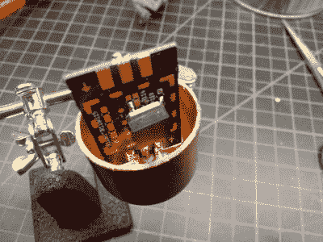
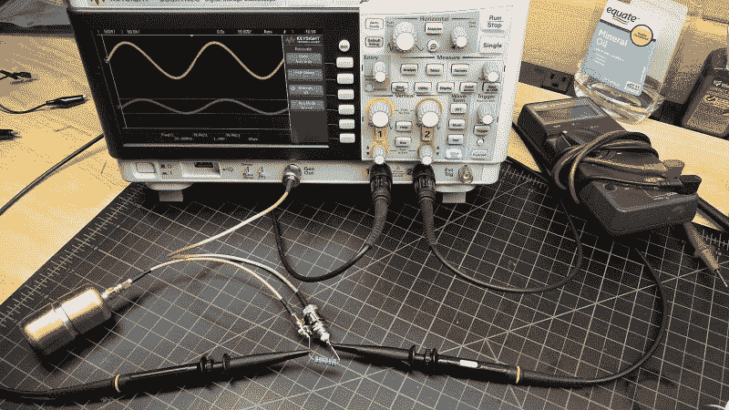
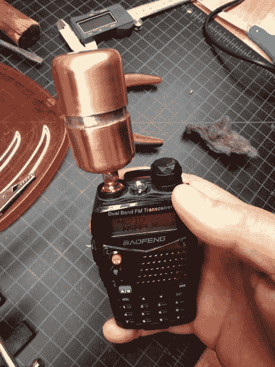

# 50 美元的火腿:假货

> 原文：<https://hackaday.com/2019/04/25/the-50-ham-dummy-loads/>

对我来说，这是令人兴奋的一天——我们终于可以制造一些业余无线电设备了！对我来说，制造设备是业余无线电爱好的最大吸引力。当然，买一台收音机很酷，即使是一台便宜的，也能触及你认为无法触及的中继器。或者在金钱谱的另一端，使用八重洲或建伍高频钻机与线性放大器和大束天线工作的人在南极洲一定很酷。但是，这两项壮举都不需要太多的电子知识或技能，最终，这就是我最初进入业余无线电的原因——学习更多的电子知识。

为了让我的自制者感到兴奋，我选择了也许是最简单的业余无线电项目:虚拟负载。每个火腿最终都需要一个假负载，这基本上是一个电路，看起来像发射机的天线，但会以热量的形式耗散能量，而不是将能量辐射到可感知的距离。它们允许操作者测试装置并进行调整，同时保持排放的合法性。几年前，如果你需要更多的背景知识，Al Williams 讲述了虚拟负载的基础知识。

我们将构建两个虚拟负载:一个专门用于我的手持对讲机(HTs)的低功率负载将是本文的主题，而一个用于高功率发射机的更大、充满油的“cantenna”负载将紧随其后。当然，我的设计都不是原创的；毕竟，借用其他火腿的电路是意料之中的。但是我在每一个上面都做了我自己的调整，你也应该做同样的事情。我的 Hackaday.io 页面对这些构建进行了深入的介绍，但下面请和我一起分享一个好的构建的要点:L'il Dummy。

## 我会装哑巴

正如 Al 在上面链接的文章中指出的，假负载只是一个电阻元件，它与发射机天线连接的特性阻抗相匹配。几乎在所有情况下，都是 50 欧姆。负载需要尽可能具有阻性的原因是，无论施加何种频率，它都需要看起来像一个平坦的 50 欧姆负载。负载中的任何电感或电容元件都会使其电抗更大，从而随着输入频率的变化而改变阻抗。这可能导致 RF 功率反射回发射机的最终放大器晶体管，可能会损坏或彻底摧毁它们。不是你要找的。

这意味着我们的电阻元件需要尽可能无感。但是，它们也需要能够消耗大量的能量。HT 虚拟负载，我称之为 L'il Dummy，需要处理一个 HT 可以输出的 5 到 8 瓦的功率。问题是，在这个范围内的功率电阻通常是线绕的，一个线圈会有太多的电感。我们需要聪明地寻找零部件。

Looking down into L’il Dummy just before applying the torch. The RF Biscuit board is a handy little thing.

L'il Dummy 的电路几乎不值一提，它只是一个 SMA 插孔，外部接地和内部导体之间有一个 50 欧姆的电阻。我选择在 RF 饼干板上构建电路。这是一种开源设计，支持各种方便的小型 RF 电路——衰减器、滤波器，以及本例中的假负载。我选择的电阻元件是一个能够消耗 35 瓦功率的厚膜 SMT 器件——对于这项工作来说已经足够了。这和一个边缘安装 SMA 插孔应该是所有我需要做一个工作假负载。

令我惊讶的是，一旦我把电阻焊接到 RF 饼干板上，假负载几乎和我的宝丰 HT 上的橡胶鸭子一样好。我可以毫无问题地通过假货击中一个本地中继器。显然不是一个好的设计。为了纠正它，我把整个东西放入一个由 1”铜管制成的外壳中。不是便宜的东西，但也不坏，我喜欢抛光铜的外观。将整个箱子焊接在一起是一个挑战，我的大韦勒焊枪无法胜任，试图用丙烷火炬将所有东西加热到足够高的温度而不过度加热是一段有趣的时间。

## 预算测试

现在来回答这个 50 美元的问题:它有用吗？我用数字万用表测试了电阻，结果只有大约 49 欧姆，这在我的书里已经足够接近了。但那是 DC 的抵抗；阻抗呢？我没有天线分析仪，所以我四处寻找，找到了一种简单的测量阻抗的方法,只需要一个信号发生器和一个示波器。我的示波器内置了一个 20 MHz 的函数发生器，所以我用一个 BNC 插孔和一个 SMA 插孔制作了一个快速测试夹具，通过一个剩余的 1000 欧姆电阻串联起来。

L’il Dummy test setup. Measure the p-p voltage on each side of the series resistance connecting the function generator to the dummy, and do a little math.

对假负载施加一个正弦波，测量电阻两侧的峰峰值电压，并做一点数学运算，就可以表征 2.5 MHz 至 20 MHz 范围内的阻抗。数学很简单:

V1 是输入端的电压，V2 是输出端的电压，Rref 是串联电阻的实际值，我测得为 998 欧姆。

结果非常接近 50 欧姆，并且在整个测试频带上是平坦的

| f (MHz) | V1 | V2 | z(欧姆) |
| --- | --- | --- | --- |
| Twenty | One point four nine | Zero point zero six two | Forty-three point three |
| --- | --- | --- | --- |
| Fifteen | One point eight nine | Zero point zero eight two | Forty-five point three |
| --- | --- | --- | --- |
| Ten | Two point five seven | Zero point one one three | Forty-five point nine |
| --- | --- | --- | --- |
| Five | Three point nine | Zero point one seven three | Forty-six point three |
| --- | --- | --- | --- |
| Two point five | Four point seven | Zero point two one seven | Forty-eight point three |
| --- | --- | --- | --- |

我希望我可以在 VHF 和 UHF 频率下测量它，但这必须等到我得到一个高达 400 MHz 左右的函数发生器。不过，我很怀疑 50 美元的预算能否解决这个问题。

## 下次

我曾打算在一篇文章中同时介绍 L'il Dummy 和它更大、更聪明的兄弟，但我仍然有一些关于大 Dummy 的测试要做。我将在下一次讨论这个问题，之后我们将继续测量一个廉价的中国 HT 的输出，并可能建立一个滤波器来净化它。