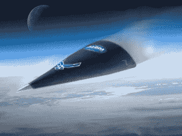
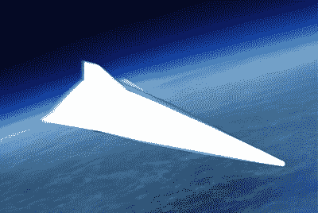

# 高超音速武器的时代已经开始

> 原文：<https://hackaday.com/2019/01/07/the-age-of-hypersonic-weapons-has-begun/>

随着备受关注的试射，以及弗拉基米尔·普京总统承诺将很快部署到前线部队，俄罗斯的 Avangard 高超音速武器已经正式从一个秘密的开发计划变为必然。作为第一种进入现役的同类武器，它能够以高达 27 马赫的速度将有效载荷运送到地球上的任何地方，同时由于其令人难以置信的速度和增强的机动性，与传统的洲际弹道导弹(ICBMs)相比，传统的导弹防御系统仍然无法阻挡。

Rendering of Avangard reentering Earth’s atmosphere

在 Avangard 成功测试后发表的一份声明中，普京总统明确表示，这种武器的规避特性不可低估:“Avangard 不会被潜在对手的任何现有和未来的导弹防御手段拦截。”这位前苏联克格勃特工出身的国家元首从来不会回避自吹自擂，但在这件事上，这不仅仅是夸大其词。虽然美国和中国一直在研究自己的高超音速武器，当它们最终上线时，应该能够满足 Avangard 的能力，但这种类型的武器仍然没有明确的威慑力。

今年早些时候，美国战略司令部司令约翰·海顿将军向参议院军事委员会作证说，报复的威胁是控制高超音速武器风险的最好的，也许是唯一的方法:“我们没有任何防御手段可以否认对我们使用这种武器，所以我们的回应将是我们的威慑力量。”从本质上讲，高超音速武器的威胁可能会开创一个“相互确保摧毁”(MAD)的新时代，这是一个冷战时代的理论，让任何一方都不会在知道自己会遭受对手同样或更大破坏的情况下打响第一枪。

随着普京总统声称 Avangard 已经进入批量生产，并将最早于 2019 年初部署，美国和中国正在竞相缩小高超音速差距。但是，世界上其他国家离开发出实用的高超音速武器还有多远呢？也许更确切地说，“高超音速武器”到底是什么意思？

## 一种新的古老的飞行方式

对于任何在俄罗斯媒体上观看 Avangard 测试的人来说，这次发射看起来没有什么特别的。如果有的话，它看起来有点过时。沉重的发射井舱门在积雪的地面上打开，火焰滚滚而出，当它咆哮着进入多姆巴罗夫斯基空军基地上空的寒冷空气中时，观众只能看到光滑导弹的短暂一瞥。如果观众希望看到一些未来的航天器从发射台升空，他们肯定会失望。但是这次虎头蛇尾的发射是意料之中的，因为 Avangard 并不是一个完整的导弹系统，而仅仅是在苏联时代的 UR-100UTTKh 洲际弹道导弹上发射的有效载荷。

 [https://www.youtube.com/embed/KFiDvuSq2Iw?version=3&rel=1&showsearch=0&showinfo=1&iv_load_policy=1&fs=1&hl=en-US&autohide=2&wmode=transparent](https://www.youtube.com/embed/KFiDvuSq2Iw?version=3&rel=1&showsearch=0&showinfo=1&iv_load_policy=1&fs=1&hl=en-US&autohide=2&wmode=transparent)

Avangard 在 ICBM 的说法中被称为“杀伤运载工具”:火箭的最后一级，它进行末端制导并携带实际的爆炸装置(核或其他)。虽然在俄罗斯媒体发布的官方渲染图中，Avangard 可能看起来像一架未来主义的明星战斗机，但它实际上无法起飞。它需要用常规火箭发射，以达到它可以分离并继续独立飞行的速度和高度。

到那时，Avangard 就变成了众所周知的高超音速滑翔飞行器。这些是利用助推-滑翔原理的飞行器，其中火箭发射的飞行器“跳过”地球大气层的边缘，以增加其飞行时间。早在第二次世界大战期间，人们就对这一概念进行了探索，设计了一种名为“Silbervogel”的亚轨道太空轰炸机，德国希望这种轰炸机能够打击美国境内的目标。德国在轰炸机还没有开始设计之前就被打败了，但是对设计的现代分析表明，当代材料科学和有限的重返大气层知识意味着设计的飞行器将永远无法完成预定的任务。

Illustration of a atmospheric “skip” by Clem Tillier (CC BY-SA 2.5)

快进到 21 世纪，更现代的复合材料以及计算机建模的好处使得这种飞行器缩小到可以安装在常规洲际弹道导弹上成为可能。这使得弹头可以比发射它的导弹飞得更远更快，同时也摆脱了传统弹头可预测的抛物线飞行路径。

简而言之，它很可能是完美的战略打击武器。难以置信的快，难以跟踪，能够执行规避动作，由于它利用现有的助推器和发射基础设施，部署相对便宜。既然这项技术已经被证明是可行的，未来十年内的扩散似乎是不可避免的。

## 暖气打开了

Hypersonic Technology Vehicle 2 (HTV-2)

俄罗斯可能已经生产了他们的 Avangard 高超音速滑翔飞行器，但美国和中国并没有落后太多。这两个国家都成功地试飞了他们自己的高超音速滑翔机，尽管应该说它们仍然是实验项目，还没有准备好进行实际部署。按照目前的发展速度(鉴于俄罗斯的成就，这一速度可能会加快)，预计两国最早也不会在 2020 年前制造出功能性武器。

在美国，自 21 世纪初以来，快速全球打击计划一直在寻求发展各种类型的高超音速武器。虽然还没有有形的系统出现，但 DARPA Falcon 项目在形式和功能上最接近 Avangard。该计划最近的飞行是由高超音速技术飞行器 2 (HTV-2)在 2010 年和 2011 年进行的，这两次飞行的速度都达到了 20 马赫，但在与牛头怪 IV Lite 助推器分离后不到 10 分钟就结束了，当时飞行器开始解体。当确定前两次收集的数据足以满足计划的目标时，第三次计划的试飞被取消。

People’s Republic of China DF-ZF

关于中国的实验性 DF-ZF 高超音速滑翔机，我们知之甚少，但美国情报机构的侦察表明，2014 年至 2017 年期间进行的 7 次试飞都是成功的。中国国防部声称，这些飞行纯粹是为了科学目的，但专家认为，高超音速滑翔机计划是加强该国军事力量的一部分，该系统非常接近作战状态。

从中国媒体提供的有限图片来看，东风-ZF 从外表上看是 HTV-2 的箭头形状和阿凡加德明显的尾翼和控制表面的融合。尽管有这些视觉上的相似之处，而且事实上它利用了相同的助推-滑翔原理，但人们只观察到东风-ZF 以最大 10 马赫的速度飞行。也就是说，任何速度超过 5 马赫的东西都应该足够快，可以躲过目前所有的防御系统。

## 新的太空竞赛

20 世纪的太空竞赛不仅是为了探索或民族自豪感，也是为了决定谁拥有军国主义的“制高点”。美国认为，如果苏联登上月球，他们将拥有发动攻击的最有利位置，这种情况在古巴导弹危机之后是不允许的。尽管通过将第一颗卫星和人类送入太空显示了早期的领先优势，但美国最终在登月方面击败了苏联。虽然竞争持续了几十年，但苏联的最终解体将使美国成为太空技术和探索领域事实上的领导者。

但在尼尔·阿姆斯特朗迈出这一小步不到 50 年后，这种领导地位已经岌岌可危。在航天飞机退役后，俄罗斯现在不仅是人类太空飞行的纽带，而且他们刚刚声称在天基武器方面取得了决定性的胜利。即使以最乐观的观点来看，美国也可能需要五年时间才能达到 Avangard 的能力，而且还远远没有一个可行的探测和对抗基础设施。

我们都对 SpaceX 和蓝色起源等商业公司之间的“新太空竞赛”感到兴奋和鼓舞，[这要归功于他们的尖端技术和他们精通互联网的媒体部门](https://hackaday.com/2018/02/06/are-there-better-things-to-hurl-into-orbit-than-a-sports-car/)。虽然它可能不会有同样的直播媒体闪电战，但似乎俄罗斯和美国之间争夺天空统治地位的再次比赛已经准备就绪，这一次中国加入了战斗。谁也说不准这一次谁会最终胜出，但事实上，俄罗斯肯定会胜出。