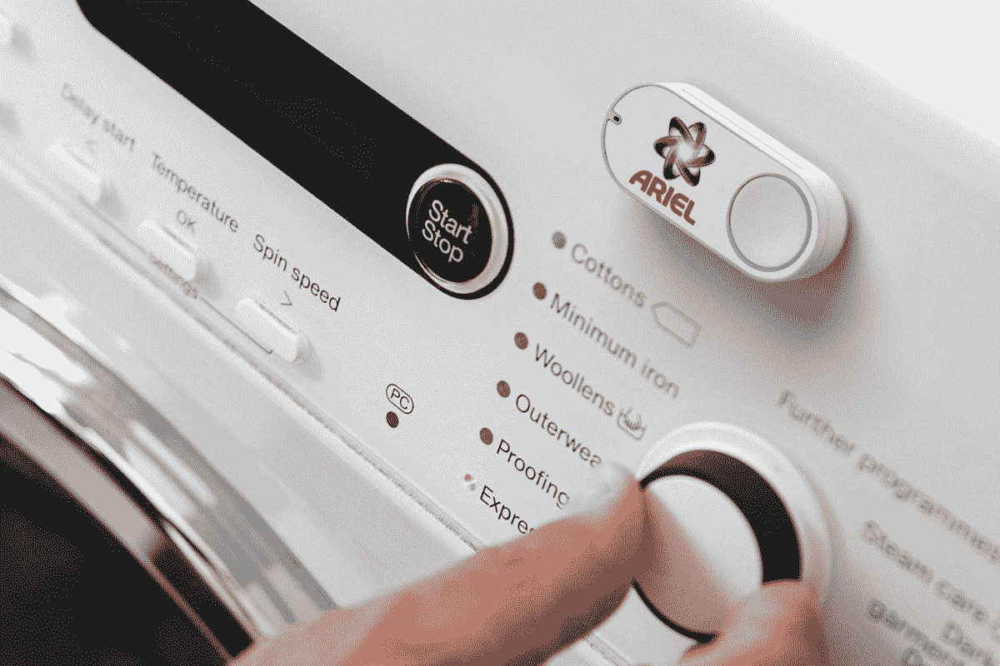
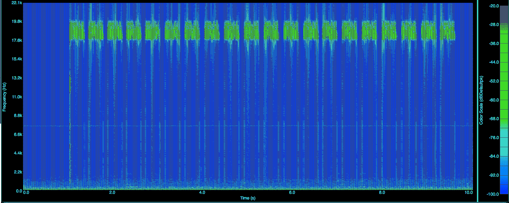
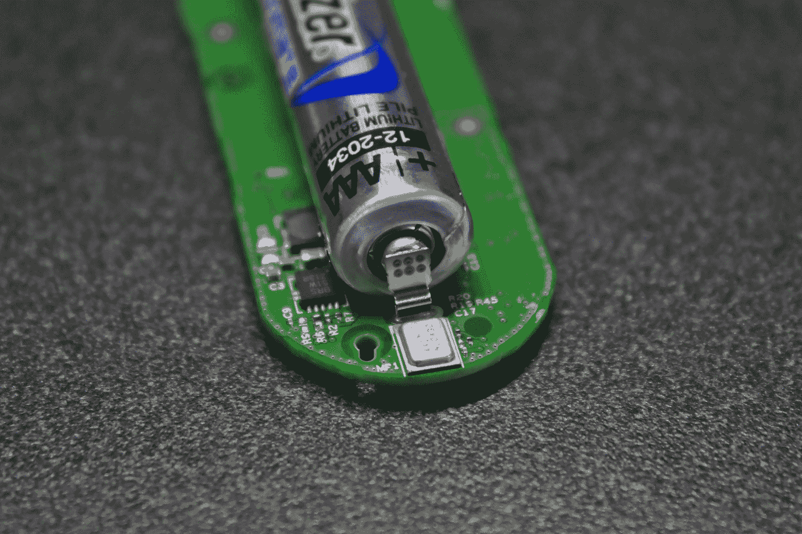
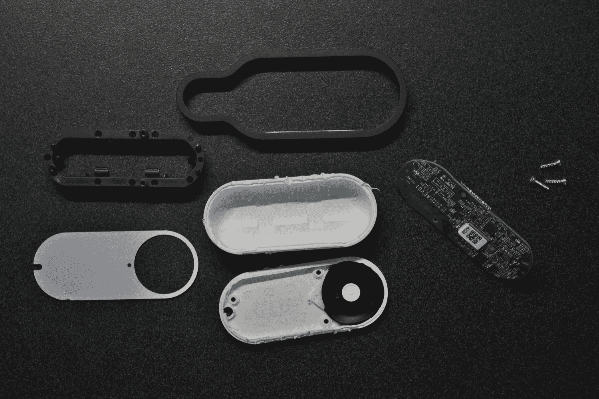
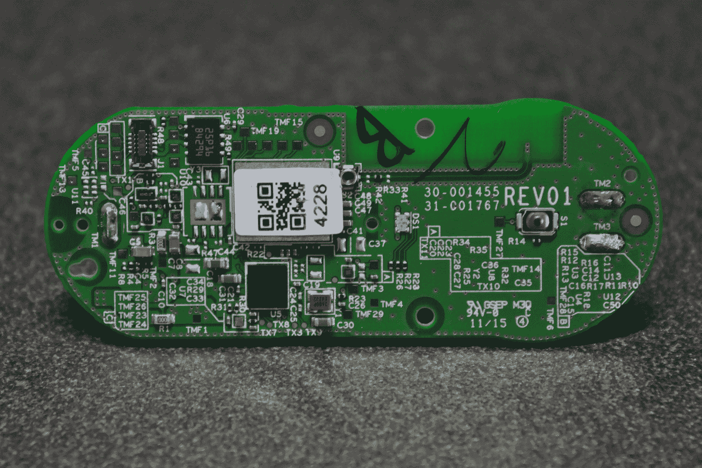
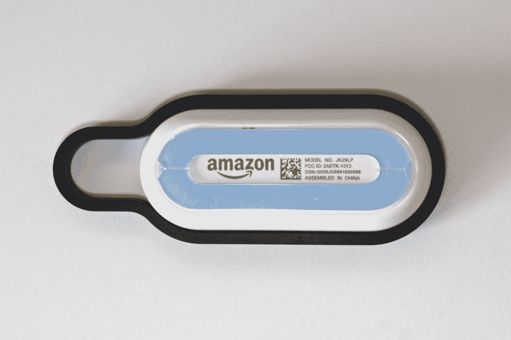

# 亚马逊破折号:回顾展

> 原文：<https://hackaday.com/2019/08/27/the-amazon-dash-button-a-retrospective/>

物联网将彻底改变一切！制造业？遛狗？咖啡豆再填充？汽车驾驶？吃东西？放个传感器进去！市场营销清楚地表明，我们生活中的任何一部分都离不开物联网。为什么？因为有了一个简单的传感器和一曲关于机器学习的企业之手的交响乐，一场 iPhone 式的革命就在眼前！输入:亚马逊 Dash，大约 2014 年。

Dash 家族的第一个产品实际上是一个条形码扫描棒，免费提供给亚马逊生鲜客户，旨在挂在厨房或贴在冰箱上。当新鲜的顾客用完了牛奶，他们可以扫描纸箱，因为它被扔掉，以添加到他们的购物车重新订购。我怀疑这些设备相当昂贵，而且有些过于复杂，无法像亚马逊希望的那样频繁使用(因此推出的产品极其有限)。亚马逊的目标是让潜在客户以绝对最小的摩擦订购，这样他们就可以尽可能多地购买。还记得[“一键立即购买”按钮吗？](https://en.wikipedia.org/wiki/1-Click)

最初的 Dash Wand 最终升级为包括一个按钮激活的 Alexa(条形码扫描仪和冰箱贴完好无损),并且[普遍可用](https://www.amazon.com/Amazon-Dash-Wand-With-Alexa/dp/B01MQMJFDK)。但是亚马逊寄希望于一个新男友。2015 年年中，亚马逊推出了 Dash 补货服务以及一款堪称典范的产品 Dash Button。破折号按钮是物理世界的一键按钮。条形码扫描棒要求用户记住棒就在附近，找到条形码，扫描它，然后记得去他们的购物车并订购产品。要离开贝佐斯先生疯狂的商业之旅，有太多的步骤，太多的地方。仪表板按钮很简单！按下按钮，将贴有标签的产品运送到预先配置的地址。每个按钮都是以特定的品牌关系购买的(5 美元，5 美元优惠券)，然后在线配置为按下时购买特定的产品。在营销资料里，幸福的家庭把它们放在洗衣机上买汰渍，或者放在厨房的柜子里买纸巾。非常聪明，它真的*是*现实世界的一键购买。

破折号按钮有两个版本。两者都有相同的用户界面和基本相同的工作方式。它们有一个单独的按钮(软件可以识别几个点击模式)，一个单独的 RGB LED(“natch”)，一个麦克风(不，它*没有听你的*，但我们会回到这个)。他们也有一个无线收音机。第二版(2016 年悄悄发布)增加了蓝牙，并完全改变了电气内部结构，尽管没有对用户产生影响。

2019 年 2 月，亚马逊停止销售 Dash 按钮。

## 这是黑客日，不是商业内幕

好吧，为什么我们要在黑客日赞美一个公司战略？仪表板按钮是一个聪明的黑客！在后 ESP8266 时代，像 Dash 按钮这样的硬件是标准的家庭自动化启动项目。但在 2015 年，当按钮被释放时，ESP 才刚刚开始掀起波澜。在那之前，WiFi 意味着一种不寻常的设备，如带有德克萨斯图像的[电动 Imp](https://hackaday.com/2014/04/14/electric-imp-locks-and-unlocks-your-door-automatically/) 或昂贵的[集成电路](http://www.ti.com/product/CC3100)。当时，低成本互联网连接设备的市场非常不同，价格也高得多。

如果制造成本超过几美元，像 Dash button 这样的设备对亚马逊来说可能没有意义，所以在不牺牲用户体验的情况下，我们玩了一些小把戏来降低成本。

声音捕捉，承蒙【杰伊·格列柯】

聪明的黑客从配对体验开始。将纯 WiFi 设备连接到家庭网络的传统方法通常是用户体验的灾难。第一次启动设备，等待它发现没有网络连接并进入接入点模式，打开一个应用程序，手动打开一个设置页面并连接到新的 WiFi 网络，返回应用程序，输入凭据，等待*某个东西*告诉你它成功了。只有当你的手机因为没有互联网连接而没有在后台关闭应用程序或断开 WiFi 网络时，这才有效！在 Android 的不同点上，应用程序开发人员可能已经能够在没有用户干预的情况下强制切换 WiFi 网络，但即使在这种情况下，平台之间的体验也是严重不一致的。

那么黑客该怎么做呢？蓝牙工作得很好，但需要另一个无线电。前面提到的电动 Imp 使用一个光电传感器，当你按下手机屏幕时，它会以编码凭证的模式痉挛地闪烁。设备可以预编程，就像亚马逊对新的 Kindle 和购买者的亚马逊账户凭证所做的那样，但这是一个复杂的工厂过程，当网络发生变化时，你仍然需要一个后备。没有这些变通办法，亚马逊选择了一些我只听过的笑话；声学配对。

Dash Button V1，出自[马修·彼得罗夫](https://mpetroff.net/2015/05/amazon-dash-button-teardown/)

两代 Dash Button 都包含单个麦克风，通过频率低于 20 kHz 的频移键控音调接收用户的网络凭证。为什么是 20 kHz 而不是以上？声学配对方法适用于任何有话筒和扬声器的地方。这些要求很容易满足，亚马逊可以编写配对流程，不仅可以在原生应用上工作，允许人们使用任何东西，从带有桌面浏览器的 Chromebook 到另一个亚马逊设备，来完成这个流程。我不知道他们从附近的回声做无声设置，但这在技术上是可行的，绝对神奇。考虑到这个范围，它需要在一个能够准确再现的频率范围内，这意味着人类的听觉范围。更多细节请看[Jay]对协议的惊人的[逆向工程(33C3 talk](http://www.blog.jay-greco.com/wp/?p=116) [此处](https://hackaday.com/2017/02/02/33c3-hunz-deconstructs-the-amazon-dash-button/))。

V1 内景，从[马修·彼得罗夫](https://mpetroff.net/2015/05/amazon-dash-button-teardown/)

移入装置我们面对着一个不寻常的景象；一节 AA 电池！而且不是一个重新命名的“工业”电池，而是一个真正的消费者电池，商标完好无损，点焊在触点上。啊？嗯，显然亚马逊认为普通的硬币电池不会提供足够长的使用寿命，可能是因为唤醒时 WiFi 重新连接期间的能量消耗，而更大的硬币电池可能比普通的消费电池贵得多。虽然电池被塑料中框(黑色椭圆形，左侧)很好地捕获，但不幸的是，它被焊接到标签上，这意味着当电池在大约 1000 次按压后耗尽时，整个组件都需要更换。我们很乐意看到有人在 Digikey 上找到一些兼容的电池标签，并开始打印替换外壳！

围栏的其他部分呢？这看起来再简单不过了。有螺钉将 PCBA 固定在外壳的顶部，但其他所有部件都用胶水或超声波焊接在一起。每个塑料组件的形状似乎也非常适合注塑成型，没有突出物，弯曲的几何形状非常适合大的[拔模斜度](https://revpart.com/draft-angles-for-injection-molding/)。总的来说，这种设备制造起来又快又容易(意思是:便宜),这并不令人惊讶。

## 黑客能力

你能在一个破折号按钮上做什么？如果人们开始扔掉这些便宜得惊人的设备，我们能给他们另一种生活吗？

也许第一批 Dash 黑客在完全没有软件或硬件黑客的情况下重新利用了这些设备。当按钮处于两次按下之间时，它会被关闭以节省电能。从长期来看，即使是为了跟上 WiFi 连接间隔而偶尔出现的峰值也将意味着巨大的功耗:Dash 按钮的正常使用寿命为*年*，因此它们不会保持连接。当你按下按钮时，设备就会醒来，切换其 LED 以指示活动，连接到 WiFi，点击亚马逊的 API，然后断开网络并关灯。当他们连接到你的本地网络时，他们必须通过一些设置步骤，包括广播一个 [ARP 探测](https://en.wikipedia.org/wiki/Address_Resolution_Protocol#ARP_probe)，以确保没有其他人共享同一个 MAC 地址。

有进取心的黑客意识到，如果你能观察局域网上的流量，那么你就能看到这些 ARP 探测，其中包括设备的唯一 MAC 地址。由于破折号按钮的生命周期非常特殊，如果您可以看到 ARP 探测，那么您可以暗示设备刚刚醒来，这反过来意味着按钮刚刚被按下。在这种情况下，利用这些信息做些事情只是管道工程。我发现第一次提到这个方法是在这篇文章的[【Ted】中。即使亚马逊的后端最终关闭，也没有理由停止工作。](https://blog.cloudstitch.com/how-i-hacked-amazon-s-5-wifi-button-to-track-baby-data-794214b0bdd8)

V1 全身拍摄，来自[ [马修·彼得罗夫](https://mpetroff.net/2015/05/amazon-dash-button-teardown/) ]

捕捉 ARP 探针效果不错，但是给我感觉挺摇摇晃晃的。这些东西已经有了处理器，所以我们应该能够让它们自己说话。编程破折号按钮怎么样？不出所料，人们已经绘制出了电路板，并确定了测试点的位置。两个版本都没有特别不寻常的部分:版本 1 有一个来自 WICED 家族的~~Broadcom~~Cypress BCM 943362 wcd 4 模块，它只是一个粘在收音机上的 STM32F205，为此有一个可用的[dev kit](https://www.cypress.com/documentation/development-kitsboards/bcm943362wcd4evb-evaluation-and-development-kit)。版本 2 似乎是一个 ~~Atmel~~ 微芯片 ATSAMG55 和一个 ~~Atmel~~ 微芯片 ATWINC1500B，带有 Cypress CYBL10563-68FNXI 蓝牙无线电，以便进行良好的测量。除了关于市场整合的有趣评论，这些都是有据可查的免费 ARM CPUs。

然而，尽管演示硬件和 Dash 按钮都可用，但似乎没有人走得很远。很容易找到关于刷新设备和闪烁 LED 或倾听按钮按压的[伟大教程](https://learn.adafruit.com/dash-hacking-bare-metal-stm32-programming)，但我找到的每个教程都以令人沮丧的吊人胃口的“从现在开始，只要弄清楚 WiFi 就行了。”所以，是的，它们可以被重新编程为奇怪的小开发板，但我们还没有看到有人完全控制设备，所以我们可以访问其中包含的所有有趣的功能。

## 下一步是什么？

在结束之前，让我们花点时间在这里交替赞扬和谴责亚马逊。像 Dash 按钮和 Wand 这样的“小”硬件项目是我最喜欢的一种公司实验。当一家公司试图制造一种普通的硬件产品时，我总是很兴奋。(Dash 魔杖有一个真正的 *[条形码扫描仪](https://en.wikipedia.org/wiki/CueCat)！*！)这比在这些想法走出实验室之前扼杀它们要好得多。

另一方面，破折号按钮相当浪费。它们被设计成有有限的寿命，这很好，但是没有标记可以防止它们在停止工作时进入家庭垃圾。亚马逊还应该期待用户做什么？该设备显然内部有电池，但没有像电池门这样的明确提醒，在设备寿命的最后时刻，用户不会明显知道它应该被送去处理电池。使用典型的家用电池是非常聪明的，但正确的后续措施应该是包括一些去除它的方法，允许无限的产品寿命和更周到的处理。

从更积极的方面来说，我们希望捡起一大袋仪表板按钮变得非常容易！当它们停止工作时，我们可以通过收集它们并提供新的用途来打破电子垃圾循环。

一旦我们开始看到这些出现在项目抽屉里，就有两条值得探索的道路。一个是找到一套非常适合现有 PCBA 的电池标签，这样电池就可以被替换，以及可以打印的新外壳，用来容纳所有的电池。在这一点上，Dash 按钮可以摆脱其有限设计寿命的束缚，只要我们愿意，它也可以运行。

调查的另一个过程是显而易见的:最终让 WiFi 工作起来！虽然根据我的经验，Broadcom 的 WICED 品牌 WiFi 部件可能会非常复杂，但 WINC1500 似乎并没有什么特别之处。[正如 Adafruit 在 2016 年指出的](https://blog.adafruit.com/2016/07/26/new-amazon-dash-buttons-using-winc1500/)这个模块实际上被用在了 Arduino MKR1000 和 WiFi Shield 101，以及一系列 Adafruit 板中。那么这个能搞清楚吗？我们希望如此！一如既往，如果你为亚马逊 Dash 按钮找到了新的生命，新的外壳，聪明的固件，或其他任何东西，我们很乐意听到它！