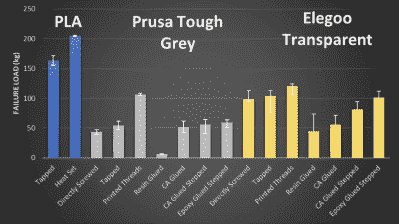

# 树脂零件的最佳螺纹孔

> 原文：<https://hackaday.com/2022/11/01/the-best-threaded-holes-for-resin-parts/>

螺纹镶嵌非常适合用烙铁熔成 FDM 图案。对于树脂印刷品来说，这一过程并不简单，因为它们一般不会受热软化。当然，您也可以直接打印螺纹，将螺栓拧入无螺纹的孔中，或者攻一个孔。来自*数控厨房*的【Stefan】遵循他一贯严格的测试流程，调查了各种在树脂印刷品上添加螺纹孔的[方法。](https://www.youtube.com/watch?v=4nbvU2kGzxc)

在使用螺纹嵌件(205 千克)和螺纹孔(163 千克)在 PLA 上建立拔出力后，【Stefan】测试了用 Prusament 坚韧无烟煤树脂印刷的零件。无螺纹和螺纹孔分别在 44 千克和 55 千克时失效，而印刷螺纹的强度几乎是两倍，在断裂前达到 106 千克。Stephan 还尝试用树脂和 CA 胶将插入物粘到零件上。树脂在不透明部分(6 千克)没有完全固化，而 CA 与塑料线相当，在 52 千克时失败。

TLDR: Print your threads for best results

【Stefan】还测试了常规的 ELEGOO 半透明树脂。固化树脂的硬度更高，使得无螺纹和螺纹孔的零件可以保持大约 100 千克，而印刷螺纹可以达到 120 千克。由于提高了紫外线穿透力，用树脂粘合的螺纹嵌件在透明部件上做得更好，但是非常不一致。用 CA 胶合的插入物的性能与 Prusament 部件大致相同，在 56 kg 时失效。

为了提高镶件的性能,【Stefan】打印了一些带有阶梯孔的零件，以匹配镶件的几何形状，这有利于防止镶件在胶合过程中脱落。它只对 Prusament 零件产生了微小的影响，但却将 ELEGOO 树脂上的 CA 胶合嵌件的强度提高到了 82 千克。还尝试了两部分环氧树脂，其强度与无螺纹孔相匹配。

因此，对于树脂零件，最好的方法可能是在 CAD 中建立螺纹模型，然后直接打印出来。如果您需要能够在不剥离的情况下重复拧紧和拧松孔中的紧固件，使用 CA 或环氧树脂的螺纹孔可能是更好的解决方案。

 [https://www.youtube.com/embed/4nbvU2kGzxc?version=3&rel=1&showsearch=0&showinfo=1&iv_load_policy=1&fs=1&hl=en-US&autohide=2&wmode=transparent](https://www.youtube.com/embed/4nbvU2kGzxc?version=3&rel=1&showsearch=0&showinfo=1&iv_load_policy=1&fs=1&hl=en-US&autohide=2&wmode=transparent)

