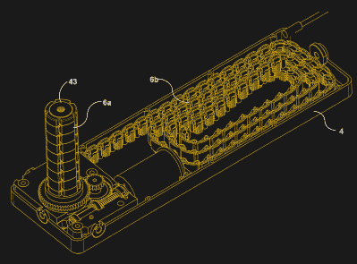
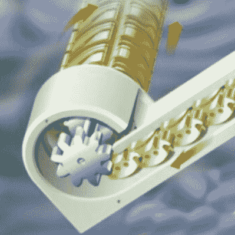

# 消失的线性致动器的魔法

> 原文：<https://hackaday.com/2020/12/29/the-black-magic-of-a-disappearing-linear-actuator/>

我们在 Hackaday 上提供的许多项目都是新鲜出炉的，来自媒体的努力。但有时，只是有时，我们会偶然发现过去的想法，它们太简单而无法忽略。这是其中的一个时代——这个有争议的装置是“卡塔卡”,由[延斯·索伦森]发明，并在 2003 年左右登上了《尤里卡》杂志的封面。

 该设备的商标为 Kataka，但一般称为[分段主轴](https://en.wikipedia.org/wiki/Segmented_spindle)，是一种紧凑形式的线性致动器，它使用一种新颖的皮带排列来创建一种可以减小到非常小的厚度的设备，而当完全伸展时，它的尺寸看起来似乎不可能。这是优于传统致动器的关键优势，传统致动器通常缩回到至少活塞长度的外壳中。

看着这个装置运转，看到活塞“不知从哪里冒出来”有点神奇。遗憾的是，Kataka 的 youtube 频道现在已经不活跃了，但它包含了该设备在各种场景中使用的许多视频，例如升降椅子和橱柜。我们对该设备能够支持的负载量印象深刻。当用于剪式升降机时，它还具有独特的优势，即[平坦的力/扭矩曲线](https://www.youtube.com/watch?v=6zEsx_fciDU&ab_channel=kataka1)。

 大多数设备上线的记录大致都是十年前的事了。虽然制造了许多原型，并颁发了专利，但这种机制似乎从未起飞或得到主流使用。我们想知道，随着更多的认可和 3D 打印的出现，我们是否会在 odd maker 项目中看到这种设计。

没错，3D 打印线性致动器并没有你想象的那么糟糕。它们很容易制造，有多种设计可供选择，而且“T2”能承载比你想象的更多的负荷。也就是说，如果你正在建造，比如说，你自己的飞行模拟器，你可能不得不[设计一些更大的](https://hackaday.com/2014/04/12/diy-linear-actuators-for-a-flight-sim/)。

非常感谢[Keith]的提示，我们很喜欢阅读这篇文章！

 [https://www.youtube.com/embed/OiPU9BGQL2M?version=3&rel=1&showsearch=0&showinfo=1&iv_load_policy=1&fs=1&hl=en-US&autohide=2&wmode=transparent](https://www.youtube.com/embed/OiPU9BGQL2M?version=3&rel=1&showsearch=0&showinfo=1&iv_load_policy=1&fs=1&hl=en-US&autohide=2&wmode=transparent)

