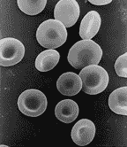

# 血液工厂:新研究可能打开人造血的大门

> 原文：<https://hackaday.com/2022/11/15/the-blood-factory-new-research-may-open-the-door-to-artificial-blood/>

本周有一些新闻报道，标题有些令人窒息，暗示医学突破即将到来:“在第一个例子中，两个人接受了实验室培养的血细胞的输血。”像这样的标题肯定会吸引眼球，尤其是随着假期的临近，以及每年这个时候血液供应紧张时不可避免的对献血量增加的需求。这样的标题是否意味着有人正在研究完全人造血？

对于这类事情，答案总是好坏参半。是的，英国的一个小组已经给两名患者输入了少量实验室培养的红细胞，这是第一次实施这种特殊的程序。虽然标题在技术上是正确的，但输血量非常小，所以实验室培养的全血输血取代捐献血液的那一天还没有到来。但是做了什么和为什么要尝试的细节是这里真正有趣的部分，它值得深入研究，因为它确实潜在地指明了未来完全合成血液可能成为现实的方向。

## 红色成长

为了理解这项被称为“干细胞来源的红细胞的恢复和存活”的试验中所做的事情，我们必须详细了解血液形成的过程。从单一细胞类型到充满平衡的红细胞、白细胞、血小板和无数其他特化细胞和因子的全血的旅程被称为造血。这是一个非常复杂且受到严格监管的过程，但这一切都始于体内最简单的细胞，在某种程度上也是最重要的细胞:干细胞，这是一种未分化的细胞，可以进行无限数量的自我复制。

Many branches, but one starting point. A simplified view of hematopoiesis. Source: [CCCOnline](https://pressbooks.ccconline.org/bio106/chapter/cardiovascular-levels-of-organization/), CC BY-SA 4.0

造血根源的干细胞被称为成血细胞细胞。在成人中，成血细胞主要位于骨髓中，特别是胸骨、椎体、肋骨和骨盆骨的翼部。响应于某些生长因子的存在或缺乏，成血细胞经历一系列分裂，导致具有特定功能的分化越来越多的细胞。虽然一些成血细胞最终沿着一条分支前进，这条分支通向组成我们免疫系统的各种类型的细胞——白细胞或白细胞——但其他成血细胞开始分化为专门运输氧气和二氧化碳的细胞:红细胞(RBCs)，也称为红细胞。

在分化或红细胞生成的过程中，干细胞在大小和形状上都经历了巨大的转变。发育中的红细胞变得越来越小，并开始呈现其特有的双凹圆盘形状。编码血红素蛋白的基因开始表达，随着载氧蛋白血红蛋白在细胞质中积累，发育中的红细胞开始变红。最终，在整个分化过程中一直在萎缩的干细胞中的细胞核从未成熟的红细胞中排出，留下一小袋血红蛋白，仅此而已。

这个阶段的不成熟红细胞被称为网织红细胞。此时，它们从骨髓迁移到血液循环中，并在几天后成熟为红细胞。在任何给定时间，网织红细胞约占健康患者 RBC 的 1%,其余 99%是年龄高达约 4 个月的混合群体。当它们变老时，红细胞受损太严重，无法发挥作用，因此它们被从循环中移除，并由脾脏回收，血红蛋白中的元素铁被回收用于下一轮红细胞生成。

## 婴儿血细胞

在健康的成人中，红细胞生成是一个惊人的生产过程；尽管从干细胞到网织红细胞需要三周时间，但骨髓每天向循环中输送大约 2000 亿个新的红细胞。这种快速重建红细胞储备的能力是献血的关键；通常情况下，献血者在 20 天左右的时间内从捐献半升全血中完全恢复。由于这种快速回收，献血已经成为一种绝对重要的拯救生命的工具，用于治疗各种疾病和失调。

Photomicrograph of erythrocytes. Source: by Drs. Noguchi, Rodgers, and Schechter of NIDDK, National Institutes of Health. Public domain.

但是，尽管输血可以挽救生命，但也可能出现并发症。红细胞表面带有蛋白质因子，即人们熟悉的“ABO”分类，即使经过仔细的分型和交叉配型，它们最终也能提高受体的免疫反应。这往往是最普遍的频繁血液接受者，特别是那些贫血如镰刀细胞贫血或地中海贫血，或凝血障碍如血友病。

一种潜在的避免发展为本质上相当于“血液过敏”的方法是增加输血的间隔时间，这正是 RESTORE 试验所关注的。他们希望能够给患者输血，而不是输含有各种年龄红细胞的全血，其中每个红细胞都是完全相同的年龄和全新的。这样，至少在假设的情况下，被输血的红细胞可以存活整整 120 天，而不是从输血的那一刻开始就不断地被淘汰。

探索实验室培养的血液在治疗疾病中有多大用处的第一步是制造一些血液。虽然还没有 RESTORE 试验的论文发表，但几十年来，[体外红细胞生成](https://www.ncbi.nlm.nih.gov/pmc/articles/PMC6947291/)已经成为一个非常标准的实验室程序。方法各不相同，但从 RESTORE 团队给出的描述来看，他们很可能是在分离和扩增少量造血干细胞，这些干细胞与成熟细胞一起在血液中循环。这些细胞表面有成熟红细胞所缺乏的抗体，这一事实可以用来将它们与其他细胞分离开来。然后，一小部分干细胞可以在合适的生长培养基中生长。

为了将干细胞转化为红细胞，可以用红细胞生成素处理培养物，红细胞生成素是一种通常由肾脏分泌的蛋白质。红细胞生成素，即 EPO，是在身体感觉到血氧不足时分泌的；身体的反应是刺激干细胞分化成红细胞，以增加血液的携氧能力。促红细胞生成素在 20 世纪 90 年代作为一种提高成绩的药物而闻名，当时运动员，特别是自行车运动员使用它来增加血液的携氧能力。

在 RESTORE 研究中，全血取自健康的捐献者，干细胞从全血中纯化出来，然后培养红细胞。也留出一些全血作为对照。然后，两批血液都用一种轻度放射性示踪剂进行标记。在捐献者方面，健康的志愿者被输入非常少量的培养血液——只有几毫升。在接下来的四个月里，将对他们进行跟踪，分析他们的血液样本，以观察还剩下多少培养的红细胞。在所有培养的血液被清除后，用捐献的血液重复实验。

如果一切顺利，恢复团队将总共为 10 名志愿者输血。他们预计，培养的红细胞在循环中比输全血持续的时间更长；如果是这样的话，这可能为需要频繁输血的患者打开改善治疗的大门。当然，在此之前还有很多工作要做，尤其是扩大一种方法的规模，这种方法目前可以为一个人生产足够的培养红细胞。

 [https://www.youtube.com/embed/_Dw4mGy_DJg?version=3&rel=1&showsearch=0&showinfo=1&iv_load_policy=1&fs=1&hl=en-US&autohide=2&wmode=transparent](https://www.youtube.com/embed/_Dw4mGy_DJg?version=3&rel=1&showsearch=0&showinfo=1&iv_load_policy=1&fs=1&hl=en-US&autohide=2&wmode=transparent)

## 人造血的未来

但是有一天类似的过程会导致完全实验室培养的全血吗？有可能，但是全血比红细胞要复杂得多，学习大量培养全血可能要困难得多。使这成为可能的是最初的干细胞:成血细胞。由于全血中的每一个细胞都是由这一种细胞类型衍生而来，因此完全在体外培养全血应该是可能的。当然，这并不意味着这个过程完全是人工合成的。这些干细胞必须来自某个地方，而最明显的来源就是人类捐赠者。这就引出了一个问题，为什么你要为体外步骤费心；如果你必须得到捐赠，只要得到全血就行了，对吗？

虽然这是真的，但将捐赠的干细胞转化为人工全血将会有显著的好处。主要优势在于，由于干细胞本质上是永生的，单次捐献可能会产生无限量的全血。在潜在献血者有限的地方，这可能有很大的好处，但在紧急情况下仍然可能需要血液——想想太空旅行。即使从干细胞培养物中产生全血被证明是不可能的，能够扩大红细胞的产量并将其与捐献的血浆混合也是非常有价值的——多亏了血浆去除法，血浆的捐献频率比全血高得多。

不再需要捐献人类全血的那一天可能永远也不会到来，即使到来，也是遥遥无期。但是 RESTORE 试验已经成功培养出了最初实验所需的几毫升血液，这是一个令人兴奋的消息。这项试验不仅会给现在有需要的病人带来切实的好处，而且还会打开无限量全血供应的大门。