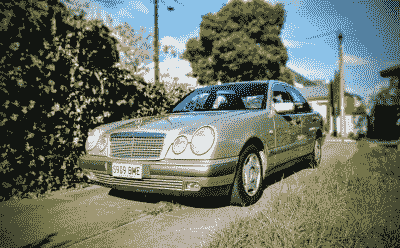
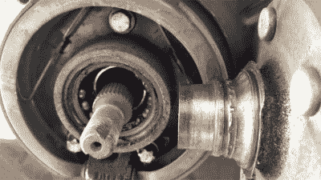
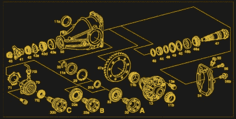
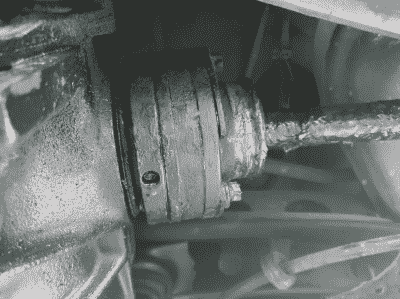
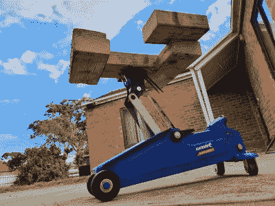
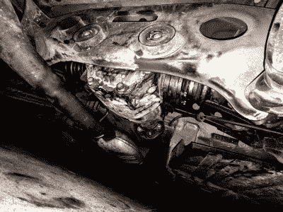

# 神秘的传动系统噪音案例

> 原文：<https://hackaday.com/2021/07/14/the-case-of-the-mysterious-driveline-noise/>

花足够的时间在汽车分类广告上，你最终会发现一个好得不能错过的交易。最近的一辆是奔驰轿车，刚过了 20 岁生日，车况出奇的好。1998 年的 E240 售价不到 3000 美元，太棒了，不能错过，只能一睹为快。

The car in question. Clean bodywork is too tempting to resist, even if there are mechanical issues.

这辆车很干净，干净得不能要价。当然，试驾发现这款车有一个重大缺陷——传动系统发出恼人的嗡嗡声，似乎随速度而变化。不过总的来说，机械问题往往比车身更便宜，也更容易解决，所以德国轿车成了一场赌博。首要任务是诊断和纠正问题。

## 描述、研究、调查

捕捉任何噪声的第一步是尽可能多地描述它的特征。在这种情况下，当汽车以 40 公里/小时-60 公里/小时的速度行驶时，噪音最明显，表现为振动嗡嗡声。噪音源的位置不清楚。重要的是，噪音随着车速的变化而变化，车速越高，噪音越大，车速越慢，噪音越小。发动机转速对噪声没有任何影响，无论变速器选择什么档位，包括空挡，噪声都存在。

A worn wheel bearing can create an annoying noise when travelling at speed.

以上所有这些都告诉我们，噪音不是来自发动机，也可能不是来自变速器，也许输出轴承除外。噪声随速度变化的事实告诉我们，它来自与车轮速度相关的运动物体。因此，这可能是车轮或轮胎失去平衡、车轮轴承或制动器磨损、差速器噪音或传动轴、其相关轴承或联轴器有问题。这需要进行大量的工作，而且在噪音消失之前，简单地更换零件是远远不够的。如果要解决这个问题，就必须缩小噪音源的范围。这通常很困难，因为悬架和驱动轴等部件会传递或放大噪音，掩盖其原始位置。

在购买之前，噪音相当明显，尽职调查意味着做足够的研究，以确保问题不可能是灾难性的。在论坛上搜索常见的噪音来源发现，W210 系列拥有相对坚固的变速器和发动机，传动系统下游的其他一切都相对简单，如果有缺陷，很容易修复。因此，这辆车以 2650 澳元的价格被购买，并真诚地相信这个问题可以在没有过多支出的情况下得到解决。

There are precisely this many bearings in the car’s differential. If any one of them is excessively worn, it could create driveline noise. The pinion bearing is usually the culprit, as it can often receive poor lubrication or excessive load.

为了排除车轮轴承问题，汽车被顶起，车轮前后晃动以检查间隙。没有发现任何问题，同样，无论车轮上的转向负载如何，噪音也没有变化，这表明轴承是完好的。目测显示，车轮状况良好，轮胎仅使用了一年；由于不方便寻找另一套测试汽车，他们也搁置在这一阶段的调查。刹车也被排除在外，因为无论刹车与否，声音都不会改变，而且噪音也不是与此类零件相关的典型研磨声。

为了更深入地观察传动系统，汽车被放在千斤顶上。这将允许检查差速器、驱动轴、橡胶驱动轴联轴器和驱动轴的中心支撑轴承。经过一番挣扎，后驱动轴联轴器被拆下，这表明有些老化，但总体而言，橡胶完好无损。驱动轴或它的中间轴承似乎也没什么问题。

然而，这种差异是另一回事。来回摇动输入显示小齿轮有明显的间隙。当小齿轮碰到齿圈的齿时，差速器会发出明显的沉闷金属声。有些游戏是正常的，但直觉表明这是在过度的水平。小齿轮也显示出明显的前后游隙，表明差速器出了严重的问题。用手转动小齿轮也显示出有点脆脆的感觉，表明差速器中的轴承可能磨损了——这肯定是传动系统噪音的原因。

在这一点上，车辆被送往一个机械师的车间进行评估，理想的是，一个新的差速器。机修工在电梯上运行汽车，用听诊器定位噪音，就能很容易地确定噪音来自差速器的小齿轮。这在千斤顶上尝试是不安全的，但在机修工车间里做起来很简单。事实证明，验证差异确实是问题所在是很有用的。可以清楚地听到最大的噪音来自差速器本身，即使传动轴有点像扬声器，放大了汽车上其他地方的噪音。这也可以通过更现代的工具来实现，[通常称为“机箱耳”。](https://www.youtube.com/watch?v=Wy5nqh3LSs4)这样，即使在开车时，也可以在汽车周围放置麦克风，从源头上轻松诊断问题噪音。尽管如此，这些工具还是很贵，而且常常超出家庭技工的能力范围。(但是他们自己可能会做一个不错的 DIY 项目。)

## 修理

现在确定了噪声源，需要更换差速器。由于零件很难在当地找到，这项工作超出了车间愿意承担的范围，因此寻找和安装另一个差速器自然成了 DIY 工作。可悲的是，梅赛德斯-奔驰车主在历史上没有花太多时间在自己的车辆上，这意味着许多车型根本不存在 DIY 手册。相反，找到清晰的车间说明的最佳方法是通过各种在线市场上的灰色市场卖家购买访问梅赛德斯-奔驰 WIS 信息系统的权限。

Modern Mercedes-Benz vehicles often use E-Torx bolts. Investment in the correct tooling to deal with these should be budgeted into any repair. These bolts were the hardest to remove in the whole repair.

有了关于如何执行修复的工厂说明，以及另一辆 E 级奔驰的优质二手差速器，唯一要做的就是更换零件。差速器互换是 shadetree 机械师的中级工作，需要小心避免在拆卸和安装过程中被压碎。为了避免这种情况，需要一个定制的工具，以支架的形式在拆卸过程中支撑差速器，并帮助将新的差速器提升到位。那些能够掌握大量卧推数据的人可能会觉得没有必要，但总的来说，最好有一个适当的结构来保持差异，而不是冒险让它掉在自己的脸上。除此之外，这是一个简单的工作，只需要拆除三个主要的支持螺栓和一些较小的紧固件举行半轴。

这一过程自然证明比预期的更加困难。八个小时的时间都浪费在用 E-Torx 螺栓将半轴固定在差速器输出法兰上，大部分时间都是在大喊大叫、沮丧和返回商店购买新工具中度过的。最终，一个大的破碎机杆和冲击扳手的组合使螺栓自由。需要注意的一件重要事情是，电池快没电的冲击枪可能听起来工作正常，但它的强度大大降低。充电电池对于更难的螺栓来说至关重要。

A cradle was built out of the very pallet the part was shipped on to enable the differential to be safely removed and replaced. It mimics the custom tool visible in the service illustration above.

松开法兰螺栓的困难导致了进一步的复杂化。为了清楚地松开它们，必须移动后等速万向节防尘罩，在重新装配时需要重新夹紧。这就需要购买新的工具来重新夹紧它们。去除它们还会导致钼润滑脂变得到处都是。然而，在这个过程中，我们学到了一些有用的技术，比如顶起后悬架，以改变半轴与差速器的角度，从而更容易接触到某些螺栓。

一旦旧的差速器被拆下来，就可以相对容易地把新的抬到合适的位置，并把所有的东西都安装好。自制的千斤顶摇篮在这里被证明是无价的，因为很难在自己拧紧螺栓的同时将 30 公斤的差速器提升到位。由于采用了密封设计，新的差速器在安装到汽车上之前也可以填充适当的润滑剂，使整个过程更加清洁。当汽车在千斤顶上时，抓住机会处理其他维修工作是很诱人的。然而，如果在差异交换后出现噪音或其他问题，任何错误都可能导致混乱。这样，差异就完成了，其他工作留待以后进行。

The new differential, sitting snugly in the rear subframe. Barely visible is a dark splotch of oil by the differential pinion. This may have been due to a spill, or it may be evidence the replacement differential has a leaking pinion seal. Careful monitoring will be required to avoid ruining the replacement differential in short order.

汽车组装好后，人们屏息以待，开始了它的第一次驾驶。令人欣慰的是，可怕的噪音消失了，得到的回报是一辆安静舒适的德国轿车。我花了大约 22 个小时的非技术时间，花了 500 美元购买工具和流体，与当地一家汽车修理厂对同样工作的报价 1200 美元相比，这感觉像是一场胜利。考虑到拥有合适设备的专业机械师可能在不到六个小时的时间内完成同样的工作，单干无疑是正确之举。额外的收获是，一路上学到了很多东西。

应该有条不紊地调查噪音，如果想要成功，最好在更换任何零件之前将噪音定位到单个部件。耐心也是关键，以避免代价高昂的错误，如在途中弄圆螺栓或剥去螺纹。总的来说，关键是要相信你的学习能力，并调查一个问题，直到你从根本上理解发生了什么。只有这样，您才能保证问题能够得到妥善解决。