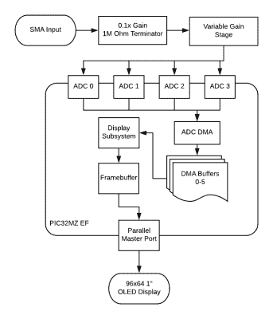
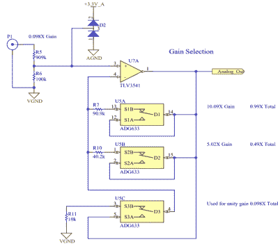

# 史上最可爱的示波器

> 原文：<https://hackaday.com/2019/10/10/the-cutest-oscilloscope-ever-made/>

如果你认为你的手持数字示波器是你的信号分析工具中最便携的，那么你会大吃一惊。这个由[Mark Omo]制造的示波器只有一平方英寸，大部分空间都被有机发光二极管屏幕占据了。

它可以折叠成一个更容易握持的工具，并且确实需要外部输入，所以它不是一个独立的工具。示波器运行在 PIC32MZ EF 处理器上，实现了 20Msps 和 1MHz 的带宽。前者交错处理器的内部 ADC，以实现其速度。

对于模拟前端，信号首先进入一个 1Mω的终结器，该终结器将信号除以 10x，以便在供电轨之外进行测量。然后，它们通过一对连接到供电轨的二极管，箝位电压以防止损坏。分压器将输入的交流信号集中在 1.65V 左右，介于 AGND 和+3.3V 之间。作为进一步的安全特性，在信号和二极管之间有一个更大的 909k 欧姆电阻，以防止大电压进入系统时大电流通过二极管。

下一个元件是可变增益级，提供 10 倍、5 倍或 1 倍增益，对应于 1 倍、0.5 倍和 0.1 倍系统增益。对于子系统，考虑到驱动因素，使用 TLV3541 运算放大器和 ADG633 三引脚 SPDT 模拟开关来提供围绕系统响应的功率带宽。值得注意的是，开关的电阻不可忽略，可能随电压而变化。幸运的是，示波器中使用的屏幕需要 12V 电压，因此向多路复用器提供 12V 电压会产生更低的电压，从而产生更平坦的响应。

ADC 模块 PIC32MZ1024EFH064 是一款 12 位逐次逼近型 ADC。他的特殊 ADC 的一个优势是额外的分辨率位只需要恒定的时间，因此速度和精度可以折衷。转换从采样保持序列开始，利用电容上存储的电压计算电压。

多个 ADC 并行使用，同时进行采样，因此交错提高了采样速率。由于来自 ADC 模块的数据为每秒 120 兆位，PIC32MZ 上的直接存储器访问(DMA)外设允许将数据直接写入微控制器的存储器，而无需处理器参与。

固件目前可在 [GitHub](https://github.com/1o1-Oscilloscope/Firmware/tree/display) 上获得，原理图发布在[项目页面](https://hackaday.io/project/160802-1-square-inch-20msps-oscilloscope)上。

 [https://www.youtube.com/embed/w-0vn-Lz5E0?version=3&rel=1&showsearch=0&showinfo=1&iv_load_policy=1&fs=1&hl=en-US&autohide=2&wmode=transparent](https://www.youtube.com/embed/w-0vn-Lz5E0?version=3&rel=1&showsearch=0&showinfo=1&iv_load_policy=1&fs=1&hl=en-US&autohide=2&wmode=transparent)

