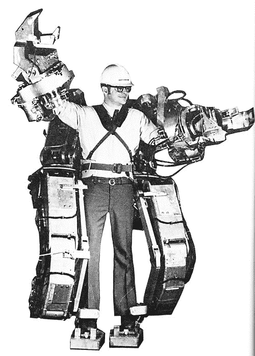

# 我们中间的电子人:外骨骼成为主流

> 原文：<https://hackaday.com/2019/01/28/the-cyborgs-among-us-exoskeletons-go-mainstream/>

每一项技术进步似乎都有一个明显的拐点，在此之前，任何早期采用者似乎都被视为怪人，但在此之后，设备或服务迅速成为主流，以至于非采用者成为怪人。以手机为例，我清楚地记得 20 世纪 90 年代的一篇新闻报道，关于一些制造商在手机中安装数码相机的疯狂想法。似乎几分钟后，你就买不到不带摄像头的手机了。

看起来我们可能正在接近一个类似的转折点，这是一项比手机摄像头更复杂、可能更能改变生活的技术:电动外骨骼。随着越来越多的新闻报道涉及老年人外骨骼助手的进步，脊髓损伤和神经退行性疾病患者的治疗应用，以及渗透到工作场所——包括战场——作为人类努力的放大器，在看到有人在公共场合使用外骨骼变得如此普遍以至于不被注意之前，有必要看看我们在外骨骼方面的进展。

## 历史

首先，一些定义。我使用的术语“外骨骼”可能过于宽泛，指的是任何人类可穿戴的动力铰接设备，旨在增强或恢复人类运动的自然范围。我还包括目前市场上的一些非电动工人辅助设备，因为它们是一个重要的类别，其中大多数可以在不久的将来作为电动设备的基础。但是我没有提到机械人或者机械套装；看着杰格斯和凯居在 T2 的环太平洋地区一决雌雄可能很酷，但这也带来了一大堆麻烦。

The GE Hardiman. This is a posed shot; the suit was too dangerous to actually be used. Source: [General Electric](https://www.ge.com/reports/post/78574114995/the-story-behind-the-real-iron-man-suit/)

动力外骨骼的概念可以追溯到很久以前的蒸汽动力时代，那时这个想法还没有实现。直到 20 世纪 60 年代，当控制系统和动力传输变得足够先进时，才开始认真努力开发外骨骼。这是来自通用电气公司 R&D 实验室的一种叫做“哈迪曼”的机电服。该设备有四个液压驱动的肢体，它们应该能够感知操作者在其中的运动，并在每个肢体上平稳地再现这些运动，使操作者能够提起相当于 1500 磅(680 公斤)服装重量的负载。但是控制系统永远无法调整到足以减少肢体剧烈运动的趋势；因此，当它通电时，没有人穿上这套衣服。

也许第一个在媒体上引起轰动的外骨骼是由前美国陆军游骑兵蒙蒂·里德设计的 LIFESUIT。当一次夜间跳伞在离地面还有 100 英尺(33 米)的时候发生了可怕的错误，蒙蒂受伤了，这将严重影响他的行动能力。虽然没有瘫痪，但他无法行走或站立超过几分钟。蒙蒂不愿面对平躺着的生活，而是发明了一种外骨骼来帮助他重获独立。他自学了机器人和控制系统的概念，并在 2005 年西雅图 5 公里公路赛中驾驶第 12 个版本之前，在预算有限的情况下完成了多个 LIFESUIT 原型。

 [https://www.youtube.com/embed/DSg9i9On9JQ?version=3&rel=1&showsearch=0&showinfo=1&iv_load_policy=1&fs=1&hl=en-US&autohide=2&start=30&wmode=transparent](https://www.youtube.com/embed/DSg9i9On9JQ?version=3&rel=1&showsearch=0&showinfo=1&iv_load_policy=1&fs=1&hl=en-US&autohide=2&start=30&wmode=transparent)

## 再次行走

尽管蒙蒂已经取得了很大的成就，但他的努力与目前这一代辅助外骨骼相比似乎有些微不足道。电池技术、无刷电机和复杂控制系统的最新进展意味着电动外骨骼现在可以更加光滑，接近可以穿在衣服下面的程度。

辅助外骨骼市场的领导者之一是一家名为 Cyberdyne 的日本公司。从流行文化的角度来看，他们选择这个特定的名字有点令人费解，因为这是他们旗舰产品 HAL 的首字母缩写。HAL 是“混合辅助肢体”的缩写，有几种配置，目前在日本和欧盟上市，这是第一个被批准用于治疗的非手术医疗机器人。

看起来市场份额最大的 HAL 配置是下肢版。安装在骨盆上的支架支撑着电池和控制系统，而佩戴者的腿两侧是臀部和膝盖的致动器。Cyberdyne 没有提供太多关于他们产品内部排列的信息，但看起来腿部支撑和骨盆带之间的关节非常复杂，允许在多个轴上运动。

HAL 在控制方式上不同于其他医用外骨骼。当其他外骨骼寻求完全自动化行走动作，使穿着者更像一名乘客时，HAL 使用应用于腿部的传感器来检测与行走相关的神经信号，并将它们转化为控制信号，以协助预期的运动。这是一种机械生物反馈系统，用户的大脑在它发出的信号和由此产生的运动之间建立联系，最终可能帮助用户重新独立行走。

哈尔现在正在美国接受锻炼。下面的视频首先展示了一位新用户，一位 57 岁的佛罗里达州男子，自两年前的一场摩托车事故以来一直瘫痪，他希望能够在女儿的婚礼上陪她走过红毯；接下来是一个更有经验的患有格林-巴利综合征的用户，他几乎可以独立行走。

 [https://www.youtube.com/embed/suA0Q5-sxLU?version=3&rel=1&showsearch=0&showinfo=1&iv_load_policy=1&fs=1&hl=en-US&autohide=2&wmode=transparent](https://www.youtube.com/embed/suA0Q5-sxLU?version=3&rel=1&showsearch=0&showinfo=1&iv_load_policy=1&fs=1&hl=en-US&autohide=2&wmode=transparent)

 [https://www.youtube.com/embed/hTu47I_245E?version=3&rel=1&showsearch=0&showinfo=1&iv_load_policy=1&fs=1&hl=en-US&autohide=2&wmode=transparent](https://www.youtube.com/embed/hTu47I_245E?version=3&rel=1&showsearch=0&showinfo=1&iv_load_policy=1&fs=1&hl=en-US&autohide=2&wmode=transparent)

## 负重前行

医疗辅助应用远不是动力外骨骼渗透的唯一市场。多家公司已经在探索外骨骼支持和保护工人并增强他们投入的潜力，Cyberdyne 提交了一些参赛作品。一种是 HAL 腰椎型，一种穿戴在下背部和大腿上部的动力外骨骼。它有两个版本，一个用于一般行业，一个用于医疗护理人员；两者都是为了减少在笨拙的位置移动重物时对下背部的压力。

对于其他工人来说，下半身疲劳远不是主要问题。任何曾经在电梯上的汽车下面工作过的人都知道，手臂的持续伸展可能会对肩关节造成损伤，并且在那个位置可以施加的力是有限的。汽车装配线上的工人对此再清楚不过了，没有多少老员工对自己的肩膀问题没有一两句抱怨。为了补救这一点，一些汽车厂转向 Ekso Bionics 的 EksoVest，这是一种非动力铰接式框架，通过工人的腿将负载从他或她的手臂转移到地面。EksoVest 还提供了一个可调辅助装置，允许用户额外举起 5-15 磅(2-7 公斤)，但这只是一个附带好处。该背心旨在减少高空作业时工人的磨损；福特发现，以前让工人靠边站的人体工程学问题减少了 90%。

 [https://www.youtube.com/embed/HpYhY5-cVyk?version=3&rel=1&showsearch=0&showinfo=1&iv_load_policy=1&fs=1&hl=en-US&autohide=2&wmode=transparent](https://www.youtube.com/embed/HpYhY5-cVyk?version=3&rel=1&showsearch=0&showinfo=1&iv_load_policy=1&fs=1&hl=en-US&autohide=2&wmode=transparent)

## 电子人士兵

凭借其在战斗中的明显优势，外骨骼正在进军军事市场。美国陆军目前正在测试洛克希德·马丁公司的 ONYX 外骨骼，它与 HAL 设备有些许相似之处。动力下肢外骨骼旨在减少将重型装备运送到战场的疲劳和努力，并允许战场指挥官用更少的部队做更多的事情。ONYX 还可以潜在地减少非战斗士兵在支援角色中遭受的伤害，这些角色通常需要剧烈的活动。事实上，哈迪曼宇航服的一个设想用例是允许一名士兵将一枚 1000 磅(500 公斤)的炸弹装载到飞机上。

 [https://www.youtube.com/embed/funNAxaiRhk?version=3&rel=1&showsearch=0&showinfo=1&iv_load_policy=1&fs=1&hl=en-US&autohide=2&wmode=transparent](https://www.youtube.com/embed/funNAxaiRhk?version=3&rel=1&showsearch=0&showinfo=1&iv_load_policy=1&fs=1&hl=en-US&autohide=2&wmode=transparent)

美国陆军也希望在未来的某个时候为其特种作战士兵配备 TALOS，即战术突击轻型操作员服。目前处于征求建议书阶段，TALOS 被设想为一种动力装甲外骨骼，可以显著增强穿戴者的力量，并添加传感器套件来监控环境和士兵。军方认为第一代 TALOS 将会在今年夏天进行测试。

尽管大肆宣传，我们离真正的钢铁侠套装还有很长的路要走，机械化战士开着私人双足坦克在乡村穿行的那一天可能还很遥远。但是，当一种可以帮助瘫痪者再次行走的医用外骨骼目前以一辆好车的价格上市时，我们可能不久就会在足球场上看到争论，因为小约翰尼被抓到腋下有一个外骨骼。

[专题图片:[外骨骼报告](https://exoskeletonreport.com/2015/12/cyberdynes-hal-to-be-sold-as-medical-device-in-japan/)