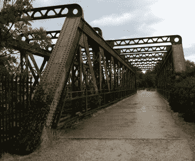
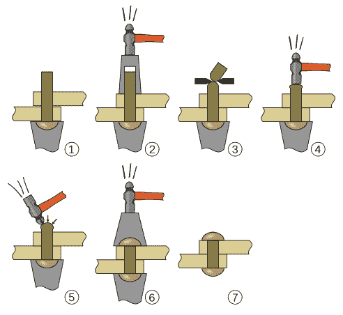

# 被遗忘的铆接结构艺术

> 原文：<https://hackaday.com/2018/08/20/the-forgotten-art-of-riveted-structures/>

如果你有寻找废弃铁路的习惯，你可能已经站在不止一座维多利亚时代铁桥的阴影下。这些建筑规模庞大，被证明非常坚固，其中许多即使在多年失修后仍处于良好状态。

A handsome riveted railway bridge, over the River Avon near Stratford-upon-Avon, UK.

当你仔细检查它们时，它们与任何现代同类产品之间的直接差异就会显现出来，不像今天创造的几乎所有类似的金属制品，它们不包含焊接接头。像可靠的电力供应这样的弧焊机在建造的时候已经过了几十年，所以它们是用数百个巨大的铆钉连接在一起的。它们将被分段预制并运输到现场，在那里它们将被一个铆接组用一个便携式锻造设备组装起来。

那么对于 2018 年的一个观众来说，铆钉是什么？如果你马上想到了波普空心铆钉，那么它的功能就是把两块材料紧紧地拉在一起，但是它的结构完全不同。这些铆钉最初是由钢条形成的，一端形成蘑菇状的圆顶，可能是在热模锻过程中形成的。

铆钉被加热到赤热，然后穿过要连接的板材上预先对准的孔，其直端被锤成蘑菇状，以匹配圆顶端。然后铆钉冷却并收缩，使其处于张力之下，将两块薄板紧紧地拉在一起。事实上足够紧密，可以形成防水或高压蒸汽的密封，正如铁铆钉在船舶或高压锅炉制造中的应用所示。这怎么可能呢？我们来看看吧！

## 铆钉是如何形成的

上面对过程的简单描述省略了一些细节。铆钉咬合和固定工具——重型实心钢成形器，用于固定铆钉的直端和蘑菇形端——用于铆钉的两端，蘑菇形端用于在铆钉被锤打时将其固定到位，直端用于用咬合工具将板材锤打在一起，并用固定工具形成光滑的新蘑菇形。因此，一个典型的铆接团队，如在铁路桥上工作的团队，将包括两个人在铆钉上工作，一端一个。有时，在蘑菇状末端拿着装置的人不得不爬进有限的空间，例如锅炉内部，来完成这项任务。

 [")](https://hackaday.com/2018/08/20/the-forgotten-art-of-riveted-structures/680px-riveting_01/)   

在维多利亚时代，这项工作都是手工完成的，铆钉是通过锤子反复敲打来成型的，但从 20 世纪早期开始，一个典型的铆接团队将使用手持气动铆接枪。如果你想到铆钉工罗西经常拿着的工具，那你就找对地方了。然而，正如下面 1949 年的视频所示，这一场景与维多利亚时代相比几乎没有什么变化，一个小锻造厂的经营者将发光的铆钉扔向一名工人，这名工人在半空中接住它们，然后将它们放入待锻造的孔中。

 [https://www.youtube.com/embed/CVjS1DsqYvo?version=3&rel=1&showsearch=0&showinfo=1&iv_load_policy=1&fs=1&hl=en-US&autohide=2&wmode=transparent](https://www.youtube.com/embed/CVjS1DsqYvo?version=3&rel=1&showsearch=0&showinfo=1&iv_load_policy=1&fs=1&hl=en-US&autohide=2&wmode=transparent)

## 用焊接或螺栓替换铆钉

在 2018 年，你可能只会遇到这种类型的铁铆钉被用于遗产修复工作或旨在模仿它的工作(航空业使用铆钉，但与你在锅炉或铁路桥上发现的铆钉不太一样！).即便如此，就像新建的蒸汽机车*上的锅炉是焊接的而不是铆接的一样，使用铆钉也不是必然的。你可以看到一个视频，一个现代铆接团伙在克鲁的 LNWR 遗产安装锅炉补丁，这是这种铆接工作的典型。具有讽刺意味的是，即使是最具标志性的铆工之一，也是在这种做法正在消亡的时候被拍摄的，当美国造船厂正在拥抱焊工时，铆工罗西的肖像出现了。今天仍然使用带有配合孔的结构钢，但是在铆接的高度，高强度螺栓已经完全取代了铆钉。*

 *就我个人而言，作为一名普通的抄写员，我父亲偶尔需要像铁匠一样钉钉子。手工完成，将套件放置在铁砧的坚硬孔中，对于一个热情的青少年来说，这是一项比你想象的更困难的工作，我记得不止一次尝试，在最终的关节中出现了明显的游戏。我怀疑我没有设法保持我的铆钉足够热，因此它的收缩小于它应该有的。我们用的铆钉毕竟比视频里的要小。也许如果过去有[方便的在线教程](https://www.youtube.com/watch?v=tIgZi1duP3E)，我会取得更大的成功。

标题图片:Simon Lee [ [CC BY-SA 2.0](https://commons.wikimedia.org/wiki/File:Santa_Justa,_rebites_(Simon_Lee).jpg) 。*