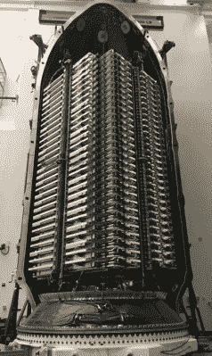
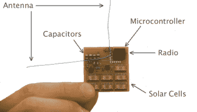
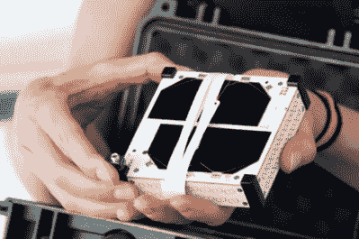

# 太空的未来是微小的

> 原文：<https://hackaday.com/2019/06/25/the-future-of-space-is-tiny/>

虽然最近的商业竞争已经将到达轨道的成本降低到了十年前许多人认为不可能的程度，但它仍然非常昂贵。我们已经从太空仅仅是世界超级大国的领地的时代进入了一个拥有数十亿美元资产的公司可以加入其中取乐的时代，但进一步减少太空所需的技术飞跃仍然在很大程度上被归入绘图板。就目前而言，情况已经好得不能再好了。

Starlink satellites ready for launch

如果我们不能指望轨道发射的每磅成本在未来几年内持续下降，那么从逻辑上讲，下一个最佳选择就是设计更小更轻的航天器。谢天谢地，这部分相当简单。智能手机革命意味着我们已经可以将数量惊人的传感器和处理能力装进你的手掌中。但是有一个陷阱:齐奥尔科夫斯基火箭方程。

通常简称为“火箭方程”，它允许你计算(除其他外)一辆车的有用货物与其总质量的比率。对于轨道火箭来说，这个数字非常小。即使是像猎鹰 9 号这样的现代发射器，有效载荷也只占发射重量的不到 5%。换句话说，物理定律要求轨道火箭体积庞大。

不幸的是，操作这种火箭的成本与它携带的质量不成比例。无论有效载荷有多轻，SpaceX 都需要大约 6000 万美元来发射猎鹰 9 号。但是如果你把它装满几十个，甚至几百个更小的卫星呢？如果它们都属于同一个运营商，那么这是一种极其划算的飞行方式。另一方面，如果所有这些“乘客”属于不同的集团，分摊发射成本，每个运营商可能会看到百倍的降价。

SpaceX 已经在一次发射中打包了 60 颗小型轻型 Starlink 卫星，但与其他小组正在研究的相比，即使是这些飞行器也是巨大的。我们看到了比立方体卫星还要小的宇宙飞船新时代的曙光。这些微型航天器提供了令人兴奋的新可能性，但也带来了独特的工程挑战。

## 在以下时间启动筹码

毫无疑问，芯片卫星(也被称为精灵)是目前运行中最小的航天器，是 2011 年 Kickstarter 的产品。这个想法是创造一个极其简单的自由飞行卫星，它可以数百个装在一个分配器中，它本身可以作为搭载载荷进入太空。为了降低成本和质量，该飞行器不需要任何物理辐射屏蔽，甚至也不需要刚性框架。顾名思义，它们实际上是裸露的 PCB，上面有裸露的芯片。它们不会持续很长时间，有些甚至可能无法在部署后存活，但是当你一次释放 100 个时，你可以承受失去几个。

Chipsat prototype from 2011

每个芯片重量不到 4 克，边长 3.6 厘米。作为基本原型，他们只携带了最基本的电子设备:用于能源生产的小型光伏板，德州仪器 CC430F513X 微控制器，集成了运行在 437 MHz 的 RF 收发器，以及 LSM9DS1 三轴加速度计。甚至电池也被认为是奢侈品；这些芯片只有在阳光直射下才能工作。这种相当简单的材料清单的好处是，即使使用太空级组件，每个芯片卫星的制造成本也不到 100 美元。

作为第八次[材料国际空间站实验(MISSE)](https://hackaday.com/2018/03/12/lost-in-space-how-materials-degrade-in-space/) 的一部分，原型芯片卫星在太空环境中暴露了三年，这证明该设计足够强大，足以承受为它们计划的短暂任务持续时间。2014 年 4 月，国际空间站释放了第一个运行中的 Chipsat 任务，称为 KickSat。不幸的是，由于 KickSat“母舰”出现故障，单个芯片卫星未能部署。

第二次尝试，KickSat-2，是在 2019 年 2 月完成向国际空间站运送货物的任务后，从自由飞行的天鹅座 *SS 约翰·格里恩*上部署的。在轨道上呆了几周后，KickSat-2 成功部署了 105 颗芯片卫星，创下了同时释放卫星数量的最高纪录。在几天后重新进入地球大气层之前，地面站能够接收到来自单个芯片的信号，并验证它们是否按预期运行。现在他们已经被证明在低地球轨道上是可行的，[美国宇航局相信芯片卫星在未来可以被部署到附近的小行星甚至火星上](https://www.nasa.gov/ames/kicksat)。

## 一群太空蜜蜂

Swarm Technologies 的 SpaceBEE 采用了一种不那么简约的方法来设计小型卫星。这些飞行器的尺寸为 100 毫米×100 毫米×25 毫米，比 Chipsat 稍大一些，但仍然只有最小的 CubeSat 的 1/4 左右。它们旨在为传感器或设备提供全球低带宽连接，否则这些传感器或设备可能无法接入互联网。

 有趣的是，太空蜂的大小成了某种绊脚石。它们处于一种尴尬的境地，既大到可能对其他航天器构成潜在威胁，又小到难以追踪。为了帮助应对这一问题，SpaceBEE 的两侧覆盖着一种由美国太空和海战系统司令部开发的实验性被动雷达反射材料。据报道，这种材料使三明治大小的飞行器在地面雷达上看起来大十倍。

不幸的是，联邦通信委员会没有被说服，拒绝了发射和操作太空蜜蜂的申请。令人难以置信的是，Swarm Technologies 无视 FCC 的决定，于 2018 年 1 月通过印度火箭发射了四颗 SpaceBEE 卫星。未经授权的发射为该公司赢得了 90 万美元的罚款，并在接下来的三年里加强了 FCC 的监督。

对 SpaceBEE 雷达可见性的担忧促使决定将星座中的下四颗卫星升级到更传统的 1U 立方体卫星外形，但不清楚这是出于 FCC 的担忧还是该公司对星座的新长期计划的权宜之计。

## 下一代

像 Chipsat 或 SpaceBEE(官方称为 femtosatellites)这样的设计的主要缺点是，它们的尺寸很难为它们配备传统自由飞行航天器的大部分硬件。例如推进系统。虽然 SpaceBEE 确实有能力将自己旋转到高阻力方向，允许进行基本的轨道调整，但 Chipsat 基本上只是顺其自然。在地球轨道上的短途任务中，缺乏推进力并不是什么大不了的事情，但对于像这样的航天器来说，要想有机会在远离家乡的地方进行真正的科学研究，它们需要能够四处移动。

虽然女性卫星的小尺寸和低质量意味着经典的双组元推进剂火箭发动机是不可行的，但这些相同的特性确实开辟了一些有趣的可能性。作为雄心勃勃的“突破倡议”项目的一部分，该项目试图寻找并最终与地外生命交流，已经为克级星际探测器提出了几种新颖的推进方案。

这个假想的探测器名为 StarChip，将利用光子推进，如太阳帆和激光推进器；用更大的飞船来实现这些概念要困难得多。今天，这种技术充其量还处于发展的早期阶段。但由于这个微型航天器的新时代，工程师们将能够在真实世界的情况下测试和开发这些概念，比以前更快，更便宜。