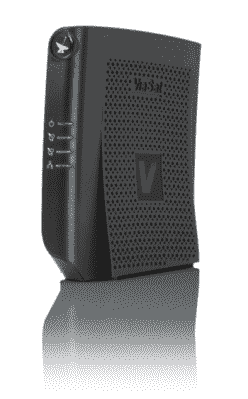

# 欧洲 Sat 大黑客事件应该是对我们所有人的一个警告

> 原文：<https://hackaday.com/2022/06/02/the-great-euro-sat-hack-should-be-a-warning-to-us-all/>

军事官员和民间安全研究人员多年来一直在警告我们:网络攻击正在成为现代战争中非常真实的一部分。网络攻击不仅局限于军事目标，还可以摧毁从重要的公共基础设施到商业和工业运营的一切。

2 月 24 日凌晨，当俄罗斯入侵部队开始向乌克兰城市发射导弹时，另一场攻击正在数字领域进行。突然之间，整个欧洲的卫星终端都下线了，许多卫星终端遭受了永久性的破坏。

细节仍不清楚，但研究人员和军事分析家已经拼凑出了当晚发生的事情。欧洲卫星大黑客事件证明了我们的数字基础设施在战时是多么脆弱的最新例子。

## 一个网络的安全性取决于它最薄弱的地方

由美国 Viasat 公司运营的 KA-SAT 卫星于 2010 年发射。它负责在整个欧洲提供宽带卫星互联网，部分有限的覆盖范围也延伸到中东部分地区。这项服务的客户包括欧洲各地的住宅用户，以及许多工业系统。

5,800 wind turbines lost their satellite data connections during the attack, compromising remote monitoring of the hardware. Service was restored through a combination of replacing affected satellite modems and installing supplementary cellular/LTE data links. Credit: [ENERCON press site](https://www.enercon.de/en/news/news-detail/cc_news/show/News/over-95-per-cent-of-wecs-back-online-following-disruption-to-satellite-communication/)

2 月 24 日，当俄罗斯军队开始全面入侵乌克兰时，KA-SAT 系统同样受到了攻击。成千上万的终端在凌晨突然下线。不仅仅限于乌克兰，希腊、波兰、意大利、匈牙利和德国的用户都受到了影响。

值得注意的是，随着攻击的肆虐，德国的 5800 台风力涡轮机的管理系统陷入瘫痪。当卫星连接中断时，通过 SCADA 系统监控风力涡轮机就不再可能了。令人欣慰的是，根据运营商 ENERCON 的说法，电网稳定性[没有受到影响](https://www.enercon.de/en/news/news-detail/cc_news/show/News/over-95-per-cent-of-wecs-back-online-following-disruption-to-satellite-communication/)，因为电网运营商通过其他方法保持了对风力输入电网的控制。

早期报道推测，一个简单的分布式拒绝服务(DDoS)攻击可能是罪魁祸首。这种类型的攻击使用大量流量来淹没网络或服务器，这种攻击简单而短暂。

然而，很快就发现发生了一次更严重的攻击。分析后果的研究人员注意到，许多终端已经永久离线，不再可用。信息从各种渠道慢慢流出，表明卫星本身没有被篡改，也没有受到任何形式的损坏或物理攻击。因此，问题可能出在 KA-SAT 网络的地面部分。

Official statements noted the consumer-grade Surfbeam2 modems were a primary target of the attack. This raises questions around how the attack then came to impact German energy infrastructure, which would be expected to use a more industrial-spec solution. Credit: [Viasat](https://eguide.field.viasat.com/surfbeam-2-modem-test/)

就在攻击发生一个多月后，Viasat 发布了一份声明，解释了攻击的规模和性质。根据该公司的报告，行动于世界协调时凌晨 03:02 开始，在 KA-SAT 网络面向消费者的部分，使用 SurfBeam 2 和 Surfbeam2+调制解调器的用户传播拒绝服务攻击。这些位于乌克兰的调制解调器产生大量恶意流量，并阻止合法用户保持在线。Viasat 的技术团队致力于从网络中阻止这些恶意调制解调器，随着团队拆除它们，更多的恶意调制解调器会出现。

在此期间，这个网络分区上的调制解调器逐渐脱机。这种情况在凌晨 4:15 加速，在欧洲各地，大量调制解调器连接到 KA-SAT 网络，所有这些都在同一个消费者网络分区上。丢失的调制解调器永远消失了，没有人试图重新连接到卫星网络。

后来的分析表明，KA-SAT 网络的管理系统出现了漏洞，原因是“VPN 设备配置错误”。攻击者访问管理网络并使用它向网络上的住宅调制解调器发出命令，破坏板载闪存并使其无法运行。

在此之后，[安全研究员 Ruben Santamarta](https://www.reversemode.com/2022/03/viasat-incident-from-speculation-to.html?m=1) 能够找到一个受影响的 Surfbeam2 调制解调器，以及另一个未受攻击影响的干净设备。从两个调制解调器转储闪存很有启发性。与原来的调制解调器相比，受损的调制解调器具有严重损坏的闪存，这使得调制解调器处于非工作状态。在某些情况下，损坏如此严重，以至于受影响的调制解调器[甚至不会在打开时显示状态灯](https://www.reuters.com/world/europe/exclusive-us-spy-agency-probes-sabotage-satellite-internet-during-russian-2022-03-11/)。30，000 个替换调制解调器最终被运送给客户，让他们在攻击后的几周内重新上线。

关于这次袭击还有一些问题需要回答。目前还不清楚攻击者是如何进入 KA-SAT 网络的管理部分的，该公司不愿公开发生了什么。早期的 DDOS 攻击以及随后的调制解调器阻塞也暗示了一次精心策划的多阶段攻击，表明这次黑客攻击是提前计划好的。还有一些附带的问题，比如为什么德国的电力基础设施会受到攻击的影响，这种攻击应该仅限于家用调制解调器和面向消费者的网络部分。

这些细节引起了安全研究人员和相关公司相关人员的兴趣。然而，更广泛地说，它表明网络攻击可以而且将会在战争时期被用来攻击真实的基础设施。此外，影响不一定局限于目标地区或军事。当我们的网络跨越国界时，这种攻击很容易对下游产生广泛影响。

总的来说，这是一个令人不寒而栗的提醒，提醒我们许多基础设施中固有的脆弱性。这次是卫星互联网，其他时候可能是供水系统或 T2 的医疗系统。所有这些案例的风险都很高，因此有足够的理由在任何可能的情况下投资加强安全性。