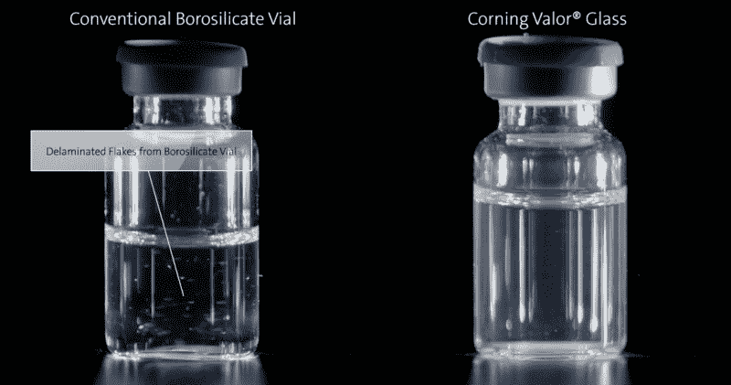
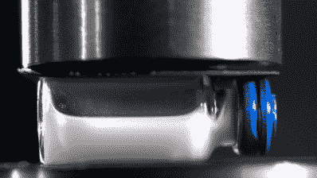

# 用于运送冠状病毒疫苗的高科技 Valor 玻璃小瓶

> 原文：<https://hackaday.com/2020/12/28/the-high-tech-valor-glass-vials-used-to-deliver-the-coronavirus-vaccine/>

当全世界都在等待新冠肺炎疫苗的时候，一些制药公司已经准备好了一项令人兴奋的改进:更好的药瓶来装药物。小瓶在过去的 100 年里没有太大的变化，但在 2011 年，康宁决定对此做些什么。他们开始开发一种能够抵抗损坏和防止裂缝的替代玻璃。这种玻璃叫做 Valor glass，是一种非常坚固的材料。想想医疗行业的大猩猩玻璃。

传统上，药瓶由硼硅酸盐玻璃制成，硼硅酸盐玻璃是与康宁公司的 Pyrex 相同的实验室安全材料。硼硅酸盐玻璃的强度来自硼的加入。虽然硼硅酸盐玻璃相当坚韧，但它也有一些问题。任何类型的玻璃的强度取决于其缺陷，硼硅酸盐玻璃容易出现一些特别限制强度的缺陷。制药玻璃必须经得起极端温度，从小瓶制造过程的高温到某些新冠肺炎疫苗脆弱的病毒 RNA 所需的严寒冷冻干燥过程和储存温度。让我们来看看 Valor 玻璃瓶如何应对这些挑战。

## 消除损坏和分层

Borosilicate glass flakes float in the vial. Image via [Corning Incorporated](https://www.youtube.com/watch?v=fJsgBXbXOR0)

硼硅酸盐药瓶除了破损之外的最大问题是[它们容易在内部分层](https://www.corning.com/worldwide/en/products/pharmaceutical-technologies/pharma-technologies-delamination.html)，这意味着玻璃碎片会从药瓶内部脱落并污染药物。在转换阶段，长玻璃管被分离，两端被密封到小瓶中，硼从玻璃网络中蒸发，并在管内留下硼酸钠沉积物。当药瓶装满药物时，像钠、硅和钾这样的元素会从玻璃中滤出并进入溶液中。

康宁公司花费数百万美元做了深入研究，确定硼本身就是分层的根本原因。因此，在梳理了周期表并将各种元素与二氧化硅混合后，他们想出了一种不含硼的替代品，使用氧化铝来增强强度。

 [https://www.youtube.com/embed/NeKOtjeQuG4?version=3&rel=1&showsearch=0&showinfo=1&iv_load_policy=1&fs=1&hl=en-US&autohide=2&wmode=transparent](https://www.youtube.com/embed/NeKOtjeQuG4?version=3&rel=1&showsearch=0&showinfo=1&iv_load_policy=1&fs=1&hl=en-US&autohide=2&wmode=transparent)

药瓶从原料玻璃到准备好的剂量要经过几个生产阶段，每个阶段都有损坏的可能。静脉注射药物的批次是在一个称为冻干的过程中产生的，这是一个三阶段的冷冻干燥过程。在冻干过程中，药物以不同的速率膨胀，这些膨胀会在小瓶内产生额外的应力。

硼硅酸盐玻璃的另一个问题是生产线上产生的粉尘。所有这些并排放置的瓶子在生产线上移动时会相互摩擦，产生的微粒会毁掉整批产品。Valor glass 有一种特殊的涂层，摩擦系数低，可以将灰尘减少到几乎为零。

Valor vials can withstand around 1,000 pounds of force. Image provided by [Corning](https://www.corning.com/worldwide/en/products/pharmaceutical-technologies/valor-glass.html)

## 强壮的东西

Valor glass 最让人印象深刻的就是它的强度。在这个视频中，一个普通的硼硅酸盐小瓶在仅仅 20 公斤的力的作用下破裂。但这种名副其实的超级玻璃可以承受大约 1000 磅的力，这使它比硼硅酸盐玻璃强 50 倍。

在将玻璃管切割和成形为小瓶的转换过程之后，小瓶被浸没在熔融盐浴中以增强韧性。在这个过程中，盐水中的钾原子与玻璃中的钠原子交换，这个强化过程赋予了 Valor 力量。康宁最初为大猩猩玻璃开发了这种工艺，大猩猩玻璃因其在防刮擦和防摔智能手机屏幕上的应用而闻名，这种材料同样非常坚硬。然后对瓶子进行冲洗，并涂上一层聚合物，当瓶子碰撞在一起时，这种聚合物可以大大减少玻璃粉尘。

为了衡量 Valor 小瓶的强度，康宁进行了广泛的冻融测试，他们在大约一分钟的时间内将小瓶从室温冷却到-100°C，然后在接下来的 12 个小时内将小瓶解冻回室温。他们加工并在小瓶中装入甘露醇，这是一种在冻融过程中会迅速膨胀的药物。当甘露醇结晶时，会在药瓶内产生很高的[环向张应力](https://en.wikipedia.org/wiki/Cylinder_stress)，使药瓶容易破裂和破损。Valor 样品瓶"[在冻融条件下比硼硅酸盐样品瓶破裂的可能性至少低 40 倍](https://www.corning.com/media/worldwide/global/documents/ValorLyoPaper061819v3.pdf)(PDF)，因为它们的成分和熔融盐浴有助于它们在整个冻干过程中保持强度。

Valor 玻璃有张力层和压缩层，张力层中出现的裂纹不会像硼硅酸盐玻璃中那样传播到小瓶的其余部分。Valor 玻璃仍然会在足够的力度下破裂，所以成分和退火过程真正做的是防止裂缝生长并变成裂缝。

 [https://www.youtube.com/embed/Qz7NnIGS6YM?version=3&rel=1&showsearch=0&showinfo=1&iv_load_policy=1&fs=1&hl=en-US&autohide=2&wmode=transparent](https://www.youtube.com/embed/Qz7NnIGS6YM?version=3&rel=1&showsearch=0&showinfo=1&iv_load_policy=1&fs=1&hl=en-US&autohide=2&wmode=transparent)

今年夏天，[康宁获得了美国政府 2 . 04 亿美元的拨款，用于在“曲速行动”倡议下扩大 Valor 药瓶的生产。他们不是唯一寻求新包装解决方案的人。另一家名为 SiO2 Materials Science 的公司也在生产硼硅酸盐的替代品，这是一种混合容器——塑料内衬一层薄的玻璃样涂层,“T2”消除了玻璃和塑料单独使用时的主要问题](https://www.corning.com/worldwide/en/about-us/news-events/news-releases/2020/06/us-departments-of-defense-health-human-services-select-corning-valor-glass-packaging-to-accelerate-delivery-of-covid-19-vaccines.html)我们需要所有能找到的小瓶。