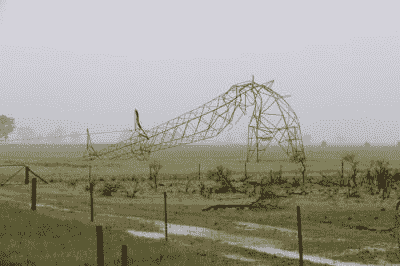
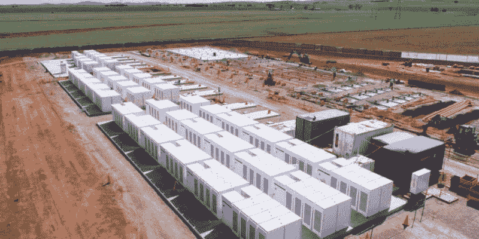
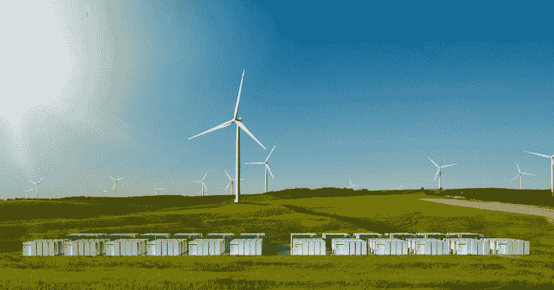
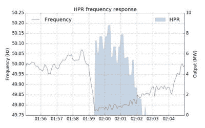

# Hornsdale 电力储备及其对电网电池存储的意义

> 原文：<https://hackaday.com/2019/12/16/the-hornsdale-power-reserve-and-what-it-means-for-grid-battery-storage/>

长期以来，可再生能源一直被吹捧为抵御全球日益严重的气候紧急状况的主要要求。政府行动迟缓，但价格持续下降，可再生能源的需求日益增加。

然而，可再生能源一直在可用性问题上苦苦挣扎。太阳能只在阳光明媚的时候工作，风力发电机只在刮风的时候工作。显而易见的解决方案是制造某种大型并网电池，在非高峰时段储存多余的能量，并在可再生能源产量较低时用它来支撑电网。如今，这实际上是一个可行的想法，正如南澳大利亚在 2017 年证明的那样。

## 建造世界上最大的锂离子电池

The blackout was caused by storms taking down transmission lines, but the politics of the day laid the blame at renewable energy’s door. Credit: [ABC News](https://www.abc.net.au/news/2019-08-07/regulator-legal-action-against-energy-companies-over-sa-blackout/11390400)

2016 年 9 月 28 日，南澳大利亚州面临前所未有的风暴。阵风超过每小时 120 公里，倾盆大雨威胁着低洼地区。在混乱中，主要的输电线路和互联线路遭到破坏，整个电网瘫痪。170 万人突然断电。

谢天谢地，在接下来的几个小时里，文明依然屹立不倒。紧急救援人员能够相对较快地恢复电网，该州大部分地区在 24 小时内恢复运行。尽管如此，这一事件很快被用作政治足球，执政的亲煤联邦政府将责任完全归咎于该州大量使用可再生能源。这被证明是错误的，但引发了一场关于提高电网弹性和在太阳能和风能发电不切实际时使用电网存储的更大讨论。

Despite the hype and bluster, or perhaps because of it, the battery was built in record time. Credit: [The Lead SA](http://theleadsouthaustralia.com.au/industries/renewables/south-australias-big-battery-to-become-50-per-cent-bigger/)

波拉瓦引起了埃隆·马斯克的注意，后者向他发出了挑战。在合同签署后 100 天内安装基于电池的存储解决方案，否则免费。更多的亿万富翁参与进来，州政府启动了这个项目。建设实际上在 2017 年 9 月 29 日签署合同之前就开始了，电池在 55 天后完成，技术上比计划提前了很多。一些人谴责这是公关噱头，但 Hornsdale 电力储备现在拥有世界上最大的锂离子电池，直接连接到电网。

## 利用快速和现成的资源

安装的电池具有 129 MWh 的存储容量，使用三星 21700 锂离子电池，类似于特斯拉 Model 3 中的电池。最大放电率为 100MW，在完全倾斜的情况下，电池可以工作一个多小时。然而，在日常操作中，电池并不是这样使用的。取而代之的是，电池以几种不同的方式运行，以适应电网的需求。

30 MW(或 90 MWh 容量)下的三小时输出被预留用于负荷转移。当电网不需要时，多余的可再生能源就储存在电池中。这种电力随后在电价较高的高峰时段在市场上出售。

除此之外，70MW 的输出用于维持电网的稳定性。为了确保电网的电压和频率保持在可接受的范围内，电网需要仔细管理其许多相连的发电机。这是通过维持整个电网的电力供需平衡来实现的。供应或需求的突然变化需要附属发电机的快速反应，以避免可能导致电网离线或导致滚动停电的重大偏差。通常，这种情况发生在主要发电机如煤电厂出现故障时，或者在英国肥皂剧结束，成千上万的家庭同时打开水壶时。这在当地市场被称为频率控制和辅助服务(FCAS ),通常由燃气发电机处理，其响应时间从几秒到几分钟不等。

A graph of the Loy Yang incident in December 2018, showing the Hornsdale Power Reserve’s quick response time to the frequency excursion. Credit: [Renew Economy](https://reneweconomy.com.au/tesla-big-battery-outsmarts-lumbering-coal-units-after-loy-yang-trips-70003/)

然而，Hornsdale 电池的响应时间要快得多。2017 年 12 月 14 日，Loy Yang A 燃煤发电机跳闸，导致电网突然失去 560 兆瓦的发电量。在主频率下降到 49.8 Hz 时，[仅仅几毫秒，Hornsdale 装置就向电网输送了 7.3 MW 的电能](https://reneweconomy.com.au/tesla-big-battery-outsmarts-lumbering-coal-units-after-loy-yang-trips-70003/)以在几分钟内支撑频率，同时其他基础设施也已上线。这种快速放电的能力使得电池比其他发电机更有竞争力。这给电池的所有者 Nueon 带来了可观的利润，因为它向电网提供 FCAS 服务，[从现有运营商手中夺取了 55%的市场。](https://electrek.co/2018/05/11/tesla-giant-battery-australia-reduced-grid-service-cost/)有人抱怨说[现有的计费系统实际上不够快](https://electrek.co/2018/03/22/tesla-powerpack-battery-too-quick-to-get-paid/)来适当补偿电池所有者的输出，因为该系统最初是围绕响应较慢的传统发电设计的。

## 展望未来

该项目的成功证明，电网规模的电池存储现在是可行的，更重要的是，是有利可图的。Hornsdale 电力储备的建造成本仅为 5000 万美元，尽管他们最初嘲笑该州的项目，但联邦自由政府已确认为项目的扩建提供资金。[电池将升级至 150 MW，容量扩大至 193.5 MWh](https://www.abc.net.au/news/2019-11-19/sa-big-battery-set-to-get-even-bigger/11716784) 。这将使电池有更大的容量来应对不利事件，并提高负荷转移操作的盈利能力。还将有“数字惯性”技术的试验，其中电池的逆变器将被设计成复制大型同步发电机的机械惯性，进一步稳定电网。

其他锂离子电池项目也在世界范围内涌现。纽约工厂的计划正在进行中，目标是 316 兆瓦的输出和 2528 兆瓦时的巨大容量，使电池能够长时间运行。加州也在寻找一对装机容量，一个在长滩，一个在莫斯兰丁，分别是 400 兆瓦和 300 兆瓦。

由于规模经济和电动汽车革命，锂离子电池的成本持续下降，可能会有更多的项目取得成果。当可再生能源的负荷转移有利可图时，随着对高度响应的电网稳定服务的需求，电网蓄电池成为一个强有力的商业案例。