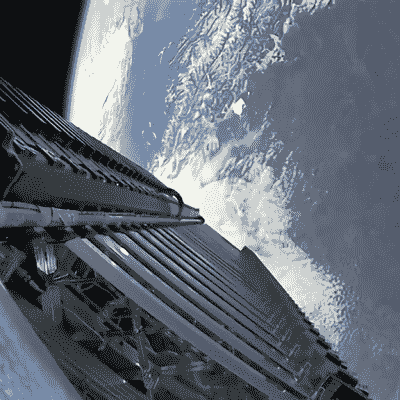

# 狂野西部的最后时光

> 原文：<https://hackaday.com/2021/04/10/the-last-days-of-the-wild-west/>

几周前，当一个由[黑客组成的国际团队成功记录并解码 SpaceX 发射](https://hackaday.com/2021/03/11/monitor-spacex-rocket-launches-with-software-defined-radio/)的遥测数据和图像时，我们很高兴。现在看来，作为回应， [SpaceX 已经开始对所有内容进行加密。Booo！](https://hackaday.com/2021/04/07/fun-while-it-lasted-falcon-9-telemetry-now-encrypted/)

解码卫星和其他宇宙飞船的传输已经成为黑客的一大消遣。最近，我们看到一个[小组在中国田文 1 号火星探测器](https://hackaday.com/2020/07/28/what-is-the-tianwen-1-probe-saying/)发射后不久就开始收听，但是[收听深空网络](https://hackaday.com/2020/10/17/it-came-from-outer-space-listening-to-the-deep-space-network/)或者仅仅是[解码气象卫星广播](https://hackaday.com/2021/01/27/decoding-noaa-satellite-images-in-python/)可以给人们一个理由来伸展他们的无线电肌肉。

我们知道 SpaceX 为美国政府机构执行一些合同任务，这些机构不喜欢泄露关于他们卫星下落的信息，但对于非秘密任务，我们认为让业余爱好者在他们身后监听没有什么坏处。如果/当事情变得很糟糕时，也许他们这样做是出于公关原因？

 不管是什么原因，都是一种耻辱。太空对黑客开放已经有很长一段时间了，在业余卫星的情况下是故意的，而在许多其他卫星的情况下是不知不觉的，这些卫星直到 90 年代中期还拥有未加密的*命令信道*。(在这个问题上，我不得不坚持“匿名消息来源”,但我确实认识一个人，他(她)旋转了一颗不属于他(她)的卫星。)通过收听来自上方的信号可以学到很多东西，虽然你仍然可以自己解码气象卫星数据，但这并不像直接从猎鹰 9 号上下载图像那样有趣。

对于 SpaceX 来说，冷静的做法应该是说“当然，我们向我们最大的粉丝广播了未加密的 PR”，但看起来他们只是不认为有人会监听，这让他们感到惊讶和恐慌。在 2021 年，像太空任务这样复杂的事情，有点尴尬。无论如何，对于那些在加密前成功进入的人，恭喜你们！

This article is part of the Hackaday.com newsletter, delivered every seven days for each of the last 200+ weeks. It also includes our favorite articles from the last seven days that you can see on [the web version of the newsletter](https://mailchi.mp/hackaday.com/hackaday-newsletter-649368). Want this type of article to hit your inbox every Friday morning? [You should sign up](http://eepurl.com/gTMxQf)!