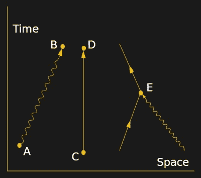
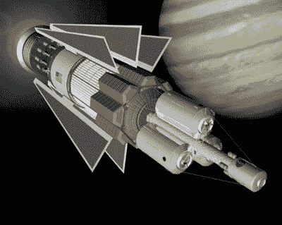
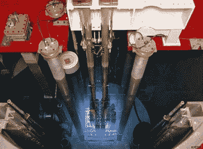
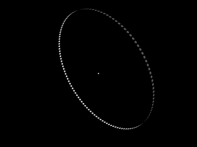
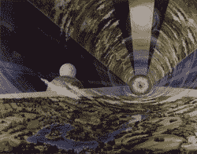

# 科学界最耀眼的明星之一弗里曼·戴森的遗产

> 原文：<https://hackaday.com/2020/03/09/the-legacy-of-one-of-sciences-brightest-stars-freeman-dyson/>

在科学界众多知名人士中，很少有人像弗里曼·约翰·戴森那样不愿坚持某一特定领域。他于 1923 年出生在英国，甚至在孩提时代就对数学和相关领域表现出了极大的兴趣。15 岁时，他获得了剑桥大学三一学院的奖学金，在那里他学习数学。尽管战争迫使他在空军作战研究部( [ORS](https://en.wikipedia.org/wiki/Operations_research#Second_World_War) )工作，但之后他会回到三一学院获得数学学士学位。

在随后的职业生涯中，他在英国和美国的大学任教，最终在康奈尔大学结束，在那里他应校长 j .罗伯特·奥本海默的邀请加入了[高级研究院](https://en.wikipedia.org/wiki/Institute_for_Advanced_Study)。在这里，他会遇到像 T2·理查德·费曼这样的人，和他们一起研究量子电动力学。

除了数学和物理，戴森还对太空探索和遗传学表现出极大的兴趣——戴森球体是众所周知的——无论是在生命最初形成的背景下，还是在通过基因操纵来改善植物以应对当今问题的背景下。他还参与了著名的猎户座项目，该项目使用核弹推进。

在本文中，我们将看看戴森先生遗产的这些和其他部分，以及他的作品对今天的影响。

## 量子电动力学

The elements of a Feynman diagram.

早在 20 世纪 40 年代末，许多关于量子电动力学( [QED](https://hackaday.com/2017/01/24/the-birth-of-quantum-electrodynamics/) )的发现仍然是电动力学的相对论量子场论。它结合了量子力学和狭义相对论，描述了通过光子交换带电粒子的相互作用。它本质上是经典电磁学的量子对应物，描述了物质和光的相互作用。

从[汉斯·贝特](https://en.wikipedia.org/wiki/Hans_Bethe)的理论开始，随着[友永信一郎](https://en.wikipedia.org/wiki/Shin%27ichir%C5%8D_Tomonaga)、[朱利安·施温格](https://en.wikipedia.org/wiki/Julian_Schwinger)、理查德·费曼和弗里曼·戴森的后续论文，最终有可能开发出一个连贯的、功能性的 QED 模型，该模型将继续作为后续量子场理论的模板，包括[量子色动力学](https://en.wikipedia.org/wiki/Quantum_chromodynamics)，它涵盖了夸克和胶子之间的强烈相互作用，这是中子和质子等强子的基础。

戴森的贡献包括证明费曼创造的用于模拟相互作用的图表等同于 Schwinger 和 Tomonaga 基于算子的场论方法。正如戴森在 2014 年接受广达杂志采访时所说:

> 我没有发明任何新东西——我把费曼的想法翻译成数学，让世界更容易理解，结果，我出名了，但这一切都发生在大约六个月内。

不幸的是，由于三位科学家获奖的限制，戴森没有与友永、施温格和费曼一起分享 1965 年诺贝尔物理学奖。然而，他的努力被视为 QED 成功的工具。

## 核动力推进

NASA concept for a modern nuclear pulse propulsion space craft.

核脉冲推进的概念可以追溯到 1947 年，当时 T2·斯坦尼斯劳·乌拉姆·T3 提出了这个概念。20 世纪 50 年代末，DARPA 创建了猎户座 T4 项目，让[通用原子](https://en.wikipedia.org/wiki/General_Atomics)设计核脉冲火箭。弗里曼·戴森对猎户座能够完成的任务类型进行了第一次分析，包括到达离太阳最近的恒星系统半人马座阿尔法星。他的希望是看到负担得起的到太阳系新殖民地的太空旅行。

虽然像猎户座这样的核脉冲火箭失宠了，主要是因为公开引爆核弹的预期复杂性，但这个概念最终会被复兴。代达罗斯项目是 20 世纪 70 年代由英国星际学会进行的一项研究，旨在创造一种使用氘/氦-3 燃料颗粒的无人飞船，利用惯性约束聚变的概念产生电子束来产生推力。

20 世纪 80 年代，NASA 通过 Longshot 项目进一步发展了 Daedelus 概念，随后在 20 世纪 90 年代，宾夕法尼亚州立大学研究了 T2 反物质催化核脉冲推进。在这一点上，美国国家航空航天局和其他机构正在积极研究不同类型的宇宙飞船核动力推进装置。

## 特里加

A TRIGA reactor core, with the blue glow from Cherenkov radiation.

弗里曼·戴森是 TRIGA 设计团队的一员，TRIGA 是一个培训、研究、同位素、通用原子的核研究反应堆。这种类型的反应堆由通用原子公司制造，第一个 Mark I 原型于 1958 年 5 月 3 日在圣地亚哥的通用原子公司园区投入使用，一直持续到 1997 年。它现在是一个历史性的里程碑。

TRIGA 是一个池式反应堆，使用铀锆氢化物(UZrH)燃料，该燃料具有较大的负反应性燃料温度系数。这意味着随着燃料温度的升高，其反应性(连锁反应)迅速降低。正因为如此，它是一个安全的，防熔毁的研究反应堆，不需要安全壳结构。TRIGA，主要是其马克 2 号、III 和其他变体，通常用于全球大学和研究机构的同位素生产和测试目的。

## 戴森贝壳

Visualization of a Dyson ring around a star.

尽管通常被称为“戴森球”，弗里曼·戴森[在 20 世纪 60 年代最初的论文](http://www.islandone.org/LEOBiblio/SETI1.HTM)标题是“寻找人造恒星的红外辐射源”称这些假设的结构为“外壳”，尽管他没有详细说明这些结构看起来像什么。他提出，一个文明对能源日益增长的需求将驱使它以越来越先进的方式获得这种能源，遵循[卡尔达舍夫标度](https://en.wikipedia.org/wiki/Kardashev_scale)。

虽然这是迄今为止让他最出名的概念，在《星际迷航:下一代》第一集中，戴森球体包裹了一整颗恒星，但这可能是相当讽刺的，戴森希望这个概念不是他提出的。毕竟，早在 1937 年奥拉夫·斯台普顿的《T2》中，这个词就已经被科幻作家创造出来了。他也不太在乎对这些结构的大多数解释，他说:

> 围绕恒星的固体壳或环在机械上是不可能的。我所设想的“生物圈”的形式是由一个松散的集合或一群在独立的轨道上围绕恒星运行的物体组成的。

Colony in an O’Neill cylinder, with a clear view of nearby planets.

固体球或壳是不可能的，或者至少是非常不现实的，这个简单的原因可以归结为轨道力学。如果一个物体，比如一颗行星，在围绕恒星的轨道上，它会停留在那里。如果它是一个像固体壳一样不动的物体，有什么理由让它维持在恒星之外？取而代之的是，它将服从重力，除非不断修正，否则当它与恒星碰撞时，它将在恒星中自我毁灭。

在这里，松散耦合物体的使用，比如说一个环形结构，可以在围绕恒星的轨道上，但在其他方面满足所谓的戴森独立结构群的要求。这些会是什么样子是另一个问题。它们可能是纯粹的能量收集卫星，以某种方式将能量发送回附近的星球，或者一个文明也可以在这些卫星上生存，其结构类似于[奥尼尔圆柱体](https://en.wikipedia.org/wiki/O'Neill_cylinder)。

## 气候研究

20 世纪 70 年代，戴森将与[能源分析研究所](https://en.wikipedia.org/wiki/Oak_Ridge_Associated_Universities)合作进行气候研究，以及由[杰森](https://en.wikipedia.org/wiki/JASON_(advisory_group))国防顾问团为美国政府进行的研究。当时，他可能没有预料到，在他生命的最后几十年里，他会成为全球气候变化争论的焦点。

尽管戴森本人曾表示，对他来说，人为气候变化的影响是显而易见的，但他不同意通常伴随着它的严酷警告和厄运预测。在他 2007 年的文章《关于科学和社会的异端思想》中，他解释了为什么作为一名物理学家和数学家，他不同意将今天使用的气候模型作为唯一的真理。在他在科学领域工作的大约 70 年中，他与那些经常在野外工作的人(如生物学家)和那些主要从事理论模型工作的人一起工作。

他的“异端邪说”是质疑这样的假设，即我们现在已经掌握了所有的事实，模型涵盖了所有重要的细节，大气中二氧化碳的增加绝对会导致灾难。正如他在文章中所说:

> 但是我研究过气候模型，我知道它们能做什么。这些模型解决了流体动力学方程，并且它们在描述大气和海洋的流体运动方面做得非常好。他们在描述云、灰尘、田野、农场和森林的化学和生物学方面做得很差。它们并没有开始描述我们生活的真实世界。

在文章的其余部分，他列举了一些当今存在的相互矛盾的论点，以及对像表土这样不受欢迎的东西缺乏关注，以及全球范围内失去表土对气候意味着什么。正如他指出的那样，尽管他不是气象学家，但他很乐意询问他觉得哪里缺乏数据，正如他在 2009 年接受耶鲁环境 360 采访时解释的那样。

## 其他感兴趣的项目

戴森的进一步贡献包括发表了大量论文，主题涉及数论、物理和数学学科。以戴森命名的有[戴森变换](https://en.wikipedia.org/wiki/Dyson's_transform)(加法数论)[施温格-戴森方程](https://en.wikipedia.org/wiki/Schwinger%E2%80%93Dyson_equation)(量子场论)[戴森摇把](https://en.wikipedia.org/wiki/Crank_of_a_partition)(数论)[戴森级数](https://en.wikipedia.org/wiki/Dyson_series)(散射理论，数学物理中)。

他还会提出戴森树的想法，这是一种假设的基因工程植物，可以为掏空的彗星内部的生物圈做出贡献，一种自我复制的宇宙飞船，称为 T2 太空鸡，以及戴森场景，也被称为 T4 戴森的永恒智慧，提出了一种方法来避免开放(总是在膨胀)的宇宙的热寂。

《半条命》电子游戏系列中的角色[戈登·弗里曼](https://en.wikipedia.org/wiki/Gordon_Freeman)以弗里曼·戴森的名字命名。

## 永远保持好奇

弗里曼·戴森在 2020 年 2 月不幸摔倒，并于 2 月 28 日因并发症在医院去世。在他 96 岁的时候，他见证了科学和技术的一些最大进步，并为其中一些进步做出了贡献。尽管他没能活到亲眼目睹人类探索星空的梦想成为现实，但他的遗产将永远与我们同在。

他从不满足于只专注于一个学科或特定的科学领域，总是寻求新的难题来解决，他展示了人类必须提供的一些最佳品质。他是一个不害怕梦想和挑战自己去追逐梦想的人。他还对学术机构的僵化结构表现出了令人耳目一新的蔑视，称博士制度是“令人憎恶的”，坚持认为这是一张没有意义的纸，不能显示个人的真实素质。

为一个超越弗里曼·戴森最大希望和期望的未来干杯。