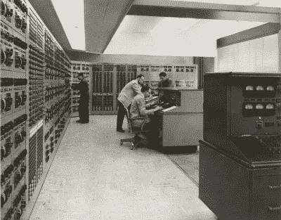
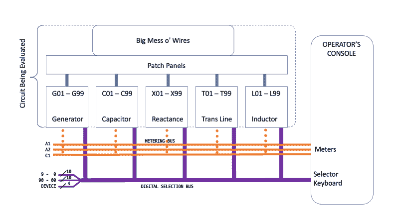
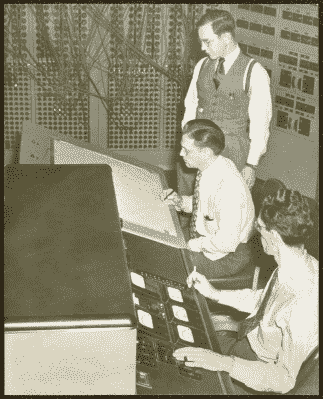
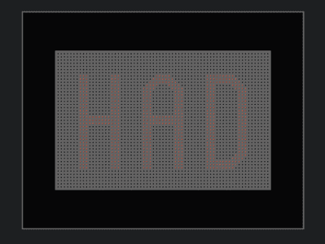
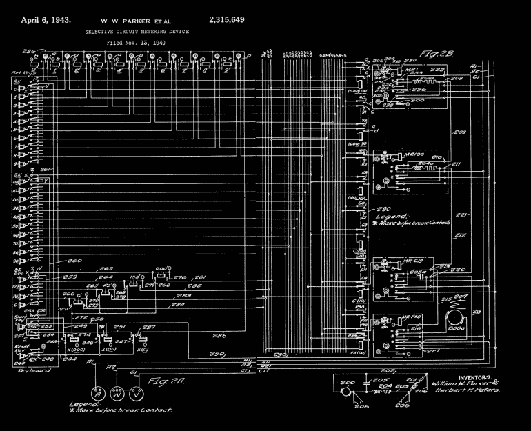
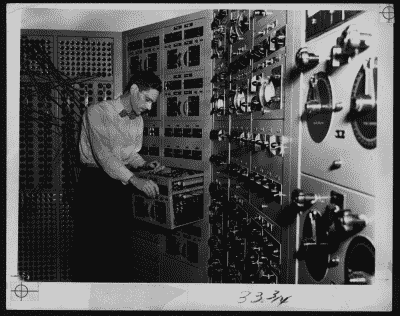

# 一台价值 300 万美元的模拟计算机的改装、修复和淘汰

> 原文：<https://hackaday.com/2021/02/09/the-modding-restoration-and-demise-of-a-3m-analog-computer/>

在 20 世纪 40 年代，当结果只能在模拟仪表上获得时，你如何快速记录价值 300 万美元的模拟计算机的输出？佐治亚理工学院负责西屋 1947 交流网络计算器的团队就面临着这个问题，并提出了一个巧妙的解决方案——侵入控制面板，并在一个特殊用途的绘图表中布线。

## 这是什么？

 这是什么野兽般的电脑？这种类型的机器是在第二次世界大战期间和之后开发的，严格地说，属于比例模型的范畴，而不是真正的计算机。尽管这些机器非常灵活，但它们主要是为了模拟配电网而设计的。虽然有很多理论，但基本上现实世界中的多相配电系统会在 400 Hz 下缩放为单相进行建模。

工程师将通过连接适当的电路元件(如电容器、电感器、传输线、发电机等)来给机器“编程”。)在大配线架上。这样编程后，位于地下室的 10 kW 电动发电机将启动，模拟正在进行中。

Block Diagram

## 兼职

早在 20 世纪 80 年代初，我在大学的第一份工作就是让这些机器运转起来。早在 1947 年，它就被佐治亚电力公司购买并捐赠给佐治亚理工学院，在那里它已经或多或少地连续服务了几十年。后来，它被用作教学辅助工具有一段时间了，并被搬到了几个地方。在我参与的时候，它还没有被使用，处于失修状态。

令人惊讶的是，修复起来并不困难。接线板的线路需要更换，因为绝缘层易碎且有裂缝。所有电路元件中的开关和触点清除了几十年的积垢。有几个学期，当我需要安静来学习和阅读时，地下室的这个安静的房间是我的避难所，偶尔通过点燃它来解决课本上的随机交流网络问题来娱乐自己。

## 操作

一旦电动发电机组达到频率并稳定下来，您就可以通过将操作员控制台中的计量电路连接到任何电路元件来监控模拟网络。你通过在一个看起来像老式机械加法机的键盘上按下参考指示符来做到这一点(很可能是)。几乎瞬间，元件的电流、电压和功率就会显示出来。这些量很复杂，所以幅度和相位都显示在仪表上。

Control Panel Detail

操作员将通过步进通过所有期望的电路元件来获得仿真结果。每次测量后，他们会停下来，在笔记本上记录数字，然后继续下一个元素。

有趣的是，这整个过程基本上是一个没有任何有源元件的大无源电路。当然，有继电器连接仪表，当然还有电动发电机为电压源供电。除此之外，从控制台读取输出相当于让技术人员携带测试仪表到每个电路并用手探测这些点。有一个例外，其中一个仪表是由一个小型真空管放大器驱动的。但它只用于一种测量类型，我想是 VARS。即使关掉了放大器，这台机器也完全正常，非常有用。

## 我们可以做得更好

该团队决定修改计算器，以便工程师更容易记录和解释结果。他们的方法是将答案直接写在图表上，并在主操作员控制台旁边安装一个特殊的制图桌。

Recording Simulation Results

这张制图桌的桌面与众不同。它像汽车的引擎盖一样被举起来，连同支撑架。桌面主要由金属制成，上面层压了半透明材料，以提供光滑的书写表面。金属板被穿孔成规则的网格图案，从底部可以进入。如果你仔细观察，你会注意到整个金属板是通过一根柔韧的编织带接地的。

在桌子里面，有一个面板，上面有数百个标记清晰的针尖插孔。每个电路元件都有一个插孔——C1 到 C99，L1 到 L99，等等。工程师们打开主控制台键盘，接入适当的逻辑信号。这些线路被路由到桌子内部的新中继电路，最终到达针尖插孔的大面板。这些电路中的每一个都将对应于操作者用于计量的电路元件而被通电。

桌子里还有一大堆松散的单芯跳线。每根跳线的一端有一个针尖插头，另一端有一个小灯泡。这些灯泡，我记得是 T-1 3/4 袖珍法兰底座，可以轻轻推入桌子下面的任何孔中，从而使灯丝的一侧接地。跳线上的针尖插头将插入面板上任何所需的插孔，从而完成灯丝另一端的电路。

CAD Rendering of the Drafting Table

现在从模拟中获得输出将需要一个新的设置过程。不仅电路本身需要“修补”,指示灯也需要连接。一张示意图用胶带粘在了制图桌上。然后，几十个带有跳线的灯泡被安装到位。每个灯泡将安装在示意图上相应元件下方的孔中。然后将电线插入面板上相应的插孔。例如，插在桌子上电容器 C16 下面的灯泡将插在配线架上的 C16 插孔里，等等。

一旦这个老鼠窝的电线被连接起来，桌面就会被关闭，像一个普通的制图桌一样使用。网络分析仪开始运行，一名操作员(在控制台)将循环浏览感兴趣的各种元素，从仪表中调出值。第二个操作员坐在控制台旁边的制图桌前，根据操作员选择的每个元素下方出现的照明点的指引，将结果直接写在原理图上。回过头来看，这让我想起了现代 GUI SPICE 模拟器的原始前身，您可以将鼠标悬停在电路元件上或单击它来查看这些“计量”值。

## 旧示意图

我在 1940 年申请的一项专利中找到了电表选择电路的原理图。我发现这非常有趣，如果仅仅是因为不同的符号和风格从今天的示意图。现在你很少看到这么多继电器，但如果你简单地研究一下，你就能理解电路的要点。它基本上是一个 24 线十进制地址总线，有个位和十位。一百个地方只有四根电线，而不是十根。这些用于选择电路元件的类别，如电源、电容器等。键盘驱动地址总线，复位按钮释放“驱动器”。

Meter Selection Schematic

一天，我和几个朋友在抽屉里翻找时，发现了一篇关于赫伯特·彼得斯的旧文章，他是一位才华横溢的西屋电气工程师，带着网络分析仪转到了佐治亚理工学院，最后在亚特兰大度过了余生。彼得斯先生似乎是守旧派中坚工程师的典型。我们可以在脑海中描绘出他戴着领结，弓着背对着电脑陷入沉思，心不在焉地拂去偶尔落在控制台上的烟灰。

Herb Peters at Work

虽然我从未见过他，但我听说他在我毕业后回来为一个项目提供咨询。他遇到了一个晶体管放大器，我花了几个月的时间来代替旧的坏了的真空管放大器。几乎没有第二个想法，他把我的底盘扔进垃圾桶，并着手在不到一个小时内修复电子管放大器。因此，设计晶体管放大器电路让我至今踌躇不前。

1985 年刚毕业没多久，听说为了节省空间，网络分析仪扔了一半。基本核心被保留了下来——只是电路元件的数量减少了一半。几年前，就连这剩下的一半也终于过剩了。如今，剩下的只有褪色的照片，地下室里一台 10 千瓦的电动发电机组，以及曾经使用过这台雄伟机器的人们的美好回忆。

* * *

我要感谢罗杰·韦伯博士，他是多年前雇我研究这台机器的教授。几年前，当他发现他在网络分析仪上的档案被学校丢弃后，他和我分享了他的回忆。